# Platform Strategy Design: Criminal Justice Digital Platform

> **Template Status**: Experimental | **Version**: 1.3.0 | **Command**: `/arckit.platform-design`

## Document Control

| Field | Value |
|-------|-------|
| **Document ID** | ARC-001-PLAT-v1.0 |
| **Document Type** | Platform Strategy Design |
| **Project** | Criminal Courts Technology & AI Reform (Project 001) |
| **Classification** | OFFICIAL |
| **Status** | DRAFT |
| **Version** | 1.0 |
| **Created Date** | 2026-02-05 |
| **Last Modified** | 2026-02-05 |
| **Review Cycle** | Quarterly |
| **Next Review Date** | 2026-05-05 |
| **Owner** | MoJ Chief Digital and Information Officer |
| **Reviewed By** | PENDING |
| **Approved By** | PENDING |
| **Distribution** | MoJ Enterprise Architecture, HMCTS Digital, CPS Digital, HMPPS Digital, LAA, Criminal Bar Association, Law Society, Judiciary |

## Revision History

| Version | Date | Author | Changes | Approved By | Approval Date |
|---------|------|--------|---------|-------------|---------------|
| 1.0 | 2026-02-05 | ArcKit AI | Initial creation from `/arckit.platform-design` command | PENDING | PENDING |

---

## Executive Summary

### Platform Vision

**Platform Name**: Criminal Justice Digital Platform (CJDP)

**Platform Purpose**: Enable seamless, efficient, and fair criminal case processing by connecting all participants — defendants, victims, witnesses, legal practitioners, courts, police, and prisons — through a unified digital ecosystem that reduces transaction costs, ensures equality of arms, and delivers faster justice.

**Target Ecosystem**: The criminal justice system of England and Wales, encompassing 77,000+ outstanding Crown Court cases, 500,000+ annual prosecutions, 43 police forces, 300+ court centres, 15,000+ barristers, 10,000+ criminal solicitor firms, and millions of defendants, victims, and witnesses.

### Strategic Overview

**Multi-Sided Market**:
- **Supply Side**: Legal practitioners who provide representation and prosecution services — defence barristers and solicitors, CPS prosecutors, expert witnesses, interpreters, court reporters, victim support workers
- **Demand Side**: Those who require justice services — defendants (requiring fair trial and representation), victims (requiring justice and support), witnesses (requiring scheduling and protection), the public (requiring accessible, transparent justice)
- **Platform Role**: HMCTS/MoJ as the orchestrator of case flow, matching judicial resources to cases, enabling evidence exchange, facilitating scheduling, and providing the digital infrastructure for all transactions

### Key Metrics

| Metric | Current State | Target | Timeline |
|--------|---------------|--------|----------|
| **Outstanding Crown Court Cases** | 77,000+ | <50,000 | 3 years |
| **Charge-to-Trial Time** | 18+ months | <13 months | 3 years |
| **Automated Data Exchange** | <10% | >90% | 3 years |
| **Defence AI Tool Access** | 0% | 70%+ | 2 years |
| **Victim Case Tracking Adoption** | 0% | 80%+ | 2 years |
| **Legacy Applications Migrated** | 0 of 37 | 20+ | 3 years |

### Critical Success Factors

1. **Liquidity**: Sufficient court capacity (sitting days) matched to case volume; enough qualified legal practitioners to handle caseload
2. **Transaction Cost Reduction**: Eliminate manual data transfer between agencies; reduce disclosure review time by 50%+; cut scheduling friction
3. **Learning Services**: AI-assisted case preparation, performance analytics for practitioners, predictive scheduling
4. **Network Effects**: More efficient courts → faster justice → greater public confidence → better witness attendance → more effective trials
5. **Defensibility**: Government monopoly on court services; network effects from integrated data; switching costs from practitioner adoption

---

## 1. Ecosystem Canvas

### 1.1 Purpose

The Ecosystem Canvas maps all entities and their relationships within the criminal justice platform ecosystem. It visualises who participates, what they exchange, and how they interact through the platform.

**Reference**: Based on PDT Ecosystem Canvas v2.2.1

### 1.2 Ecosystem Map

```mermaid
graph TB
    subgraph "Supply Side - Legal Service Providers"
        S1[Defence Barristers]
        S2[Defence Solicitors]
        S3[CPS Prosecutors]
        S4[Expert Witnesses]
        S5[Interpreters & Translators]
        S6[Court Reporters]
        S7[Victim Support Workers]
    end

    subgraph "Platform - Criminal Justice Digital Platform"
        P[HMCTS Platform Operator]
        PS1[Case Management Service]
        PS2[Scheduling & Listing Service]
        PS3[Evidence Exchange Service]
        PS4[AI Disclosure Service]
        PS5[Victim Tracking Service]
        PS6[Payment & Legal Aid Service]
    end

    subgraph "Demand Side - Justice Recipients"
        D1[Defendants]
        D2[Victims]
        D3[Witnesses]
        D4[Public / Society]
    end

    subgraph "Supporting Entities"
        SUP1[Judiciary - Judges & Magistrates]
        SUP2[Police Forces - 43 Forces]
        SUP3[HMPPS - Prisons & Probation]
        SUP4[Legal Aid Agency]
        SUP5[Regulators - SRA, BSB, ICO]
        SUP6[Crown Prosecution Service]
    end

    %% Supply to Platform
    S1 -->|Provides Defence| PS1
    S2 -->|Provides Defence| PS1
    S3 -->|Provides Prosecution| PS1
    S4 -->|Provides Expertise| PS3
    S5 -->|Provides Translation| PS1
    S6 -->|Provides Transcription| PS1
    S7 -->|Provides Support| PS5

    %% Platform to Demand
    PS1 -->|Delivers Justice| D1
    PS1 -->|Delivers Justice| D2
    PS2 -->|Schedules Attendance| D3
    PS5 -->|Provides Updates| D2
    PS1 -->|Delivers Outcomes| D4

    %% Supporting Entity Flows
    SUP1 -->|Adjudicates Cases| PS1
    SUP2 -->|Provides Evidence| PS3
    SUP3 -->|Receives Sentences| PS1
    SUP4 -->|Funds Defence| PS6
    SUP5 -->|Regulates Quality| P
    SUP6 -->|Brings Prosecutions| PS1

    %% Payment Flows
    D1 -.->|Legal Aid / Private Pay| S1
    D1 -.->|Legal Aid / Private Pay| S2
    SUP4 -->|Funds| S1
    SUP4 -->|Funds| S2
```

### 1.3 Entity Catalog

| Entity ID | Entity Name | Entity Type | Role | Resources Provided | Resources Consumed |
|-----------|-------------|-------------|------|--------------------|--------------------|
| **E-001** | Defence Barristers | Supply | Represent defendants in Crown Court trials | Advocacy, legal expertise, case preparation | Case files, disclosure materials, court time, legal aid fees |
| **E-002** | Defence Solicitors | Supply | Represent defendants, instruct barristers, manage client relationship | Client management, case preparation, police station attendance | Case files, evidence, legal aid fees, court listings |
| **E-003** | CPS Prosecutors | Supply | Present prosecution case, manage disclosure | Prosecution advocacy, disclosure schedules, charging decisions | Police evidence, court time, case management systems |
| **E-004** | Expert Witnesses | Supply | Provide specialist evidence (forensic, medical, technical) | Expert reports, court testimony | Case materials, court scheduling, expert witness fees |
| **E-005** | Interpreters & Translators | Supply | Enable participation for non-English speakers | Real-time interpretation, document translation | Court schedules, case materials, interpreter fees |
| **E-006** | Court Reporters | Supply | Create official transcripts of proceedings | Transcripts, real-time text | Court access, transcription fees |
| **E-007** | Victim Support Workers | Supply | Support victims through the justice process | Emotional support, practical assistance, court accompaniment | Case status information, victim contact details |
| **E-008** | Defendants | Demand | Individuals accused of criminal offences | Compliance with court orders, evidence, pleas | Fair trial, legal representation, case information, timely resolution |
| **E-009** | Victims | Demand | Individuals who have suffered from criminal offences | Witness testimony, victim impact statements | Justice outcomes, case updates, support services, Victims' Code compliance |
| **E-010** | Witnesses | Demand | Individuals who can provide evidence | Testimony, witness statements | Scheduling information, witness care, expenses, special measures |
| **E-011** | Public / Society | Demand | Broader society requiring functioning justice | Tax funding, jury service, compliance with law | Public safety, deterrence, rehabilitation, transparent justice |
| **E-012** | Judiciary (Judges & Magistrates) | Supporting | Adjudicate cases, ensure fair trials, pass sentences | Judicial decisions, case management, sentencing | Case files, legal submissions, court infrastructure, judicial independence |
| **E-013** | Police Forces (43) | Supporting | Investigate crimes, gather evidence, charge suspects | Evidence packages, witness statements, arrest data | Case management integration, outcome notifications |
| **E-014** | HMPPS (Prisons & Probation) | Supporting | Manage sentenced offenders, prepare pre-sentence reports | Pre-sentence reports, offender supervision | Sentence data, court outcomes, release dates |
| **E-015** | Legal Aid Agency | Supporting | Fund legal representation for eligible defendants | Legal aid payments, eligibility determinations | Case data, practitioner claims, means assessments |
| **E-016** | Regulators (SRA, BSB, ICO) | Supporting | Ensure professional standards and data protection | Professional standards, disciplinary oversight, data protection guidance | Practitioner data, complaint information, compliance reports |

### 1.4 Relationships and Flows

**Key Flows:**

1. **Case Flow (Police → CPS → Courts → HMPPS)**
   - Police investigate and charge → CPS reviews and prosecutes → Courts adjudicate → HMPPS manages sentence
   - **Current Pain**: Manual data transfer, rekeying, delays at each handoff
   - **Platform Solution**: Event-driven API integration with standardised case data format

2. **Evidence Flow (Police → CPS → Defence)**
   - Police gather evidence → CPS reviews for disclosure → Defence receives and analyses
   - **Current Pain**: Vast digital evidence volumes, manual disclosure review, defence inequality
   - **Platform Solution**: AI-assisted disclosure review, digital evidence exchange, equivalent defence tools

3. **Scheduling Flow (Court ↔ All Parties)**
   - Court lists cases → Practitioners confirm availability → Witnesses scheduled → Hearings proceed
   - **Current Pain**: Manual scheduling, ineffective trials (40%+ crack or adjourn), wasted court time
   - **Platform Solution**: AI-optimised listing, real-time availability, automated notifications

4. **Payment Flow (LAA → Practitioners)**
   - Practitioners submit claims → LAA assesses eligibility → Payment processed
   - **Current Pain**: Complex claims process, delayed payments, administrative burden
   - **Platform Solution**: Integrated claims from case data, automated eligibility, faster payment

5. **Information Flow (Platform → Victims/Witnesses)**
   - Case progresses → Status changes → Victims/witnesses informed
   - **Current Pain**: Poor communication, victims learn of adjournments at court, Victims' Code non-compliance
   - **Platform Solution**: Real-time case tracking, automated notifications, compliance monitoring

### 1.5 Ecosystem Boundaries

**In Scope (Platform Orchestrates)**:
- All criminal case types (magistrates' courts and Crown Court)
- Case lifecycle from charge to sentence (and post-sentence for HMPPS integration)
- All professional participants (prosecution, defence, judiciary, witnesses, experts)
- Digital evidence exchange and AI-assisted processing
- Scheduling, listing, and resource allocation
- Victim and witness services
- Legal aid administration for criminal cases

**Out of Scope (Adjacent Ecosystems)**:
- Civil justice (separate court system, different participants)
- Family courts (separate jurisdiction)
- Tribunals (separate system)
- Police operational systems (beyond case file handoff)
- Prison management systems (beyond sentence data)
- Immigration detention (Home Office responsibility)

**Interfaces**:
- **Police Case Management Systems** (Niche, Connect, Athena): Inbound case files and evidence
- **HMPPS Systems**: Outbound sentence data, inbound pre-sentence reports
- **Legal Aid Agency Systems**: Bidirectional eligibility and payment data
- **GOV.UK**: Public information, court finder, online plea service
- **Professional Body Systems** (SRA, BSB): Practitioner verification

---

## 2. Entity-Role Portraits

### 2.1 Purpose

Entity portraits provide deep context on key entities in the ecosystem. Each portrait analyses context, performance pressures, goals, and gains sought — enabling platform design that delivers real value.

**Reference**: Based on PDT Entity-Role Portrait (EEP) v2.2.1

### 2.2 Portrait 1: Defence Barrister

**Entity ID**: E-001
**Entity Name**: Defence Barrister
**Entity Type**: Supply Side
**Source**: Stakeholder SD-6 (CBA / Law Society), Requirements BR-003

#### 2.2.1 Context

**Who are they?**
- Self-employed barristers (15,000+ in criminal practice) operating from chambers
- Range from junior barristers handling magistrates' cases to senior silks handling complex Crown Court trials
- Increasingly diverse but historically white, male, public school educated profession
- Average criminal legal aid earnings significantly lower than commercial practice

**Current Situation:**
- Receive instructions from solicitors or directly via Public Access
- Review paper-heavy case files (often thousands of pages of disclosure)
- Attend court for hearings, often with limited preparation time
- Manually track case progress across multiple courts and clients
- No AI tools available; prosecution (CPS) increasingly has digital advantages

**Constraints:**
- **Time**: Court commitments leave limited preparation time; cases often listed at short notice
- **Budget**: Legal aid rates have not kept pace with inflation; many barristers leaving criminal practice
- **Technology**: Minimal technology support; most work done in Word, email, paper bundles
- **Information**: Rely on solicitors for client instructions; limited visibility of case status

#### 2.2.2 Performance Pressures

**External Pressures:**
- Legal aid rate freeze since 2010 (effective 30%+ real-terms cut)
- Rising case complexity (digital evidence, disclosure volumes)
- Court backlogs causing listing uncertainty and "warned list" inefficiency
- CPS deploying AI tools, creating potential prosecution advantage
- Regulatory scrutiny (BSB) on competence and client care

**Internal Pressures:**
- Need to maintain case throughput to earn sustainable income
- Reputation depends on case outcomes and judicial respect
- Junior barristers struggle to build practice without networking opportunities
- Chambers overhead costs require minimum earnings contribution

#### 2.2.3 Goals

**Short-term Goals (0-6 months):**
1. Manage current caseload efficiently despite backlog delays
2. Access disclosure materials in usable digital format
3. Receive timely notification of listing changes

**Medium-term Goals (6-18 months):**
1. Access AI tools equivalent to CPS for case preparation and disclosure analysis
2. Reduce administrative burden (case tracking, scheduling, claims)
3. Improve work-life balance through better predictability

**Long-term Goals (18+ months):**
1. Sustainable criminal practice with fair remuneration
2. Technology parity with prosecution (equality of arms)
3. Reduced case delays improving client outcomes and job satisfaction

#### 2.2.4 Gains Sought

**What value does the platform offer this entity?**

1. **AI-Assisted Case Preparation**
   - Platform provides AI disclosure review tools equivalent to CPS
   - **Value Metric**: 50% reduction in disclosure review time (from 10 hours to 5 hours per case)
   - **Stakeholder Goal**: G-3 (Defence AI access)

2. **Digital Evidence Access**
   - All disclosure materials available in searchable digital format
   - **Value Metric**: 90% reduction in paper handling; instant search across thousands of documents
   - **Requirement**: FR-009 (Defence Technology Platform)

3. **Scheduling Visibility**
   - Real-time listing information and automated notifications
   - **Value Metric**: 24-hour advance notice of listing changes (currently often same-day)
   - **Requirement**: FR-006 (Court Case Management Enhancement)

4. **Streamlined Legal Aid Claims**
   - Claims auto-populated from case data; faster payment
   - **Value Metric**: 70% reduction in claims administration time; payment within 14 days
   - **Benefit**: B-003 from SOBC

5. **Performance Analytics**
   - Insights on case outcomes, court preferences, peer benchmarking
   - **Value Metric**: Data-driven practice improvement; identify successful strategies
   - **Learning Engine**: See Section 5

#### 2.2.5 Linkage to Platform Features

| Entity Goal | Platform Feature | How Feature Delivers Value |
|-------------|------------------|----------------------------|
| AI disclosure parity | FR-009: Defence Technology Platform, FR-001: AI Disclosure Review Engine | Defence barristers access same AI tools as CPS prosecutors, eliminating technology inequality |
| Digital evidence access | FR-005: Digital Case File Standard, PS3: Evidence Exchange Service | All disclosure in searchable digital format via secure platform |
| Scheduling visibility | FR-006: Court Case Management Enhancement, PS2: Scheduling Service | Real-time listing notifications; calendar integration |
| Streamlined claims | PS6: Payment & Legal Aid Service | Auto-populated claims from case activity; faster LAA processing |
| Performance insights | Learning Service 2: Practitioner Analytics | Anonymised outcome data, court benchmarks, practice improvement insights |

---

### 2.3 Portrait 2: Victim of Crime

**Entity ID**: E-009
**Entity Name**: Victim of Crime
**Entity Type**: Demand Side
**Source**: Stakeholder SD-12 (Victims' Commissioner), Requirements BR-007, Goal G-7

#### 2.3.1 Context

**Who are they?**
- Individuals who have suffered from criminal offences — ranging from theft to serious violence
- Diverse demographics; disproportionately affects vulnerable populations
- May be witnesses in their own case or choose not to participate
- Protected by Victims' Code of Practice (statutory rights)

**Current Situation:**
- Report crime to police → case progresses through CPS → court proceedings
- Often have minimal visibility of case progress after initial report
- Learn of adjournments and delays at court or through delayed letters
- May wait 2+ years for Crown Court trial (causing ongoing trauma)
- Special measures available but inconsistently applied (screens, video link, intermediaries)

**Constraints:**
- **Emotional**: Ongoing trauma from offence compounded by system delays
- **Information**: Limited understanding of court process; jargon-heavy communications
- **Time**: Required to attend court, often with repeated adjournments
- **Power**: No control over prosecution decisions or court scheduling

#### 2.3.2 Performance Pressures

**External Pressures:**
- Employers may not accommodate repeated court attendance
- Media attention in high-profile cases
- Defence cross-examination (traumatic, particularly in RASSO cases)
- System delays prolonging period of uncertainty

**Internal Pressures:**
- Need for closure and justice
- Desire to move on but required to remain engaged with case
- Fear of seeing defendant; fear of not being believed
- Balancing victim role with other life responsibilities

#### 2.3.3 Goals

**Short-term Goals (0-6 months):**
1. Know what is happening with their case without having to chase
2. Understand the court process and their role
3. Receive support from Victim Support or equivalent

**Medium-term Goals (6-18 months):**
1. Case resolved within reasonable timeframe
2. Opportunity to provide Victim Personal Statement
3. Access to special measures if needed

**Long-term Goals (18+ months):**
1. Justice outcome (whatever that means to them — may not require conviction)
2. Closure and ability to move forward
3. Confidence that system treated them fairly and with respect

#### 2.3.4 Gains Sought

**What value does the platform offer this entity?**

1. **Real-Time Case Tracking**
   - Self-service portal showing case status, next hearing, key milestones
   - **Value Metric**: 100% of victims can check case status anytime (vs. current ~10%)
   - **Requirement**: FR-007 (Victim/Witness Case Tracking Service)

2. **Proactive Notifications**
   - Automated updates when case status changes (charge, listing, adjournment, verdict)
   - **Value Metric**: Victims informed within 24 hours of key events (vs. current 7+ days by letter)
   - **Goal**: G-7 (Improve victim experience)

3. **Victims' Code Compliance**
   - Platform monitors and enforces Victims' Code obligations
   - **Value Metric**: 90%+ Victims' Code compliance (vs. current ~60%)
   - **Requirement**: FR-013 (Automated Victims' Code Compliance Monitoring)

4. **Reduced Delays**
   - Overall backlog reduction means faster case resolution
   - **Value Metric**: Average 30% reduction in charge-to-trial time
   - **Goal**: G-1 (Reduce Crown Court caseload)

5. **Remote Evidence Options**
   - High-quality video link facilities for giving evidence remotely
   - **Value Metric**: Remote evidence available at all Crown Court centres
   - **Requirement**: FR-008 (Remote Evidence Facilities)

#### 2.3.5 Linkage to Platform Features

| Entity Goal | Platform Feature | How Feature Delivers Value |
|-------------|------------------|----------------------------|
| Know case status | FR-007: Victim Case Tracking, PS5: Victim Tracking Service | Self-service portal with real-time case information |
| Timely updates | PS5: Victim Tracking Service, automated notifications | Push notifications via SMS/email/app when status changes |
| Victims' Code rights | FR-013: Victims' Code Compliance Monitoring | Automated tracking of obligations; escalation for non-compliance |
| Faster resolution | G-1: Backlog reduction, AI efficiency gains | Reduced charge-to-trial time through system efficiency |
| Remote evidence | FR-008: Remote Evidence Facilities | Video link suites at all Crown Court centres |

---

### 2.4 Portrait 3: CPS Prosecutor

**Entity ID**: E-003
**Entity Name**: Crown Prosecution Service Prosecutor
**Entity Type**: Supply Side
**Source**: Stakeholder SD-4 (DPP / CPS), Requirements BR-002, Goal G-2

#### 2.4.1 Context

**Who are they?**
- Employed lawyers within the Crown Prosecution Service (6,000+ prosecutors)
- Handle 500,000+ cases annually across England and Wales
- Range from Crown Prosecutors (lower-level cases) to Senior Crown Prosecutors and Chief Crown Prosecutors
- Responsible for charging decisions, disclosure, and presenting prosecution case

**Current Situation:**
- Receive case files from 43 different police forces in varying formats
- Review vast volumes of digital evidence (body-worn video, phone data, social media)
- Manually prepare disclosure schedules (a leading cause of trial collapse)
- Use CPS case management system but limited integration with courts
- Some AI tools piloted but not at scale

**Constraints:**
- **Volume**: 500,000+ cases/year with limited prosecutor headcount
- **Digital Evidence**: Exponential growth in digital evidence volumes
- **Time**: Statutory time limits for charging; court listing pressures
- **Systems**: Multiple disconnected systems (CPS, police, courts)

#### 2.4.2 Performance Pressures

**External Pressures:**
- Disclosure failures leading to collapsed trials and public criticism
- Defence challenges to AI-assisted prosecution (equality of arms)
- Growing case complexity (fraud, cybercrime, County Lines)
- Political pressure to increase conviction rates and reduce delays

**Internal Pressures:**
- CPS performance targets (timeliness, conviction rates)
- Quality assurance requirements
- Staff retention challenges (private sector pays more)
- Training requirements for new digital tools

#### 2.4.3 Goals

**Short-term Goals (0-6 months):**
1. Reduce disclosure review time for digital evidence cases
2. Receive case files from police in standardised digital format
3. Real-time case status visibility with court listings

**Medium-term Goals (6-18 months):**
1. AI-assisted disclosure review across all Crown Court cases (G-2)
2. Integrated case management with HMCTS (eliminate rekeying)
3. Reduced discontinuance rate through better case quality

**Long-term Goals (18+ months):**
1. 80%+ of disclosure processed with AI assistance
2. Seamless digital case flow from police to court
3. Disclosure-related trial collapses reduced by 40%

#### 2.4.4 Gains Sought

**What value does the platform offer this entity?**

1. **AI Disclosure Review**
   - AI triage of digital evidence; automated relevance flagging
   - **Value Metric**: 50% reduction in disclosure review time per case
   - **Requirement**: FR-001 (AI Disclosure Review Engine)

2. **Standardised Digital Case Files**
   - All police forces submit in common format
   - **Value Metric**: 90% reduction in case file reformatting time
   - **Requirement**: FR-005 (Digital Case File Standard)

3. **Integrated Case Management**
   - Single view of case across CPS and court systems
   - **Value Metric**: Zero rekeying; real-time status sync
   - **Requirement**: FR-004 (Cross-Agency API Gateway)

4. **AI Case Summarisation**
   - Automated case summaries for court preparation
   - **Value Metric**: 5-minute summary generation vs. 2-hour manual preparation
   - **Requirement**: FR-002 (AI Case Summarisation)

5. **Performance Analytics**
   - Insights on case outcomes, disclosure quality, efficiency metrics
   - **Value Metric**: Data-driven quality improvement
   - **Learning Engine**: See Section 5

#### 2.4.5 Linkage to Platform Features

| Entity Goal | Platform Feature | How Feature Delivers Value |
|-------------|------------------|----------------------------|
| AI disclosure | FR-001: AI Disclosure Review Engine | Automated triage and relevance scoring for digital evidence |
| Standardised case files | FR-005: Digital Case File Standard, FR-004: API Gateway | Police submit in common format; automatic validation |
| Integrated case management | FR-004: Cross-Agency API Gateway, INT-001: HMCTS Integration | Real-time sync between CPS and court systems |
| Case summarisation | FR-002: AI Case Summarisation | AI-generated summaries for court preparation |
| Performance insights | Learning Service 3: Prosecution Analytics | Outcome tracking, quality metrics, peer benchmarking |

---

### 2.5 Portrait 4: Crown Court Judge

**Entity ID**: E-012
**Entity Name**: Crown Court Judge
**Entity Type**: Supporting Entity (Adjudicator)
**Source**: Stakeholder SD-2 (Lady Chief Justice), Architecture Principle 22 (Judicial Independence)

#### 2.5.1 Context

**Who are they?**
- Circuit Judges and Recorders presiding over Crown Court trials
- Appointed through independent judicial appointment process
- Constitutionally independent from executive government
- Handle serious criminal cases (jury trials, complex sentencing)

**Current Situation:**
- Receive case materials through Common Platform (when it works)
- Exercise discretion over case management, listing, and trial conduct
- Concerned about AI affecting judicial independence
- Limited input into technology decisions affecting court operations

**Constraints:**
- **Constitutional**: Must maintain independence from executive
- **Technology**: Common Platform has usability issues; limited training
- **Time**: Heavy caseload; insufficient judicial sitting days
- **Resources**: Cannot direct technology investment

#### 2.5.2 Performance Pressures

**Mandates:**
- Deliver fair trials in accordance with law
- Manage cases efficiently (Criminal Procedure Rules)
- Ensure defendant rights protected
- Apply sentencing guidelines consistently

**Stakeholder Expectations:**
- Lord Chancellor: Reduce backlog, support technology
- Lady Chief Justice: Maintain judicial independence
- Practitioners: Fair and efficient case management
- Public: Visible, accessible justice

#### 2.5.3 Goals

**Judicial Goals:**
1. Maintain full discretion over case management and listing
2. Access reliable, accurate case information
3. Technology that assists without constraining judicial decision-making
4. Sufficient sitting days to address backlog

#### 2.5.4 Gains Sought

**What value does the platform offer this entity?**

1. **Reliable Case Information**
   - Accurate, up-to-date case files always available
   - **Value Metric**: 99.9% system availability during sitting hours
   - **Requirement**: NFR-A-001 (Availability Target)

2. **AI as Advisory Only**
   - AI recommendations clearly labelled; judicial discretion preserved
   - **Value Metric**: Zero AI decisions that bind judicial discretion
   - **Principle**: Architecture Principle 22 (Judicial Independence)

3. **Efficient Case Management**
   - Digital tools that save time without compromising quality
   - **Value Metric**: 2 hours/day saved on administrative tasks
   - **Requirement**: FR-006 (Court Case Management Enhancement)

4. **Judicial Oversight of AI**
   - Judicial steering group with genuine authority over AI deployment
   - **Value Metric**: Judicial veto on any AI affecting case outcomes
   - **Goal**: G-6 (AI Governance Framework)

#### 2.5.5 Linkage to Platform Features

| Entity Goal | Platform Feature | How Feature Delivers Value |
|-------------|------------------|----------------------------|
| Reliable information | NFR-A-001: 99.9% availability | System always available during court sitting hours |
| Advisory AI only | FR-011: AI Governance Register, Principle 22 | AI outputs labelled as advisory; judicial discretion preserved |
| Efficient case management | FR-006: Case Management Enhancement | Digital workflows reducing administrative burden |
| Judicial oversight | G-6: AI Governance Framework | Judicial steering group with authority over AI deployment |

---

### 2.6 Portrait 5: Police Investigating Officer

**Entity ID**: E-013
**Entity Name**: Police Investigating Officer
**Entity Type**: Supporting Entity (Evidence Provider)
**Source**: Stakeholder SD-5 (NPCC), Requirements BR-004

#### 2.6.1 Context

**Who are they?**
- Police constables and detectives investigating criminal offences
- Work across 43 independently governed police forces
- Use force-specific case management systems (Niche, Connect, Athena, others)
- Responsible for evidence gathering, witness statements, case file preparation

**Current Situation:**
- Investigate offence and gather evidence
- Prepare case file for CPS submission (MG forms)
- Manually package digital evidence (body-worn video, phone downloads)
- Re-enter data multiple times across force and CPS systems
- Receive limited feedback on case outcomes

**Constraints:**
- **Systems**: Force-specific systems that don't integrate with CPS/courts
- **Time**: Case file preparation takes significant time away from investigation
- **Training**: Limited training on digital evidence handling
- **Feedback**: Poor visibility of what happens after case submitted to CPS

#### 2.6.2 Performance Pressures

**External Pressures:**
- CPS rejecting cases for insufficient evidence or poor case file quality
- Disclosure challenges from defence
- Victim expectations for communication and updates
- Media scrutiny of high-profile investigations

**Internal Pressures:**
- Case file preparation targets
- Performance metrics (detection rates, case outcomes)
- Workload pressures across 43 forces
- Training requirements for evolving evidence types

#### 2.6.3 Goals

**Short-term Goals (0-6 months):**
1. Reduce time spent on case file preparation
2. Standardised digital evidence packaging
3. Know when cases are listed and outcomes achieved

**Medium-term Goals (6-18 months):**
1. Automated case file submission to CPS via API
2. Digital evidence automatically transferred (not manually uploaded)
3. Real-time case status visibility across force, CPS, courts

**Long-term Goals (18+ months):**
1. 90%+ of case data exchanged automatically
2. Investigation time maximised; admin time minimised
3. Feedback loop on case quality driving continuous improvement

#### 2.6.4 Gains Sought

**What value does the platform offer this entity?**

1. **Automated Case File Submission**
   - API integration from force systems to CPS
   - **Value Metric**: 80% reduction in manual data entry for case files
   - **Requirement**: FR-004 (Cross-Agency API Gateway), FR-005 (Digital Case File Standard)

2. **Digital Evidence Transfer**
   - Body-worn video and digital evidence automatically linked to case
   - **Value Metric**: 70% reduction in evidence packaging time
   - **Requirement**: INT-002 (Police System Integration)

3. **Case Outcome Visibility**
   - Real-time notification of charging, listing, verdict, sentence
   - **Value Metric**: Outcome notification within 24 hours (vs. weeks/never)
   - **Benefit**: Improved job satisfaction; investigation quality feedback

4. **Cross-Force Standardisation**
   - Common data standards enabling consistency across 43 forces
   - **Value Metric**: Single format for all forces (vs. 43 variations)
   - **Requirement**: DR-001 (Criminal Justice Data Standards)

#### 2.6.5 Linkage to Platform Features

| Entity Goal | Platform Feature | How Feature Delivers Value |
|-------------|------------------|----------------------------|
| Automated submission | FR-004: API Gateway, FR-005: Digital Case File Standard | Police systems submit directly via API; no manual rekeying |
| Digital evidence transfer | INT-002: Police System Integration | Evidence automatically linked and transferred |
| Outcome visibility | PS1: Case Management Service, event notifications | Real-time outcome notifications to investigating officer |
| Standardisation | DR-001: Data Standards | Common format adopted across all 43 forces |

---

## 3. Motivations Matrix

### 3.1 Purpose

The Motivations Matrix maps how different entities' motivations align or conflict. It identifies natural synergies and conflicts the platform must resolve.

**Reference**: Based on PDT Motivations Matrix (MM) v2.2.1

### 3.2 Cross-Entity Motivation Analysis

| | Defence Barrister (E-001) | Victim (E-009) | CPS Prosecutor (E-003) | Judge (E-012) | Police (E-013) |
|---|---|---|---|---|---|
| **Defence Barrister** | — | **TENSION**: Defence seeks acquittal; victim seeks conviction | **CONFLICT**: Adversarial relationship; disclosure disputes | **ALIGNED**: Both want fair trials | **TENSION**: Defence challenges police evidence |
| **Victim** | **TENSION**: Defence cross-examination is traumatic | — | **ALIGNED**: Both want conviction and justice | **ALIGNED**: Both want fair process and resolution | **ALIGNED**: Both want investigation success |
| **CPS Prosecutor** | **CONFLICT**: Adversarial; disclosure obligations vs. case strength | **ALIGNED**: Both want conviction | — | **ALIGNED**: Both want efficient case disposal | **ALIGNED**: Both want quality evidence |
| **Judge** | **ALIGNED**: Both want fair trials | **ALIGNED**: Both want fair process | **ALIGNED**: Both want efficient disposal | — | **NEUTRAL**: Judge assesses police evidence impartially |
| **Police** | **TENSION**: Defence challenges evidence quality | **ALIGNED**: Both want case success | **ALIGNED**: Both want convictions | **NEUTRAL**: Judge assesses evidence | — |

### 3.3 Key Synergies

**Synergy 1: Efficiency in Case Processing**
- **Entities**: All entities (E-001 through E-016)
- **Shared Motivation**: Everyone suffers from delays — defence barristers face listing uncertainty, victims wait years, prosecutors face backlogs, judges have overloaded lists, police await outcomes
- **Platform Role**: Reduce transaction costs (scheduling, data transfer, case preparation) to accelerate case flow
- **Value Creation**: 77,000+ case backlog reduced; charge-to-trial time cut by 30%

**Synergy 2: Digital Evidence Handling**
- **Entities**: CPS Prosecutor (E-003), Defence Barrister (E-001), Police (E-013)
- **Shared Motivation**: All struggling with exponential digital evidence growth
- **Platform Role**: AI-assisted evidence processing; standardised digital formats; searchable evidence
- **Value Creation**: 50% reduction in disclosure review time for both prosecution and defence

**Synergy 3: Fair Trial Integrity**
- **Entities**: Judge (E-012), Defence Barrister (E-001), Defendant (E-008)
- **Shared Motivation**: All want trials that are fair, transparent, and comply with Article 6 ECHR
- **Platform Role**: Equality of arms (same AI tools for defence and prosecution); transparent AI governance; judicial oversight
- **Value Creation**: Zero successful challenges on AI inequality grounds

**Synergy 4: Victim Support**
- **Entities**: Victim (E-009), Victim Support Worker (E-007), CPS Prosecutor (E-003)
- **Shared Motivation**: Better victim experience and Victims' Code compliance
- **Platform Role**: Real-time case tracking; automated notifications; compliance monitoring
- **Value Creation**: 90%+ Victims' Code compliance; 20% improvement in victim satisfaction

**Synergy 5: Cross-Agency Data Flow**
- **Entities**: Police (E-013), CPS (E-003), Courts (via E-012), HMPPS (E-014)
- **Shared Motivation**: Eliminate manual data transfer and rekeying between agencies
- **Platform Role**: API-based integration; standardised data formats; event-driven architecture
- **Value Creation**: 90% automated data exchange; 80% reduction in data errors

### 3.4 Key Conflicts to Resolve

**Conflict 1: Prosecution vs. Defence (Adversarial System)**
- **Entities**: CPS Prosecutor (E-003) vs. Defence Barrister (E-001)
- **Conflict**: Fundamental adversarial relationship — prosecution seeks conviction, defence seeks acquittal
- **Platform Solution**: Platform is **neutral infrastructure** — provides equal tools to both sides. Equality of arms principle (Architecture Principle 21) ensures neither side has technology advantage. Platform does not favour outcomes.
- **Success Metric**: Both prosecution and defence report equivalent platform value; zero successful challenges on technology inequality

**Conflict 2: Speed vs. Judicial Independence**
- **Entities**: Lord Chancellor (SD-1: wants rapid backlog reduction) vs. Judiciary (SD-2: wants preserved discretion)
- **Conflict**: Ministers want fast technology deployment; judges want careful, rights-respecting implementation
- **Platform Solution**: Dual-track deployment — "safe" AI (transcription, translation) deploys at pace; case-affecting AI requires judicial approval. Judicial steering group has genuine veto power.
- **Success Metric**: Non-contentious AI deployed within 12 months; case-affecting AI deployed only with judicial approval; judicial NPS positive

**Conflict 3: Prosecution AI vs. Defence Equality (R-002)**
- **Entities**: CPS (E-003: wants AI efficiency) vs. Defence (E-001: wants parity)
- **Conflict**: CPS has central funding and can deploy AI; defence practitioners are fragmented with no technology budget
- **Platform Solution**: **Simultaneous deployment principle** — no prosecution AI tool goes live without defence equivalent available. Defence Technology Platform (FR-009) centrally funded and provided as shared service.
- **Success Metric**: Every prosecution AI tool has defence equivalent; 70%+ defence practitioner adoption within 2 years

**Conflict 4: Victim Desire for Updates vs. Sub Judice Rules**
- **Entities**: Victim (E-009: wants information) vs. Legal Process (sub judice contempt rules)
- **Conflict**: Victims want detailed case information; some information cannot be shared before trial
- **Platform Solution**: Platform provides **appropriate information** at each stage — status (listed, adjourned, verdict) without prejudicing trial. Clear communication of what can/cannot be shared and why.
- **Success Metric**: Victim satisfaction with information increases 20%+; zero contempt issues from platform communications

**Conflict 5: Police System Autonomy vs. Integration Standards**
- **Entities**: 43 Police Forces (E-013: want system autonomy) vs. CPS/Courts (want standardisation)
- **Conflict**: Forces independently governed with own systems; integration requires common standards
- **Platform Solution**: **Mandate outcomes, not systems** — forces keep their systems but must output data in common format via API adapters. Central funding for adapter development. Incentives for early adopters.
- **Success Metric**: All 43 forces connected via adapters within 3 years; no mandated system replacement

---

## 4. Transactions Board

### 4.1 Purpose

The Transactions Board identifies all transactions in the ecosystem and analyses transaction costs. The platform's core role is **reducing transaction costs** to enable faster, fairer justice.

**Reference**: Based on PDT Transactions Board (TB) v2.2.1

**Transaction Costs in Criminal Justice** (adapted from Coase/Williamson):
- **Search Costs**: Finding appropriate legal representation; identifying expert witnesses
- **Information Costs**: Gathering evidence; processing disclosure; understanding case status
- **Negotiation Costs**: Plea discussions; case management hearings; scheduling
- **Coordination Costs**: Scheduling across multiple parties; managing witnesses; evidence logistics
- **Enforcement Costs**: Ensuring compliance with court orders; Victims' Code obligations

### 4.2 Transaction Catalog

| Transaction ID | Transaction Name | From Entity | To Entity | Existing? | Current Channel | Current Transaction Costs | Platform Channel | Platform Transaction Costs | Cost Reduction |
|----------------|------------------|-------------|-----------|-----------|-----------------|---------------------------|------------------|----------------------------|----------------|
| **T-001** | Case File Submission | Police (E-013) | CPS (E-003) | ✅ Yes | Manual MG forms, email, physical media | 8 hours prep time per case; 5% error rate | API submission, digital case file standard | 1 hour prep; 0.5% error rate | **87% time saved** |
| **T-002** | Disclosure Review | CPS (E-003) | Defence (E-001) | ✅ Yes | Manual review of thousands of documents | 10+ hours per Crown Court case | AI-assisted triage, digital search | 5 hours per case | **50% time saved** |
| **T-003** | Defence Case Preparation | Defence (E-001) | Defendant (E-008) | ✅ Yes | Paper bundles, manual analysis | 15+ hours per Crown Court trial | AI analysis, digital case file, search | 8 hours per trial | **47% time saved** |
| **T-004** | Court Listing | Court (via E-012) | All parties | ✅ Yes | Manual listing, phone calls, paper lists | 2 hours admin per case; 40% ineffective trial rate | AI-optimised listing, real-time notifications | 30 mins admin; 25% ineffective rate | **75% admin saved; 38% more effective trials** |
| **T-005** | Witness Scheduling | Court | Witnesses (E-010) | ✅ Yes | Letters, phone calls, manual coordination | 3 weeks lead time; 15% non-attendance | Automated notifications, calendar sync | 1 week lead time; 8% non-attendance | **67% faster; 47% better attendance** |
| **T-006** | Victim Case Updates | CPS/Court | Victim (E-009) | ❌ Poor | Delayed letters, manual calls | 7+ days for updates; 60% Victims' Code compliance | Real-time tracking, automated notifications | Same-day updates; 90%+ compliance | **700% faster; 50% compliance improvement** |
| **T-007** | Expert Witness Instruction | Solicitors (E-002) | Experts (E-004) | ✅ Yes | Manual search, individual outreach | 2 weeks to find expert; £500 search cost | Platform marketplace, verified experts | 2 days; £50 platform fee | **86% faster; 90% cost reduction** |
| **T-008** | Interpreter Booking | Court | Interpreters (E-005) | ✅ Yes | Agency calls, availability checking | 5 days lead time; frequent cancellations | Real-time availability, automated booking | 1 day lead time; confirmed bookings | **80% faster** |
| **T-009** | Legal Aid Application | Defendant (E-008) | LAA (E-015) | ✅ Yes | Paper forms, manual assessment | 10 days for decision; high rejection rate | Digital application, automated eligibility | 2 days for decision; clear eligibility | **80% faster** |
| **T-010** | Legal Aid Claim | Defence (E-001/E-002) | LAA (E-015) | ✅ Yes | Complex claim forms, manual verification | 4 hours per claim; 60+ day payment | Auto-populated claims, digital verification | 30 mins per claim; 14 day payment | **87% prep time saved; 77% faster payment** |
| **T-011** | Sentence Data Transfer | Court | HMPPS (E-014) | ✅ Yes | Manual entry, fax, delayed transfer | 24-48 hours; sentence calculation errors | Real-time API, structured data | 5 minutes; automated calculation | **99% faster; errors eliminated** |
| **T-012** | Pre-Sentence Report | HMPPS (E-014) | Court (E-012) | ✅ Yes | Manual preparation, physical delivery | 3 weeks standard; paper based | Digital submission, real-time access | 2 weeks; digital delivery | **33% faster** |
| **T-013** | Plea Entry | Defendant (E-008) | Court | ✅ Yes | Physical attendance required | Travel time; court time; adjournments | Online plea (where appropriate) | Remote plea entry | **Travel eliminated for simple cases** |
| **T-014** | Trial Transcription | Court | All parties | ✅ Yes | Manual transcription, delayed availability | 2 weeks for transcript; £500+ cost | AI real-time transcription | Same-day transcript; minimal cost | **93% faster; 80% cost reduction** |
| **T-015** | Remote Evidence | Witness (E-010) | Court | ✅ Yes | Physical attendance or basic video link | Travel; trauma; poor quality links | High-quality video, remote suites | No travel; reliable connection | **Travel eliminated; quality improved** |

### 4.3 Transaction Cost Analysis

**Total Ecosystem Transaction Costs (Without Platform):**

| Cost Type | Per Case Cost | Annual Volume | Annual Total |
|-----------|---------------|---------------|--------------|
| Search Costs (finding practitioners, experts) | £200 | 500,000 cases | £100M |
| Information Costs (disclosure, evidence review) | £1,500 | 500,000 cases | £750M |
| Negotiation Costs (case management, scheduling) | £300 | 500,000 cases | £150M |
| Coordination Costs (multi-party scheduling, witnesses) | £400 | 500,000 cases | £200M |
| Enforcement Costs (compliance monitoring, orders) | £100 | 500,000 cases | £50M |
| **TOTAL Transaction Costs** | **£2,500/case** | | **£1.25B/year** |

**Total Ecosystem Transaction Costs (With Platform):**

| Cost Type | Per Case Cost | Reduction | Annual Total |
|-----------|---------------|-----------|--------------|
| Search Costs | £50 | 75% | £25M |
| Information Costs | £600 | 60% | £300M |
| Negotiation Costs | £120 | 60% | £60M |
| Coordination Costs | £120 | 70% | £60M |
| Enforcement Costs | £40 | 60% | £20M |
| **TOTAL Transaction Costs** | **£930/case** | **63%** | **£465M/year** |

**Platform Value Creation:**
- **Cost Reduction per Case**: £1,570 saved
- **Annual Transaction Volume**: 500,000 cases
- **Annual Value Created**: **£785M/year** in transaction cost savings
- **10-Year Value**: **£7.85B** (undiscounted)

### 4.4 Transaction Enablement (New Transactions)

**Transactions That Don't Exist Today (But Will With Platform):**

1. **T-006: Real-Time Victim Case Tracking**
   - **Why it doesn't exist**: No unified system; agencies siloed; manual communication
   - **How platform enables**: Central case status; event-driven notifications; self-service portal
   - **Value unlocked**: Victims informed in real-time; Victims' Code compliance automated

2. **T-007: Expert Witness Marketplace**
   - **Why it doesn't exist**: Fragmented market; no quality signals; manual search
   - **How platform enables**: Verified expert directory; availability calendar; quality ratings
   - **Value unlocked**: Faster expert identification; quality assurance; cost transparency

3. **T-014: Real-Time Trial Transcription**
   - **Why it doesn't exist**: Human transcription slow and expensive
   - **How platform enables**: AI transcription with human verification
   - **Value unlocked**: Same-day transcripts; cost reduction; accessibility

### 4.5 Channel Improvements

| Transaction | Current Channel | Channel Problems | Platform Channel | Channel Improvements |
|-------------|-----------------|------------------|------------------|----------------------|
| Disclosure Exchange | Email, DVD, paper | Vast volumes; no search; version control issues | Digital evidence platform with AI search | Searchable; version controlled; AI-assisted review |
| Case Listing | Paper lists, phone calls | Late changes; poor communication; travel wasted | Real-time digital listing with notifications | Instant updates; calendar integration; travel saved |
| Victim Updates | Letters posted | 7+ day delay; often wrong address; no tracking | App/SMS/email with tracking | Same-day; delivery confirmation; self-service |
| Legal Aid Claims | Paper forms, manual | 4+ hours per claim; errors; 60-day payment | Auto-populated digital claims | 30 mins; accurate; 14-day payment |
| Police Case Files | MG forms, manual entry | 8 hours prep; rekeying; errors | API with digital case file standard | 1 hour; no rekeying; validation |

---

## 5. Learning Engine Canvas

### 5.1 Purpose

The Learning Engine Canvas designs services that help ecosystem entities **continuously improve**. While transactions create immediate value, learning services create long-term ecosystem health and defensibility.

**Reference**: Based on PDT Learning Engine Canvas (LC) v2.2.1

### 5.2 Learning Services Catalog

**For Supply-Side Entities:**

#### Learning Service 1: Defence Practitioner Analytics

**What**: Dashboard showing defence practitioner performance, peer benchmarks, and improvement insights

**Target Entity**: Defence Barristers (E-001), Defence Solicitors (E-002)

**Inputs**:
- Case outcomes (acquittal rates, sentence reductions by case type)
- Platform usage (AI tool adoption, digital evidence engagement)
- Peer group performance (anonymised, by experience level and case type)
- Client feedback (where available via LAA)

**Outputs**:
- Performance scorecard (outcomes vs. peer median, by case type)
- AI tool effectiveness (cases using AI vs. not)
- Practice improvement recommendations
- CPD suggestions based on outcome patterns

**How Entity Improves**:
- Identifies case types where outcomes below peer median → targets training
- Sees which AI tools most effective → increases adoption
- Benchmarks against anonymised peers → professional development motivation

**Platform Benefit**:
- Higher-quality defence ecosystem
- Increased AI tool adoption (validates investment)
- Defence community engagement with platform

**Success Metric**: Defence practitioners using analytics improve case outcomes by 5% within 12 months

---

#### Learning Service 2: Prosecution Quality Analytics

**What**: CPS unit and prosecutor performance analytics for quality improvement

**Target Entity**: CPS Prosecutors (E-003)

**Inputs**:
- Case outcomes (conviction rates, discontinued cases, cracked trials)
- Disclosure quality (defence challenges, judge comments)
- AI tool usage and effectiveness
- Timeliness metrics (charging time, disclosure schedule adherence)

**Outputs**:
- Unit performance dashboards
- Disclosure quality scores
- AI effectiveness analysis
- Best practice case studies

**How Entity Improves**:
- Units identify disclosure weaknesses → targeted training
- See correlation between AI use and case quality → drive adoption
- Learn from high-performing units → best practice sharing

**Platform Benefit**:
- Reduced disclosure failures (fewer cracked trials)
- Higher conviction rates (better case quality)
- CPS efficiency gains validated

**Success Metric**: Units using analytics see 10% reduction in disclosure-related case failures

---

#### Learning Service 3: Judicial Efficiency Insights

**What**: Anonymised court and case type efficiency analytics (with judicial approval)

**Target Entity**: Judiciary (E-012), HMCTS Operations

**Inputs**:
- Case duration by type and court
- Adjournment rates and reasons
- Listing effectiveness
- AI tool usage in court (transcription, translation)

**Outputs**:
- Court efficiency benchmarks (anonymised)
- Adjournment pattern analysis
- AI tool adoption and value metrics
- Resource allocation insights

**How Entity Improves**:
- Courts identify efficiency opportunities
- Listing officers optimise based on data
- Judicial leadership understands technology impact

**Platform Benefit**:
- Evidence base for judicial technology engagement
- Efficiency improvements validated
- Resource allocation optimised

**Success Metric**: Courts using insights reduce adjournment rates by 5% within 12 months

**Note**: Judicial independence preserved — analytics advisory only; no individual judge performance tracking

---

**For Demand-Side Entities:**

#### Learning Service 4: Victim Journey Analytics

**What**: Aggregate analysis of victim experience for service improvement

**Target Entity**: Victim Support Workers (E-007), HMCTS, Victims' Commissioner

**Inputs**:
- Case journey times by offence type
- Victims' Code compliance rates by agency
- Remote evidence usage and satisfaction
- Support service utilisation

**Outputs**:
- Victims' Code compliance dashboard by agency
- Journey time analysis by offence type (especially RASSO)
- Special measures effectiveness
- Service improvement recommendations

**How Entity Improves**:
- Agencies held accountable for Victims' Code compliance
- Service design informed by actual journey data
- Special measures investment targeted where most needed

**Platform Benefit**:
- Measurable victim experience improvement
- Compliance monitoring automated
- Political value (demonstrable progress)

**Success Metric**: Victims' Code compliance increases from ~60% to 90%+ within 2 years

---

#### Learning Service 5: Police Case Quality Feedback

**What**: Feedback loop from case outcomes to investigating officers

**Target Entity**: Police Investigating Officers (E-013)

**Inputs**:
- Case file quality assessments (CPS feedback)
- Case outcomes (charge, conviction, acquittal, discontinuance)
- Evidence quality metrics
- Digital evidence handling scores

**Outputs**:
- Individual officer feedback on case outcomes
- Force-level case quality benchmarks
- Evidence quality improvement recommendations
- Training needs identification

**How Entity Improves**:
- Officers see what happens to their cases → quality motivation
- Forces identify systemic quality issues → targeted training
- Best practice shared across 43 forces

**Platform Benefit**:
- Higher quality case files from police
- Reduced CPS discontinuances
- Police engagement with criminal justice outcomes

**Success Metric**: Case file quality scores improve by 15% within 18 months

---

### 5.3 Learning Services Business Model

**Government Platform Model:**

Unlike commercial platforms, the Criminal Justice Digital Platform is a **public service** — learning services are funded through government investment, not user fees.

**Funding Model**:
- Learning services funded as part of overall platform investment (included in £281M programme cost)
- No direct charges to practitioners or agencies
- Value captured through efficiency gains, not revenue

**Access Tiers**:
- **Standard Access** (All users): Basic performance dashboards, case tracking
- **Enhanced Access** (Practitioners): Detailed analytics, peer benchmarking, improvement recommendations
- **Strategic Access** (Leadership): System-wide analytics, policy insights, resource planning

**Data Governance**:
- All analytics anonymised and aggregated
- Individual performance data controlled by the individual
- No sharing of identifiable data without consent
- Judicial data only with judicial steering group approval

---

## 6. Platform Experience Canvas

### 6.1 Purpose

The Platform Experience Canvas integrates transactions (from Section 4) with learning services (from Section 5) into complete ecosystem journeys.

**Reference**: Based on PDT Platform Experience Canvas (PEC) v2.2.1

### 6.2 Core Journey 1: Crown Court Case — Charge to Verdict

**Journey Participants**: Defendant (E-008), Defence Barrister (E-001), Defence Solicitor (E-002), CPS Prosecutor (E-003), Police (E-013), Victim (E-009), Judge (E-012), Witnesses (E-010)

**Journey Goal**: Process Crown Court case from charge to verdict efficiently and fairly

#### 6.2.1 Journey Map

| Stage | Entity Actions | Platform Service | Transaction (from TB) | Learning Service (from LC) | Touchpoint | Pain Points Addressed |
|-------|----------------|------------------|----------------------|----------------------------|------------|----------------------|
| **1. Charge** | Police complete investigation; CPS authorise charge | Case creation; digital case file submission | T-001 (Case File Submission) | LS-5 (Police Case Quality) | Police system → API → Platform | 87% reduction in case file prep time |
| **2. First Hearing** | Defendant appears; plea entered; case management | Digital listing; online plea (where appropriate) | T-004 (Court Listing), T-013 (Plea Entry) | — | Court system; defendant portal | Reduced physical attendance for simple matters |
| **3. Disclosure** | CPS reviews evidence; serves disclosure on defence | AI disclosure review; digital evidence exchange | T-002 (Disclosure Review) | LS-2 (Prosecution Quality) | CPS system; Defence platform | 50% reduction in review time; AI parity |
| **4. Defence Preparation** | Defence reviews disclosure; prepares case | AI case analysis; expert witness search | T-003 (Defence Case Prep), T-007 (Expert Instruction) | LS-1 (Defence Analytics) | Defence Technology Platform | AI tools equivalent to prosecution |
| **5. Case Management** | Judge reviews; directions given; trial date set | AI-assisted listing; scheduling optimisation | T-004 (Court Listing), T-005 (Witness Scheduling) | LS-3 (Judicial Efficiency) | Court system; notifications | 75% admin reduction; fewer adjournments |
| **6. Witness Preparation** | Witnesses notified; special measures arranged | Automated notifications; remote evidence booking | T-005 (Witness Scheduling), T-015 (Remote Evidence) | — | Witness portal; notifications | 67% faster scheduling; 47% better attendance |
| **7. Victim Updates** | Victim informed of progress throughout | Real-time case tracking; automated notifications | T-006 (Victim Updates) | LS-4 (Victim Journey) | Victim tracking portal | 700% faster updates; 90%+ Code compliance |
| **8. Trial** | Evidence presented; verdict reached | Real-time transcription; evidence presentation | T-014 (Trial Transcription) | — | Courtroom systems | Same-day transcripts; improved accessibility |
| **9. Sentence** | Judge passes sentence; data transferred to HMPPS | Automated sentence data transfer | T-011 (Sentence Data Transfer) | — | Court → HMPPS API | 99% faster; errors eliminated |
| **10. Outcome Communication** | All parties notified of outcome | Automated outcome notifications | T-006 (Victim Updates) | LS-5 (Police Feedback) | All party notifications | Immediate notification; feedback loop closed |

#### 6.2.2 Journey Metrics

| Metric | Current State | Platform Target | Improvement |
|--------|---------------|-----------------|-------------|
| Charge-to-Trial Time | 18+ months | <13 months | **28% faster** |
| Effective Trial Rate | 60% | 75% | **25% improvement** |
| Disclosure Completion Time | 4+ weeks | 2 weeks | **50% faster** |
| Victim Notification Time | 7+ days | Same day | **700% faster** |
| Victims' Code Compliance | ~60% | 90%+ | **50% improvement** |
| Witness Attendance | 85% | 92% | **8% improvement** |
| Defence AI Tool Usage | 0% | 70%+ | **New capability** |
| Data Entry Errors | 5%+ | <1% | **80% reduction** |

---

### 6.3 Core Journey 2: Victim Experience — Report to Resolution

**Journey Participant**: Victim of Crime (E-009)

**Journey Goal**: Receive justice, support, and information throughout criminal case

#### 6.3.1 Journey Map

| Stage | Victim Action | Platform Service | Transaction (from TB) | Learning Service (from LC) | Touchpoint | Pain Points Addressed |
|-------|---------------|------------------|----------------------|----------------------------|------------|----------------------|
| **1. Report** | Reports crime to police | — (pre-platform) | — | — | Police contact | — |
| **2. Investigation** | Provides statement; awaits update | Case status visibility (limited during investigation) | — | — | Victim portal (basic) | Knows case exists in system |
| **3. Charge Decision** | Notified of charge/no charge | Automated charge notification | T-006 (Victim Updates) | — | SMS/email/app notification | Notification within 24 hours |
| **4. Court Process Begins** | Registered for case tracking | Full case tracking activated | T-006 (Victim Updates) | — | Victim portal registration | Self-service case visibility |
| **5. Disclosure Period** | — (not involved) | Status updates on case progress | T-006 (Victim Updates) | LS-4 (Victim Journey) | Portal updates | Knows case is progressing |
| **6. Case Management** | May be asked about special measures | Special measures request; remote evidence options | T-015 (Remote Evidence) | — | Victim liaison contact | Supported through options |
| **7. Trial Listed** | Notified of trial date | Automated trial notification with guidance | T-006, T-005 | — | Notification + guidance pack | Clear information; adequate notice |
| **8. Trial Attendance** | Attends (in person or remote) | Remote evidence option; witness care | T-015 (Remote Evidence) | — | Court or remote suite | Travel eliminated if preferred |
| **9. Verdict** | Notified of verdict | Immediate verdict notification | T-006 (Victim Updates) | — | Real-time notification | Knows outcome immediately |
| **10. Sentence** | Notified of sentence; can submit VPS | Sentence notification; VPS submission | T-006 | — | Notification + VPS portal | Voice heard in sentencing |
| **11. Post-Case** | Access to support; feedback opportunity | Ongoing support signposting; feedback collection | — | LS-4 (Victim Journey) | Support portal | Closure; service improvement |

#### 6.3.2 Journey Metrics

| Metric | Current State | Platform Target | Improvement |
|--------|---------------|-----------------|-------------|
| Time to Charge Notification | 7+ days | 24 hours | **86% faster** |
| Case Status Visibility | ~10% have access | 80%+ have access | **700% improvement** |
| Victims' Code Compliance | ~60% | 90%+ | **50% improvement** |
| Victim Satisfaction Score | Low (per Commissioner) | 20% improvement | **Measurable improvement** |
| Remote Evidence Availability | Limited | All Crown Courts | **Universal access** |
| VPS Submission Rate | Variable | 90%+ offered opportunity | **Consistent offer** |

---

### 6.4 Business Model Canvas

#### 6.4.1 Value Proposition

**For Defendants (E-008)**:
- Fair trial with technology-enabled defence matching prosecution capability
- Faster case resolution (reduced time on remand or bail)
- Digital access to case information

**For Victims (E-009)**:
- Real-time case tracking and proactive updates
- Victims' Code rights automatically enforced
- Remote evidence options reducing trauma

**For Defence Practitioners (E-001, E-002)**:
- AI tools matching prosecution capability (equality of arms)
- Reduced administrative burden
- Streamlined legal aid claims

**For CPS Prosecutors (E-003)**:
- AI-assisted disclosure reducing review time by 50%
- Integrated case management eliminating rekeying
- Quality analytics for continuous improvement

**For Judiciary (E-012)**:
- Reliable, available case management system
- AI as advisory tool preserving judicial discretion
- Reduced administrative burden

**For Police (E-013)**:
- Automated case file submission (87% time saving)
- Digital evidence transfer
- Case outcome visibility

#### 6.4.2 Cost Structure (Government Platform)

**Investment Costs** (from SOBC ARC-001-SOBC-v1.0):
- Total 5-year investment: £281M (£326M with optimism bias)
- Capital: £181M
- Operational: £100M over 5 years

**Ongoing Costs** (post-investment):
- Annual operational cost: £24M/year (cloud, AI, support, maintenance)
- Funded through MoJ baseline budget

**Cost Drivers**:
- Cloud infrastructure (AWS/Azure): £6M/year
- AI model licensing and compute: £5M/year
- Support and maintenance: £6M/year
- Internal team: £5M/year
- Contingency: £2M/year

#### 6.4.3 Value Capture (Government Platform)

Unlike commercial platforms, value is captured through **public benefit**, not revenue:

**Quantified Benefits** (from SOBC):
- Backlog reduction: £180M (10-year)
- AI productivity: £70M
- Cross-agency automation: £120M
- Legacy decommissioning: £50M
- Victim experience: £25M
- Risk avoidance: £50M
- **Total**: £495M (10-year)

**Unquantified Benefits**:
- Restored public confidence
- UK leadership in responsible criminal justice AI
- Reduced victim trauma
- Improved practitioner retention
- Better cross-agency data quality

#### 6.4.4 Unit Economics (Per Case)

| Metric | Current State | Platform State | Improvement |
|--------|---------------|----------------|-------------|
| Transaction Cost per Case | £2,500 | £930 | **63% reduction** |
| Cost per Crown Court Case | £15,000 | £11,000 | **27% reduction** |
| Admin Time per Case | 40 hours | 20 hours | **50% reduction** |
| Data Entry Errors | 5% | <1% | **80% reduction** |

---

## 7. Minimum Viable Platform Canvas

### 7.1 Purpose

The Minimum Viable Platform (MVP) Canvas designs the validation strategy — the smallest platform that tests the riskiest assumptions.

**Reference**: Based on PDT Minimum Viable Platform Canvas (MVP) v2.2.1

**Note**: For a government platform, "MVP" means the phased delivery approach — starting with highest-value, lowest-risk capabilities before full rollout.

### 7.2 Critical Assumptions

**Assumption 1: Defence Will Adopt AI Tools**
- **Assumption**: Defence practitioners will adopt AI tools if provided free/subsidised and demonstrate value
- **Riskiness**: 🟠 **MEDIUM** — Defence community supportive but fragmented; adoption requires change management
- **Evidence Needed**: 50%+ adoption rate among pilot practitioners within 6 months
- **Test Method**: Pilot with 100 defence practitioners in 3 Crown Court centres; measure adoption, usage, satisfaction

**Assumption 2: AI Disclosure Reduces Review Time**
- **Assumption**: AI-assisted disclosure review reduces time by 50% without compromising quality
- **Riskiness**: 🟠 **MEDIUM** — AI technology proven in similar contexts but criminal justice has unique requirements
- **Evidence Needed**: 50% time reduction with zero quality degradation in blind comparison
- **Test Method**: Controlled trial comparing AI-assisted vs. manual disclosure review; measure time and quality (defence challenge rate)

**Assumption 3: Police Forces Will Connect via API**
- **Assumption**: 43 police forces will implement adapters to connect their systems to the platform
- **Riskiness**: 🔴 **HIGH** — Forces are independent; historical interoperability efforts have struggled
- **Evidence Needed**: 10 forces connected and submitting digital case files within 12 months
- **Test Method**: Pilot with 5 willing forces; prove value proposition; offer central funding for adapters

**Assumption 4: Victims Will Use Case Tracking**
- **Assumption**: Victims will register for and actively use case tracking if offered
- **Riskiness**: 🟢 **LOW** — Victims want information; similar services successful in other jurisdictions
- **Evidence Needed**: 60%+ registration rate among victims offered the service
- **Test Method**: Pilot in 3 police force areas; measure registration, usage, satisfaction

**Assumption 5: Judiciary Will Accept AI (Non-Case-Affecting)**
- **Assumption**: Judges will accept AI transcription and translation without requiring extensive approval process
- **Riskiness**: 🟠 **MEDIUM** — Judiciary cautious but Lead Judge for AI supportive; transcription low risk
- **Evidence Needed**: Judicial steering group approval for transcription/translation pilots
- **Test Method**: Proposal to judicial steering group; pilot in 3 Crown Court centres with judicial volunteers

**Assumption 6: Equality of Arms Acceptable**
- **Assumption**: Simultaneous deployment of prosecution and defence AI tools prevents legal challenge
- **Riskiness**: 🔴 **HIGH** — Core risk (R-002); legal opinion needed
- **Evidence Needed**: Independent legal opinion confirming approach; no challenge filed during pilot
- **Test Method**: Commission legal opinion before deployment; monitor for challenges during pilot

### 7.3 MVP Feature Set (Phase 1)

**What's IN the MVP (Year 1-2):**

✅ **Core Transactions**:
- T-001: Digital case file submission (5 pilot police forces → CPS)
- T-002: AI disclosure review (CPS pilot)
- T-003: Defence AI case preparation (simultaneous with T-002)
- T-006: Victim case tracking (pilot courts)
- T-014: AI transcription (pilot courts)

✅ **Essential Platform Services**:
- Cross-agency API gateway (basic, police-CPS-courts)
- Digital case file standard (version 1.0)
- Defence Technology Platform (MVP — AI disclosure, case search)
- Victim tracking portal (MVP — status, notifications)
- AI governance register (all AI tools registered)

✅ **One Learning Service** (to test learning hypothesis):
- LS-5: Police case quality feedback (outcome notifications to pilot forces)

✅ **Governance**:
- Judicial steering group established
- AI governance framework operational
- ATRS registration for all AI tools
- DPIA completed for all processing

**What's OUT of MVP (defer to Phase 2-3):**

❌ **Full Scale**:
- All 43 police forces (start with 5-10)
- All Crown Court centres (start with pilot courts)
- Full AI feature set (start with disclosure, transcription)

❌ **Advanced Features**:
- AI case summarisation (Phase 2)
- AI-optimised listing (Phase 2 — requires judicial trust)
- Expert witness marketplace (Phase 3)
- Advanced learning analytics (Phase 2-3)

❌ **Full Integration**:
- HMPPS integration (Phase 2)
- LAA automated claims (Phase 2)
- Full legacy migration (Phases 2-3)

### 7.4 MVP Scope

**Geographic Scope**: 3 Crown Court centres (London, Manchester, Birmingham) + surrounding magistrates' courts

**Entity Scope**:
- **Police**: 5 forces (Met, GMP, West Midlands, Thames Valley, West Yorkshire)
- **CPS**: Corresponding CPS areas
- **Defence**: 100 practitioners (mix of barristers and solicitors) volunteering for pilot
- **Victims**: All victims in pilot court cases (opt-in tracking)
- **Judiciary**: Volunteer judges in pilot courts

**Transaction Scope**:
- Target: 5,000 cases through platform in Year 1
- Measure: Time savings, quality, adoption, satisfaction

**Technology Scope**:
- Cloud platform (Azure UK regions — MoJ standard)
- API gateway for cross-agency integration
- AI models (disclosure, transcription) via responsible AI vendors
- Mobile-responsive web applications
- No mobile apps in MVP (web-first)

### 7.5 Liquidity Bootstrapping Strategy

**The Criminal Justice "Chicken-and-Egg"**: Defence won't adopt tools unless prosecution does; prosecution won't invest unless defence has parity; police won't connect unless it reduces their burden.

**Solution: Coordinated Simultaneous Launch**

**Phase 1: Build Coalition (Months 1-6)**
- Secure judicial steering group support for non-case-affecting AI
- Agree "simultaneous deployment" principle with CBA/Law Society
- Sign MOUs with 5 pilot police forces
- Recruit 100 defence practitioner volunteers

**Phase 2: Build in Parallel (Months 7-12)**
- Build CPS AI disclosure tool AND Defence AI tool simultaneously
- Develop police case file API adapters for 5 forces
- Build victim tracking portal
- Deploy AI transcription in pilot courts (low-risk, high-visibility win)

**Phase 3: Coordinated Go-Live (Month 13)**
- Launch CPS and Defence AI tools on same day (critical for equality of arms)
- Activate police-CPS digital case file submission
- Open victim tracking registration
- AI transcription live in pilot courts

**Phase 4: Validate and Expand (Months 14-24)**
- Measure all validation metrics (Section 7.6)
- Refine based on feedback
- Expand to additional forces, courts, practitioners
- Prepare for Phase 2 (full rollout)

**Success Metric**: By Month 24, platform processing 50,000+ cases/year with proven value across all entity types

### 7.6 Validation Metrics (Success Criteria)

**Go/No-Go Decision after 18 Months (Phase 1 complete):**

| Metric | Success Threshold | Measurement Method |
|--------|-------------------|-------------------|
| **Police Forces Connected** | 5+ forces | API transaction logs |
| **Digital Case Files Submitted** | 5,000+ | Platform analytics |
| **CPS AI Disclosure Adoption** | 70%+ of pilot cases | CPS usage data |
| **Defence AI Adoption** | 50%+ of pilot practitioners | Defence platform usage |
| **Disclosure Time Reduction** | 40%+ | Time tracking comparison |
| **Victim Tracking Registration** | 60%+ of eligible victims | Registration data |
| **Victim Satisfaction Improvement** | 15%+ | Survey comparison |
| **AI Transcription Accuracy** | 95%+ | Quality audit |
| **Judicial Acceptance** | No AI rejected by steering group | Steering group minutes |
| **Equality of Arms** | Zero legal challenges | Legal monitoring |
| **Defence Practitioner NPS** | +20 or higher | Survey |
| **Data Entry Error Rate** | <2% | Error tracking |

**Decision**:
- **🟢 PROCEED to Phase 2**: If 10+ metrics hit targets → Full rollout
- **🟠 ITERATE**: If 7-9 metrics hit targets → Address gaps, extend pilot
- **🔴 FUNDAMENTAL REVIEW**: If <7 metrics hit targets → Review programme approach

### 7.7 MVP Timeline and Budget

**Timeline**: 24 months (Phase 1)

**Budget** (Phase 1 only — from SOBC Option 2):

| Category | Year 1 | Year 2 | Total |
|----------|--------|--------|-------|
| AI Tools (CPS + Defence) | £8M | £15M | £23M |
| Cross-Agency Integration | £10M | £12M | £22M |
| Legacy Migration (Top 5) | £8M | £5M | £13M |
| Victim Services | £3M | £5M | £8M |
| AI Governance | £4M | £3M | £7M |
| Programme Management | £6M | £5M | £11M |
| Training & Change | £3M | £4M | £7M |
| **Subtotal Capital** | **£42M** | **£49M** | **£91M** |
| Operational | £11M | £18M | £29M |
| **Total Phase 1** | **£53M** | **£67M** | **£120M** |

**Team**:
- Programme Director (SCS2)
- Technical Architect (G6)
- Product Managers (×4)
- Delivery Managers (×4)
- Engineers (×30)
- Data Scientists (×6)
- User Researchers (×4)
- Change/Training Leads (×4)
- Legal/Compliance (×2)

---

## 8. Platform Design Canvas (Synthesis)

### 8.1 Purpose

The Platform Design Canvas synthesises all insights into a single strategic overview — the "north star" for the Criminal Justice Digital Platform.

**Reference**: Based on PDT Platform Design Canvas (PDC) v2.2.1

### 8.2 Platform Overview

**Platform Name**: Criminal Justice Digital Platform (CJDP)

**Platform Vision**: A unified digital ecosystem where every participant in the criminal justice system — defendants, victims, witnesses, lawyers, judges, police, and prisons — can interact efficiently, fairly, and transparently, reducing the Crown Court backlog, ensuring equality of arms, and delivering faster justice.

**Platform Mission**: Reduce transaction costs across the criminal justice system by 60%+ through digital integration, AI assistance, and data-driven improvement — while preserving judicial independence and constitutional rights.

### 8.3 The Six Building Blocks

#### Building Block 1: Ecosystem

**Who participates?**

| Side | Entities | Scale |
|------|----------|-------|
| **Supply Side** | Defence barristers, defence solicitors, CPS prosecutors, expert witnesses, interpreters, court reporters, victim support workers | 15,000+ barristers; 10,000+ solicitor firms; 6,000+ CPS prosecutors |
| **Demand Side** | Defendants, victims, witnesses, the public | 500,000+ cases/year; millions of individuals |
| **Platform Operator** | HMCTS (court services), MoJ (policy and oversight) | 300+ court centres; national coverage |
| **Supporting Entities** | Judiciary, 43 police forces, HMPPS, Legal Aid Agency, regulators | Constitutional and operational partners |

**Ecosystem Size Targets (3-year)**:
- Cases processed: 500,000+/year
- Crown Court backlog: <50,000 (from 77,000+)
- Defence practitioners with AI tools: 70%+
- Victims with case tracking: 80%+
- Police forces connected: 43 (100%)
- Automated data exchange: 90%+

**Reference**: Ecosystem Canvas (Section 1)

---

#### Building Block 2: Value Creation

**What value do we create?**

**For Supply Side (Legal Practitioners)**:
1. **AI-assisted case preparation**: 50% reduction in disclosure review time
2. **Equality of arms**: Defence has same AI tools as prosecution
3. **Administrative efficiency**: 87% reduction in legal aid claim prep time
4. **Scheduling visibility**: Real-time listing with automated notifications

**For Demand Side (Justice Recipients)**:
1. **Faster justice**: 28% reduction in charge-to-trial time
2. **Victim transparency**: Real-time case tracking; 90%+ Victims' Code compliance
3. **Fair trials**: Technology parity between prosecution and defence
4. **Reduced trauma**: Remote evidence options; fewer wasted journeys

**For Ecosystem (System-Wide)**:
1. **£785M/year** in transaction cost savings
2. **77,000+ backlog** reduced to sustainable levels
3. **37 legacy systems** migrated to modern platforms
4. **Public confidence** restored through visible efficiency

**Reference**: Entity Portraits (Section 2), Motivations Matrix (Section 3)

---

#### Building Block 3: Value Capture

**How do we create public value?** (Government platform — no commercial revenue)

**Investment**:
- Total 5-year investment: £281M (£326M with optimism bias)
- Phase 1 (MVP): £120M
- Phase 2-3 (Full rollout): £161M

**Benefits Realisation**:
- 10-year quantified benefits: £495M
- NPV: +£5M (conservative); +£95M (including strategic value)
- Payback period: ~42 months

**Value Capture Mechanism**:
- Efficiency savings returned to MoJ baseline
- Avoided costs (legacy failures, rework) preserve resources
- Public confidence (unquantified) supports justice system legitimacy

**Reference**: Platform Experience Canvas, Business Model (Section 6)

---

#### Building Block 4: Network Effects

**How does the platform get better with scale?**

**Same-Side Network Effects**:
- **Defence practitioners**: More defence users → better AI training data → more accurate AI → better outcomes → more adoption
- **Police forces**: More forces connected → standard more entrenched → easier for remaining forces to join

**Cross-Side Network Effects**:
- **Prosecution ↔ Defence**: More efficient prosecution → faster disclosure → faster defence preparation → faster trials
- **Police ↔ CPS**: Better police case files → fewer CPS rejections → better police feedback → better future case files
- **Courts ↔ Victims**: More efficient courts → faster case resolution → better victim experience → better witness attendance → more effective trials

**Data Network Effects**:
- More cases → better AI training data → more accurate disclosure review → fewer errors → more trust → more adoption

**Learning Network Effects**:
- More users → more performance data → better benchmarks → better coaching → higher quality practitioners → better justice outcomes

**Defensibility**:
- **Government monopoly**: HMCTS is sole provider of court services — no competition
- **Switching costs**: Once practitioners adopt platform tools, switching back to manual is painful
- **Data gravity**: All case data in platform → AI models can only be trained on platform data → platform becomes indispensable
- **Network lock-in**: Once 43 forces connected, any new system must integrate with platform

**Reference**: Motivations Matrix (Section 3), Platform Experience Canvas (Section 6)

---

#### Building Block 5: Transaction Engine

**What transactions do we enable/enhance?**

**Core Transactions** (from Transactions Board):

| Transaction | From → To | Cost Reduction | Volume |
|-------------|-----------|----------------|--------|
| T-001: Case File Submission | Police → CPS | 87% time saved | 500K/year |
| T-002: Disclosure Review | CPS → Defence | 50% time saved | 100K/year |
| T-003: Defence Case Prep | Defence → Defendant | 47% time saved | 100K/year |
| T-004: Court Listing | Court → All parties | 75% admin saved | 500K/year |
| T-006: Victim Updates | Court/CPS → Victim | 700% faster | 300K/year |
| T-011: Sentence Transfer | Court → HMPPS | 99% faster | 100K/year |

**Transaction Cost Reductions**:
- Total cost savings: £1,570 per case
- Annual value created: £785M/year
- 10-year value: £7.85B (undiscounted)

**Transaction Velocity Targets**:
- Year 1 (MVP): 50,000 cases/year
- Year 2: 200,000 cases/year
- Year 3: 500,000+ cases/year (full rollout)

**Reference**: Transactions Board (Section 4)

---

#### Building Block 6: Learning Engine

**How do we help entities improve continuously?**

**Learning Services** (from Learning Engine Canvas):

| Service | Target Entity | Value |
|---------|--------------|-------|
| LS-1: Defence Practitioner Analytics | Defence barristers/solicitors | 5% outcome improvement in 12 months |
| LS-2: Prosecution Quality Analytics | CPS prosecutors | 10% reduction in disclosure failures |
| LS-3: Judicial Efficiency Insights | Judiciary, HMCTS | 5% reduction in adjournments |
| LS-4: Victim Journey Analytics | Victim services, agencies | 90%+ Victims' Code compliance |
| LS-5: Police Case Quality Feedback | Police investigators | 15% improvement in case file quality |

**Learning Impact**:
- Practitioners using analytics improve outcomes by 5-10%
- System-wide quality improvement through feedback loops
- Evidence base for policy decisions

**Government Funding Model**:
- Learning services funded within platform investment (no user charges)
- Value captured through efficiency gains and quality improvement

**Reference**: Learning Engine Canvas (Section 5)

---

### 8.4 Strategic Alignment

**Alignment to Stakeholder Goals** (from ARC-001-STKE-v1.0):

| Stakeholder | Goal | How Platform Delivers |
|-------------|------|----------------------|
| Lord Chancellor (SD-1) | Reduce backlog, restore confidence | G-1: Backlog <50K; AI efficiency; cross-agency integration |
| Lady Chief Justice (SD-2) | Preserve judicial independence | G-6: Judicial steering group; AI advisory only; judicial veto |
| HMCTS CEO (SD-3) | Operational efficiency | All platform services; 50%+ admin reduction; reliable systems |
| DPP/CPS (SD-4) | AI disclosure, case quality | FR-001: AI disclosure; FR-002: Case summarisation; T-002 |
| NPCC (SD-5) | Evidence sharing, reduce admin | T-001: Digital case files; 87% time saved |
| CBA/Law Society (SD-6) | Equality of arms | FR-009: Defence platform; simultaneous deployment |
| Victims' Commissioner (SD-12) | Victim experience | FR-007: Case tracking; 90%+ Victims' Code compliance |

**Alignment to Requirements** (from ARC-001-REQ-v1.0):

| Requirement | Platform Feature |
|-------------|------------------|
| BR-001: Reduce backlog | All efficiency features; G-1 target |
| BR-002: Prosecution AI | FR-001, FR-002, FR-003 |
| BR-003: Defence equality | FR-009; simultaneous deployment |
| BR-004: Cross-agency interop | FR-004, FR-005; T-001, T-011 |
| BR-007: Victim experience | FR-007, FR-008, FR-013; T-006 |
| NFR-A-001: 99.9% availability | Platform architecture; SLA |
| NFR-SEC-001: MFA | Security architecture; zero trust |

**Alignment to Architecture Principles** (from ARC-000-PRIN-v1.0):

| Principle | Platform Implementation |
|-----------|------------------------|
| P1: Cross-Agency Interoperability | API gateway; data standards; event-driven architecture |
| P2: Human-Centred AI Augmentation | AI advisory only; human oversight; ATRS registration |
| P3: Security by Design | Zero trust; encryption; MFA; NCSC CAF compliance |
| P21: Equality of Arms | Simultaneous prosecution/defence deployment; FR-009 |
| P22: Judicial Independence | Judicial steering group; AI does not bind judicial decisions |
| P23: Victim/Witness Protection | Enhanced access controls; special measures; data minimisation |

### 8.5 UK Government Context

**Government as a Platform (GaaP) Alignment**:

The Criminal Justice Digital Platform embodies GaaP principles:

1. **Shared Services**: Cross-agency API gateway, AI services, data standards — built once, used by all justice agencies
2. **Ecosystem Orchestration**: Platform connects 43 police forces, CPS, HMCTS, HMPPS, LAA, and private practitioners
3. **Data Sharing**: Standardised case data flows across agency boundaries via secure APIs
4. **Common Components**: Integrates GOV.UK Notify (notifications), GOV.UK Pay (where applicable), Design System

**Technology Code of Practice (TCoP) Compliance**:

| TCoP Point | Compliance Approach |
|------------|---------------------|
| **Point 1: User needs** | Extensive user research with all entity types |
| **Point 3: Accessible** | WCAG 2.2 AA compliance; multi-language support |
| **Point 4: Open standards** | OpenAPI, AsyncAPI, open data formats |
| **Point 5: Cloud first** | Azure UK regions (MoJ standard) |
| **Point 6: Secure** | NCSC CAF; Cyber Essentials Plus; penetration testing |
| **Point 8: Share, reuse** | Common components; API catalogue; open design patterns |

**GDS Service Standard Compliance**:

| Standard Point | Platform Consideration |
|----------------|------------------------|
| **2: Solve whole problem** | End-to-end case journey, not point solutions |
| **5: Inclusive** | Accessible to all participants including vulnerable users |
| **9: Secure** | Highest security standards for criminal justice data |
| **11: Choose right tools** | Cloud-native; appropriate technology for each component |
| **13: Common components** | GOV.UK Notify, Pay, Design System integration |

**Criminal Justice Specific Compliance**:

| Framework | Compliance Approach |
|-----------|---------------------|
| **DPA 2018 Part 3** | Law enforcement processing compliance; DPIAs |
| **UK GDPR** | Data minimisation; purpose limitation; subject rights |
| **AI Playbook** | 10 principles; responsible AI deployment |
| **ATRS** | All AI tools registered with algorithmic transparency |
| **Victims' Code** | Automated compliance monitoring |
| **Criminal Procedure Rules** | Case management aligned with CPR requirements |

---

## 9. Traceability

### 9.1 Stakeholder-to-Platform Traceability

| Stakeholder | Driver (from STKE) | Goal | Platform Response |
|-------------|-------------------|------|-------------------|
| Lord Chancellor | SD-1: Backlog reduction | G-1: <50K cases | All efficiency features; AI; integration |
| Lady Chief Justice | SD-2: Judicial independence | G-6: AI governance | Judicial steering group; advisory AI |
| HMCTS CEO | SD-3: Operational efficiency | G-1, G-5, G-7 | Full platform; legacy migration |
| DPP/CPS | SD-4: Prosecution efficiency | G-2: AI disclosure | FR-001, FR-002, FR-003 |
| NPCC | SD-5: Evidence sharing | G-4: Interoperability | T-001; FR-004, FR-005 |
| CBA/Law Society | SD-6: Equality of arms | G-3: Defence AI | FR-009; simultaneous deployment |
| MoJ AI Officer | SD-7: Responsible AI | G-6, G-10 | AI governance; ATRS; DPIA |
| LAA | SD-8: Defence access | G-3 | FR-009; claims automation |
| HM Treasury | SD-9: Value for money | G-8 | Business case; phased investment |
| GDS/CDDO | SD-10: Standards | G-9 | TCoP; Service Standard |
| ICO | SD-11: Data protection | G-10 | DPIAs; DPA Part 3 |
| Victims' Commissioner | SD-12: Victim experience | G-7 | FR-007, FR-008, FR-013 |

### 9.2 Requirements-to-Platform Traceability

| Requirement ID | Requirement | Platform Building Block | Implementation |
|----------------|-------------|-------------------------|----------------|
| BR-001 | Reduce backlog | Transaction Engine, Value Creation | All efficiency transactions; T-001 to T-015 |
| BR-002 | Prosecution AI | Transaction Engine, Learning | FR-001, FR-002, FR-003; LS-2 |
| BR-003 | Defence equality | Ecosystem, Value Creation | FR-009; simultaneous deployment principle |
| BR-004 | Cross-agency interop | Transaction Engine | FR-004, FR-005; API gateway |
| BR-005 | Legacy migration | Transaction Engine | T-001 to T-015 enabled by modern platforms |
| BR-006 | AI governance | Learning Engine | FR-011; AI governance register; ATRS |
| BR-007 | Victim experience | Transaction Engine, Learning | FR-007, FR-008, FR-013; LS-4 |
| FR-001 | AI Disclosure Engine | Transaction Engine | T-002; 50% time reduction |
| FR-004 | API Gateway | Transaction Engine | All cross-agency transactions |
| FR-009 | Defence Platform | Ecosystem, Value Creation | Defence AI parity; E-001 value proposition |
| NFR-A-001 | 99.9% availability | Platform Infrastructure | Mission-critical SLA during sitting hours |
| NFR-SEC-001 | MFA authentication | Platform Security | Zero trust; federated identity |

### 9.3 Risk Linkage

**From ARC-001-RISK-v1.0:**

| Risk ID | Risk | Platform Mitigation |
|---------|------|---------------------|
| R-001 | Treasury funding refusal | Phased investment model in MVP Canvas; stage-gate approvals |
| R-002 | Defence equality challenge | Simultaneous deployment principle; FR-009 funded in Phase 1 |
| R-003 | Judicial resistance | Judicial steering group; non-case-affecting AI first; advisory only |
| R-004 | Police interoperability | Adapters for existing systems; mandate outcomes not systems |
| R-005 | AI ethics controversy | AI governance framework; ATRS; DPIA; bias testing |
| R-007 | Common Platform instability | Build on stabilised CP; fallback capabilities |
| R-009 | Cost overrun | Stage-gate funding; contingency; lessons from Common Platform |

---

## 10. Next Steps

### 10.1 Immediate Actions (Next 30 Days)

1. **Establish Judicial Steering Group**
   - [ ] Proposal to Lady Chief Justice
   - [ ] Terms of reference drafted
   - [ ] Lead Judge for AI confirms chairing

2. **Confirm Defence Funding Mechanism**
   - [ ] Lord Chancellor policy decision on FR-009 funding
   - [ ] LAA implementation plan
   - [ ] CBA/Law Society agreement on "simultaneous deployment"

3. **Commission Legal Opinion on Equality of Arms**
   - [ ] Brief counsel on AI equality challenge risk
   - [ ] Receive opinion confirming mitigation approach
   - [ ] Document in risk register

4. **Secure Phase 1 Funding Approval**
   - [ ] Submit SOBC to HM Treasury (already drafted: ARC-001-SOBC-v1.0)
   - [ ] IPA Gateway 0 review
   - [ ] Spending approval for Year 1

### 10.2 Phase 1 Build (Months 2-12)

1. **Technical Foundation**
   - [ ] Azure UK deployment
   - [ ] API gateway implementation
   - [ ] Digital case file standard v1.0

2. **AI Development**
   - [ ] AI disclosure engine (CPS)
   - [ ] Defence Technology Platform (FR-009)
   - [ ] AI transcription deployment

3. **Integration**
   - [ ] Police adapter framework
   - [ ] 5 pilot force connections
   - [ ] CPS-HMCTS integration

4. **User Services**
   - [ ] Victim tracking portal
   - [ ] Practitioner dashboards
   - [ ] AI governance register

### 10.3 Phase 1 Validation (Months 13-24)

1. **Coordinated Go-Live (Month 13)**
   - [ ] CPS and Defence AI tools launch simultaneously
   - [ ] Victim tracking opens
   - [ ] AI transcription live

2. **Validation**
   - [ ] Measure all MVP metrics (Section 7.6)
   - [ ] User research and feedback
   - [ ] Judicial review of AI performance

3. **Decision Point (Month 18)**
   - [ ] Go/No-Go review
   - [ ] Phase 2 planning if proceed

### 10.4 Phase 2-3 (Years 3-5)

**If Phase 1 validation successful:**

1. **Scale**
   - [ ] All 43 police forces connected
   - [ ] All Crown Courts on platform
   - [ ] Full defence practitioner coverage

2. **Extend**
   - [ ] HMPPS integration
   - [ ] LAA claims automation
   - [ ] Advanced learning services

3. **Complete Legacy Migration**
   - [ ] Remaining 32 legacy applications
   - [ ] Full decommissioning

---

## 11. Appendices

### Appendix A: PDT Methodology Reference

**Platform Design Toolkit v2.2.1**
- **Source**: Boundaryless.io
- **License**: Creative Commons CC-BY-SA
- **Documentation**: https://boundaryless.io/pdt-toolkit/

**Adaptation for Government Context**:
- Commercial revenue models replaced with public value capture
- "MVP" interpreted as phased delivery within government procurement
- Network effects analysis adapted for regulated monopoly context
- Compliance frameworks (TCoP, GDS, NCSC) integrated throughout

### Appendix B: Canvas Completion Checklist

- [x] **Ecosystem Canvas**: 16 entity types identified; relationships mapped
- [x] **Entity Portraits**: 5 key entities with complete analysis
- [x] **Motivations Matrix**: 5×5 matrix; 5 synergies; 5 conflicts with resolutions
- [x] **Transactions Board**: 15 transactions cataloged; £785M/year value creation
- [x] **Learning Engine Canvas**: 5 learning services designed
- [x] **Platform Experience Canvas**: 2 core journeys mapped; business model defined
- [x] **MVP Canvas**: 6 assumptions; scope defined; validation metrics set
- [x] **Platform Design Canvas**: 6 building blocks synthesised
- [x] **Traceability**: Stakeholders, requirements, risks linked
- [x] **UK Gov Context**: GaaP, TCoP, GDS, criminal justice compliance

### Appendix C: Glossary

**Entity**: A participant in the criminal justice ecosystem with a distinct role

**Transaction**: An interaction between entities that the platform enables or enhances

**Transaction Costs**: Costs of justice system interaction beyond direct service (search, information, coordination, enforcement)

**Network Effects**: Platform value increases as more participants join

**Equality of Arms**: Principle that defence must have equivalent capability to prosecution (Article 6 ECHR)

**Liquidity**: Sufficient participants on both sides to enable efficient transactions

**GMV (Gross Merchandise Value)**: Not applicable — government platform with no commercial transactions

**Victims' Code**: Statutory code setting service standards for victims of crime

**ATRS**: Algorithmic Transparency Recording Standard for government AI

**DPIA**: Data Protection Impact Assessment required under UK GDPR

---

## External References

| Document | Type | Source | Key Extractions | Path |
|----------|------|--------|-----------------|------|
| ARC-000-PRIN-v1.0 | Architecture Principles | ArcKit | 23 principles including P21 (Equality of Arms), P22 (Judicial Independence) | `projects/000-global/ARC-000-PRIN-v1.0.md` |
| ARC-001-STKE-v1.0 | Stakeholder Analysis | ArcKit | 15 stakeholders, 15 drivers, 10 goals, 6 outcomes | `projects/001-criminal-courts-technology-and-ai-reform/ARC-001-STKE-v1.0.md` |
| ARC-001-REQ-v1.0 | Requirements | ArcKit | 10 BR, 14 FR, 22 NFR, 4 DR, 6 INT | `projects/001-criminal-courts-technology-and-ai-reform/ARC-001-REQ-v1.0.md` |
| ARC-001-RISK-v1.0 | Risk Register | ArcKit | 20 risks; R-002 (equality of arms) Critical | `projects/001-criminal-courts-technology-and-ai-reform/ARC-001-RISK-v1.0.md` |
| ARC-001-SOBC-v1.0 | Business Case | ArcKit | £281M investment; £495M benefits; NPV positive | `projects/001-criminal-courts-technology-and-ai-reform/ARC-001-SOBC-v1.0.md` |
| Independent Review of Criminal Courts | Policy Review | GOV.UK | 180 recommendations; AI, interoperability, legacy | `projects/000-global/external/` |

---

**Generated by**: ArcKit `/arckit.platform-design` command
**Generated on**: 2026-02-05
**ArcKit Version**: 1.3.0
**Project**: Criminal Courts Technology & AI Reform (001)
**AI Model**: Claude Opus 4.5 (claude-opus-4-5-20251101)
