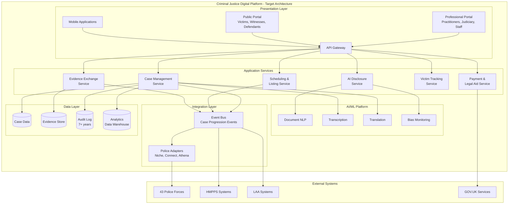
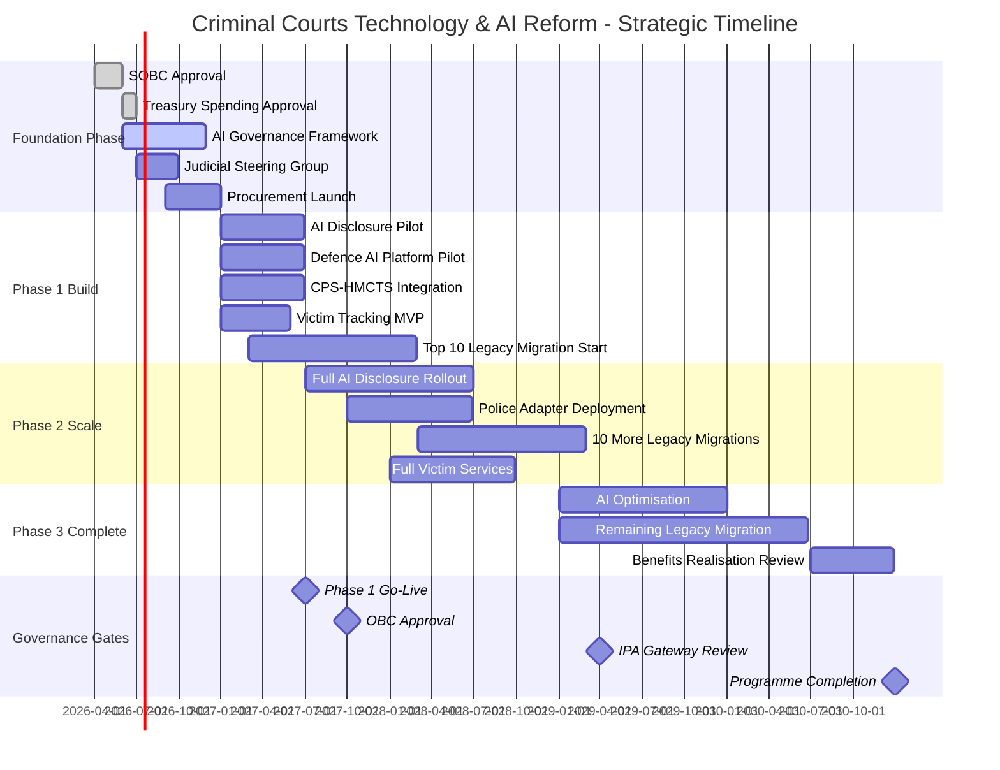

# Architecture Strategy: Criminal Courts Technology & AI Reform

> **Template Status**: Live | **Version**: 1.3.0 | **Command**: `/arckit.strategy`

## Document Control

| Field | Value |
|-------|-------|
| **Document ID** | ARC-001-STRAT-v1.0 |
| **Document Type** | Architecture Strategy |
| **Project** | Criminal Courts Technology & AI Reform (Project 001) |
| **Classification** | OFFICIAL |
| **Status** | DRAFT |
| **Version** | 1.0 |
| **Created Date** | 2026-02-05 |
| **Last Modified** | 2026-02-05 |
| **Review Cycle** | Quarterly |
| **Next Review Date** | 2026-05-05 |
| **Owner** | MoJ Chief Digital and Information Officer |
| **Reviewed By** | PENDING |
| **Approved By** | PENDING |
| **Distribution** | Lord Chancellor, MoJ Permanent Secretary, MoJ CDIO, HMCTS CEO, DPP/CPS, Lady Chief Justice's Office, HM Treasury, NAO |
| **Strategic Horizon** | 5 Years (FY 2026/27 - FY 2030/31) |
| **Approver** | MoJ Permanent Secretary (SRO) |

## Revision History

| Version | Date | Author | Changes | Approved By | Approval Date |
|---------|------|--------|---------|-------------|---------------|
| 1.0 | 2026-02-05 | ArcKit AI | Initial creation from `/arckit.strategy` command | PENDING | PENDING |

---

## Executive Summary

### Strategic Vision

The Criminal Courts Technology & AI Reform programme represents the most significant transformation of criminal justice technology in a generation. Responding to the crisis identified by the Independent Review of the Criminal Courts (Leveson Review, 2025-2026) — 77,000+ outstanding Crown Court cases, fragmented digital systems across police, CPS, courts, and prisons, and 37 critical legacy applications — this strategy establishes the architecture and investment priorities to deliver faster, fairer, and more efficient justice.

Our vision is a Criminal Justice Digital Platform (CJDP) that seamlessly connects all participants in the criminal justice ecosystem: defendants, victims, witnesses, legal practitioners, courts, police, and prisons. Through AI-augmented case processing, API-based interoperability, and legacy modernisation, we will reduce the Crown Court backlog below 50,000 cases within three years while preserving judicial independence and ensuring equality of arms between prosecution and defence.

This strategy is grounded in 23 architecture principles (ARC-000-PRIN-v1.0) that establish non-negotiable guardrails — including Security by Design, Human-Centred AI Augmentation, and criminal justice-specific principles on Equality of Arms, Judicial Independence, and Victim/Witness Protection. It addresses the drivers of 15 stakeholders (ARC-001-STKE-v1.0), mitigates 20 identified risks (ARC-001-RISK-v1.0), and delivers a positive NPV through £281M investment over five years (ARC-001-SOBC-v1.0).

### Strategic Context

| Aspect | Summary |
|--------|---------|
| **Business Challenge** | 77,000+ Crown Court case backlog; 37 legacy applications; fragmented cross-agency systems; victims waiting years for trial |
| **Strategic Opportunity** | Leveson Review mandate with cross-party support; AI technology maturity; new judicial leadership on technology |
| **Investment Horizon** | 5 years, £281M total investment (£181M CAPEX, £100M OPEX) |
| **Expected ROI** | 10.5% by FY 2030/31; Payback period 42 months |
| **Risk Appetite** | LOW for compliance/security; MEDIUM for delivery; programme cannot proceed if equality of arms (R-002) unresolved |

### Key Strategic Decisions

| Decision | Choice | Rationale |
|----------|--------|-----------|
| **Build vs Buy** | Hybrid | Build core criminal justice-specific AI; buy commodity cloud infrastructure and integration platforms |
| **Cloud Strategy** | Cloud-Native | UK Government Cloud First policy; scalability for variable caseloads; NCSC-approved patterns |
| **Vendor Strategy** | Multi-Vendor | Avoid lock-in (Principle 20); Digital Marketplace multi-lot procurement; SME participation |
| **Integration Approach** | API-First + Event-Driven | Cross-Agency Interoperability (Principle 1); Event-Driven for case progression (Principle 12) |
| **AI Deployment** | Simultaneous Prosecution-Defence | Equality of Arms (Principle 21); mitigate R-002 (Critical risk) |

### Strategic Outcomes

1. **O-1: Reduced Case Backlog and Faster Justice**: Crown Court backlog below 50,000; average charge-to-trial time reduced 30%
2. **O-2: Trustworthy AI in Criminal Justice**: 100% AI governance compliance; zero AI-related miscarriages of justice; defence parity
3. **O-3: Seamless Cross-Agency Digital Justice**: 90%+ automated case data exchange; 80% reduction in data errors
4. **O-4: Improved Victim and Witness Experience**: 20% improvement in victim satisfaction; 90%+ Victims' Code compliance
5. **O-5: Sustainable Technology Estate**: 20+ of 37 legacy applications migrated; 60% reduction in incidents
6. **O-6: Fiscally Responsible Delivery**: Within 10% of business case; IPA Gateway rating Amber/Green or better

---

## Strategic Drivers

> *Synthesised from: ARC-001-STKE-v1.0*

### Business Drivers

| Driver ID | Driver | Stakeholder | Intensity | Strategic Goal |
|-----------|--------|-------------|-----------|----------------|
| SD-1 | Reduce 77,000+ Crown Court backlog; restore public confidence | Lord Chancellor | CRITICAL | G-1: Reduce caseload <50,000 |
| SD-2 | Preserve judicial independence in AI deployments | Lady Chief Justice | CRITICAL | G-6: AI governance framework |
| SD-3 | Modernise court operations; reduce staff burden | HMCTS CEO | CRITICAL | G-5: Legacy migration |
| SD-4 | AI-assisted disclosure; case preparation quality | DPP / CPS | HIGH | G-2: AI disclosure (80%+ cases) |
| SD-5 | Digital evidence sharing; reduce officer admin burden | NPCC / Police | HIGH | G-4: Cross-agency interop |
| SD-6 | Equality of arms — defence must match prosecution technology | CBA / Law Society | CRITICAL | G-3: Defence AI access (70%+) |
| SD-7 | Responsible AI governance; ATRS/DPIA compliance | MoJ Chief AI Officer | HIGH | G-6, G-10: Governance compliance |
| SD-9 | Robust Green Book business case; value for money | HM Treasury | HIGH | G-8: Business case approval |
| SD-12 | Victim case tracking; Victims' Code compliance | Victims' Commissioner | HIGH | G-7: 20% victim satisfaction improvement |

### External Drivers

| Driver | Source | Impact | Strategic Response |
|--------|--------|--------|-------------------|
| Leveson Review 180 recommendations | Independent Review of the Criminal Courts (2025-2026) | Comprehensive reform mandate | Programme scope directly implements recommendations |
| UK Government AI Strategy | DSIT National AI Strategy | Expectation of responsible public sector AI | AI Playbook compliance; ATRS registration |
| GDS Service Standard | Government Digital Service | Mandatory for all digital services | Design for assessment; embedded user research |
| NCSC Cyber Assessment Framework | National Cyber Security Centre | Security compliance required | Security by Design (Principle 3, NON-NEGOTIABLE) |
| DPA 2018 Part 3 | Data Protection Act 2018 | Law enforcement data processing rules | DPIA before deployment; specialist legal advice |
| Victims and Prisoners Act 2024 | Parliament | Strengthened Victims' Code | Automated compliance monitoring (FR-013) |

### Stakeholder Alignment

```
                          INTEREST
              Low                         High
        +-----------------------+-----------------------+
        |                       |                       |
        |   KEEP SATISFIED      |   MANAGE CLOSELY      |
   High |                       |                       |
        |   • NAO               |   • Lord Chancellor   |
        |   • GDS/CDDO          |   • MoJ Perm Sec      |
        |   • HM Treasury       |   • MoJ CDIO          |
        |   • ICO               |   • MoJ AI Officer    |
        |                       |   • HMCTS CEO/CTO     |
 P      |                       |   • DPP/CPS           |
 O      |                       |   • Lady Chief Justice|
 W      |                       |   • Lead Judge AI     |
 E      |                       |   • NPCC              |
 R      +-----------------------+-----------------------+
        |                       |                       |
        |      MONITOR          |    KEEP INFORMED      |
   Low  |                       |                       |
        |                       |   • CBA/Law Society   |
        |                       |   • Magistrates' Assn |
        |                       |   • LAA               |
        |                       |   • Victims' Commr    |
        |                       |   • Defendants        |
        |                       |   • Witnesses         |
        |                       |   • HMPPS             |
        +-----------------------+-----------------------+
```

---

## Guiding Principles

> *Synthesised from: ARC-000-PRIN-v1.0 (23 principles across 7 categories)*

### Foundational Principles

| ID | Principle | Statement | Strategic Implication |
|----|-----------|-----------|----------------------|
| P-01 | Cross-Agency Interoperability | All systems expose functionality through well-defined, versioned APIs | API-first architecture; drives Theme 2 investment |
| P-02 | Human-Centred AI Augmentation | AI augments rather than replaces human decision-making | Shapes all AI deployments; judicial oversight required |
| P-03 | Security by Design | Defence-in-depth with zero-trust principles; **NON-NEGOTIABLE** | Security embedded in all designs; no exceptions |
| P-04 | Legacy Modernisation | Prioritise decommissioning legacy systems | Drives Theme 3 (legacy migration) investment |

### Technology Principles

| ID | Principle | Statement | Strategic Implication |
|----|-----------|-----------|----------------------|
| P-05 | Scalability and Elasticity | Design for horizontal scaling under variable demand | Cloud-native architecture; auto-scaling for backlog surge |
| P-06 | Resilience and Fault Tolerance | Graceful degradation; automated recovery | Court operations cannot pause; mandatory fallbacks |
| P-07 | Observability | Structured telemetry; real-time dashboards | Enables Leveson Review KPI monitoring |
| P-08 | Data as Shared Strategic Asset | Single authoritative source per data domain | Eliminates data drift across agencies |

### Governance Principles

| ID | Principle | Statement | Strategic Implication |
|----|-----------|-----------|----------------------|
| P-17 | Infrastructure as Code | All infrastructure defined as code; no manual changes | Reproducible environments; audit trail |
| P-20 | Open Standards | Use open standards; avoid vendor lock-in | Multi-vendor strategy; exit provisions in contracts |

### Criminal Justice Principles

| ID | Principle | Statement | Strategic Implication |
|----|-----------|-----------|----------------------|
| P-21 | Equality of Arms | Technology for prosecution matched by defence equivalent | **Critical**: No prosecution AI without defence parity |
| P-22 | Judicial Independence | Technology must not constrain judicial discretion | Judicial steering group veto on case-affecting AI |
| P-23 | Victim/Witness Protection | Enhanced protections for victim/witness data | Special access controls; anonymisation capability |

### Principles Compliance Summary

| Principle Category | Current Compliance | Target Compliance | Gap |
|-------------------|-------------------|-------------------|-----|
| Strategic (P-01 to P-07) | 15% | 100% | 85% |
| Data (P-08 to P-10) | 20% | 100% | 80% |
| Integration (P-11, P-12) | 10% | 100% | 90% |
| Quality (P-13 to P-16) | 25% | 100% | 75% |
| Development (P-17 to P-20) | 30% | 100% | 70% |
| Criminal Justice (P-21 to P-23) | 5% | 100% | 95% |
| **Overall** | **18%** | **100%** | **82%** |

---

## Current State Assessment

### Technology Landscape

The criminal justice system operates on a fragmented technology estate built across multiple decades, agencies, and funding cycles. HMCTS manages 37 critical legacy applications, some dating to the 1970s (Police National Computer, 1974). The Common Platform — intended to unify HMCTS and CPS case management — has experienced troubled rollout with user complaints and scope reduction. Cross-agency integration relies heavily on manual data transfer, email, and physical media.

**Key Systems**:

| System | Purpose | Technology | Age | Technical Debt | Strategic Fit |
|--------|---------|------------|-----|----------------|---------------|
| Common Platform | Court case management | Modern web stack | 3 years | MEDIUM | RETAIN (stabilise) |
| CPS Case Management | Prosecution workflow | Legacy + modern mix | 10+ years | HIGH | REPLACE (integrate) |
| Police National Computer | Criminal records | Mainframe | 50+ years | CRITICAL | REPLACE (phased) |
| HMPPS Systems | Prison/probation | Mixed legacy | 15-40 years | HIGH | INTEGRATE (API layer) |
| LAA Systems | Legal aid admin | Legacy | 20+ years | HIGH | MODERNISE |
| Evidence Management | Digital evidence storage | Varies by force | Varies | HIGH | STANDARDISE |

### Capability Maturity Baseline

| Capability Domain | Current Maturity | Assessment |
|-------------------|------------------|------------|
| Cross-Agency Integration | Level 1 (Initial) | Manual data transfer; no standard APIs; point-to-point integrations |
| AI/ML Capabilities | Level 1 (Initial) | Pilots only; no production AI in criminal case processing |
| Cloud Adoption | Level 2 (Repeatable) | Common Platform on cloud; most systems on-premises |
| Security Operations | Level 3 (Defined) | Good perimeter security; limited zero-trust; recent LAA breach |
| Data Management | Level 2 (Repeatable) | No enterprise data model; inconsistent standards across agencies |
| User Experience | Level 2 (Repeatable) | Common Platform usability issues; limited victim/witness digital services |

**Maturity Levels**: L1 (Initial), L2 (Repeatable), L3 (Defined), L4 (Managed), L5 (Optimised)

### Technical Debt Summary

- **Total Technical Debt**: £45M/year in avoidable operational costs
- **High Priority Items**: 37 critical legacy applications; Police National Computer replacement long overdue
- **Impact on Delivery**: Legacy constraints block AI deployment; manual processes prevent scaling

### Strengths, Weaknesses, Opportunities, Threats (SWOT)

| Strengths | Weaknesses |
|-----------|------------|
| Common Platform provides foundation (if stabilised) | 37 legacy applications on unsupported platforms |
| Cross-party support via Leveson Review mandate | Poor track record (Common Platform cost overruns) |
| Judicial leadership on AI (Lead Judge appointed) | 43 independently governed police forces |
| Strong GDS/DDaT capability in MoJ | Legal aid funding constraints for defence technology |

| Opportunities | Threats |
|---------------|---------|
| AI technology mature for disclosure, transcription, translation | Defence equality of arms challenge (R-002, Critical) |
| Leveson Review creates investment mandate | HM Treasury funding refusal (R-001, High) |
| New judicial AI steering group can build trust | AI ethics controversy could halt programme (R-005) |
| Cross-agency data standards could transform efficiency | Police interoperability failure (R-004) |

---

## Target State Vision

### Future Architecture

The target architecture is a multi-sided Criminal Justice Digital Platform (CJDP) — analysed in detail in ARC-001-PLAT-v1.0 — that orchestrates the flow of cases, evidence, and information across all criminal justice participants.

**Target State Characteristics**:
- **Cloud-Native**: All new services deployed on UK Government-approved cloud platforms with auto-scaling
- **API-First Integration**: Published, versioned APIs enabling real-time cross-agency data exchange
- **Event-Driven Case Progression**: Asynchronous events for charge → hearing → verdict → sentence lifecycle
- **AI-Augmented Processing**: AI-assisted disclosure, transcription, translation, and scheduling optimisation
- **Equality of Arms by Design**: Defence practitioners access same AI capabilities as prosecution
- **Security by Design**: Zero-trust architecture; encryption everywhere; comprehensive audit logging
- **Data-Driven Dashboards**: Real-time operational KPIs as recommended by Leveson Review

### Capability Maturity Targets

| Capability Domain | Current | Target | Gap | Priority |
|-------------------|---------|--------|-----|----------|
| Cross-Agency Integration | L1 | L4 | +3 | CRITICAL |
| AI/ML Capabilities | L1 | L4 | +3 | CRITICAL |
| Cloud Adoption | L2 | L4 | +2 | HIGH |
| Security Operations | L3 | L5 | +2 | HIGH |
| Data Management | L2 | L4 | +2 | HIGH |
| User Experience | L2 | L4 | +2 | MEDIUM |

### Architecture Vision Diagram



---

## Technology Evolution Strategy

### Strategic Positioning

| Component | Current Position | Target Position | Evolution Strategy |
|-----------|------------------|-----------------|-------------------|
| AI Disclosure Review | Genesis | Custom Build | Build in-house/partner; core differentiator |
| Case Management | Product (Common Platform) | Product (Enhanced) | Enhance and stabilise |
| Cloud Infrastructure | Product | Commodity | Consume via G-Cloud frameworks |
| Integration Platform | Genesis/Custom | Product | Buy API management platform |
| Analytics/BI | Genesis | Product | Buy modern BI platform |
| Security Operations | Product | Commodity | Consume managed SOC services |

### Build vs Buy Decisions

| Capability | Decision | Rationale | Timeline |
|------------|----------|-----------|----------|
| AI Disclosure Engine | BUILD | Criminal justice-specific; equality of arms requirement; no suitable off-the-shelf | FY 2026/27 |
| Defence AI Platform | BUILD/PARTNER | Must be equivalent to prosecution; may share components | FY 2026/27 |
| API Integration Platform | BUY | Commodity market; G-Cloud options; faster time to value | FY 2026/27 |
| Cloud Hosting | CONSUME | UK Government Cloud First; G-Cloud procurement | FY 2026/27 |
| Transcription AI | BUY/PARTNER | Mature market; evaluate HMCTS existing contracts | FY 2027/28 |
| Translation AI | BUY/PARTNER | Mature market; validate accuracy for court use | FY 2027/28 |
| Case Management | ENHANCE | Common Platform exists; stabilise and extend | FY 2026/27 onwards |
| Legacy Migration | PARTNER | Specialist migration skills; DOS procurement | FY 2026/27 onwards |

### Technology Radar Summary

| Ring | Technologies |
|------|--------------|
| **Adopt** (Use now) | Cloud-native services (Gov PaaS successors), API management platforms, Event-driven integration, Structured logging, Infrastructure as Code (Terraform/CDK) |
| **Trial** (Evaluate) | LLM-based disclosure review, AI transcription in court, Real-time translation, Graph databases for case relationships |
| **Assess** (Watch) | Generative AI for case summarisation, Predictive scheduling (with judicial approval), Automated video evidence analysis |
| **Hold** (Avoid) | Predictive AI for case outcomes (Leveson Review caution), On-premises infrastructure for new services, Single-vendor AI platforms (lock-in risk) |

---

## Strategic Themes & Investment Areas

### Theme 1: AI-Assisted Justice (£51M, 18% of total)

**Strategic Objective**: Deploy AI tools for disclosure review, transcription, translation, and case preparation across prosecution AND defence, delivering efficiency gains while preserving fairness.

**Investment**: £51M over 5 years (£40M CAPEX, £11M OPEX)

**Key Initiatives**:
1. **AI Disclosure Engine**: Build AI-assisted disclosure review and digital evidence triage
2. **Defence AI Platform**: Shared-service AI platform for defence practitioners (equality of arms)
3. **Court Transcription/Translation**: AI-assisted real-time transcription and translation in court
4. **AI Governance Framework**: ATRS, DPIA, judicial steering group, ethics review board

**Success Criteria**:
- [ ] 80%+ Crown Court cases using AI-assisted disclosure by FY 2028/29 (G-2)
- [ ] 70%+ defence practitioners with AI tool access by FY 2028/29 (G-3)
- [ ] 100% AI deployments with ATRS registration and DPIA (G-10)
- [ ] Zero AI-related miscarriages of justice
- [ ] Judicial steering group operational within 12 months (G-6)

**Principles Alignment**: P-02 (Human-Centred AI), P-21 (Equality of Arms), P-22 (Judicial Independence)

**Key Risks**: R-002 (defence equality, Critical), R-005 (AI ethics), R-013 (AI bias)

---

### Theme 2: Cross-Agency Interoperability (£46M, 16% of total)

**Strategic Objective**: Enable seamless, automated case data exchange between police, CPS, HMCTS, HMPPS, and LAA through API-based integration, eliminating manual data transfer.

**Investment**: £46M over 5 years (£35M CAPEX, £11M OPEX)

**Key Initiatives**:
1. **API Integration Platform**: Central API gateway and event bus for cross-agency data exchange
2. **Police Adapters**: Middleware adapters for Niche, Connect, Athena (covers ~85% of forces)
3. **Digital Case File Standard**: Standardised format for police → CPS case file transfer
4. **HMPPS Integration**: Real-time sentence data to prisons; pre-sentence reports to courts

**Success Criteria**:
- [ ] 90%+ case data exchanged automatically by FY 2028/29 (G-4)
- [ ] API standards published and discoverable via catalogue
- [ ] 85%+ police force integration via adapter layer
- [ ] Zero manual data rekeying between CPS and HMCTS

**Principles Alignment**: P-01 (Cross-Agency Interoperability), P-11 (Loose Coupling), P-12 (Event-Driven)

**Key Risks**: R-004 (police interoperability), R-011 (data sharing agreements)

---

### Theme 3: Legacy Modernisation (£62M, 22% of total)

**Strategic Objective**: Migrate 37 critical legacy applications to supported, maintainable platforms, reducing cyber risk and enabling modern integration.

**Investment**: £62M over 5 years (£50M CAPEX, £12M OPEX)

**Key Initiatives**:
1. **Portfolio Assessment**: Comprehensive assessment, risk rating, and migration sequencing
2. **High-Risk Migration (10)**: Priority migration of top 10 highest-risk applications
3. **Medium-Risk Migration (10)**: Second tranche of legacy application migration
4. **Long-Tail Migration (17)**: Remaining applications migrated or decommissioned
5. **Common Platform Stabilisation**: Pre-requisite stabilisation before new features

**Success Criteria**:
- [ ] Top 10 highest-risk applications migrated by FY 2027/28
- [ ] 20+ applications migrated by FY 2028/29 (G-5)
- [ ] All 37 applications migrated/decommissioned by FY 2030/31
- [ ] 60% reduction in legacy-related incidents

**Principles Alignment**: P-04 (Legacy Modernisation), P-06 (Resilience), P-17 (Infrastructure as Code)

**Key Risks**: R-007 (Common Platform instability), R-008 (migration disrupts courts)

---

### Theme 4: Victim & Witness Services (£25M, 9% of total)

**Strategic Objective**: Transform victim and witness experience through real-time case tracking, automated notifications, and accessible remote evidence facilities.

**Investment**: £25M over 5 years (£13M CAPEX, £12M OPEX)

**Key Initiatives**:
1. **Victim Case Tracking Portal**: Self-service portal for victims to track case progress
2. **Automated Notifications**: Push notifications for case milestones (charge, listing, verdict)
3. **Victims' Code Compliance Monitoring**: Automated tracking and escalation for non-compliance
4. **Remote Evidence Facilities**: High-quality video link suites at all Crown Court centres

**Success Criteria**:
- [ ] 80%+ victim case tracking adoption by FY 2028/29
- [ ] 20% improvement in victim satisfaction within 2 years (G-7)
- [ ] 90%+ Victims' Code compliance (vs. current ~60%)
- [ ] Remote evidence available at 100% of Crown Court centres

**Principles Alignment**: P-23 (Victim/Witness Protection), P-15 (Accessibility)

**Key Risks**: R-001 (funding constraints), R-010 (GDS assessment)

---

### Theme 5: Governance, Security & Compliance (£22M, 8% of total)

**Strategic Objective**: Establish robust governance, security, and compliance foundations enabling responsible AI adoption and cross-agency data sharing.

**Investment**: £22M over 5 years (£11M CAPEX, £11M OPEX)

**Key Initiatives**:
1. **AI Governance Framework**: Categorisation, ATRS, DPIA, judicial steering group, ethics board
2. **Security Enhancement**: Zero-trust architecture; enhanced SIEM; penetration testing programme
3. **Data Sharing Agreements**: Formalised agreements with ICO engagement
4. **Architecture Governance**: Enterprise architecture function; ADR process; review boards

**Success Criteria**:
- [ ] AI governance framework operational within 12 months (G-6)
- [ ] 100% DPIA coverage for AI deployments (G-10)
- [ ] Zero ICO enforcement actions
- [ ] All services pass GDS assessment (G-9)

**Principles Alignment**: P-03 (Security by Design), P-10 (Privacy), P-22 (Judicial Independence)

**Key Risks**: R-005 (AI ethics), R-011 (data sharing), R-012 (ICO enforcement)

---

### Theme 6: Programme Management & Change (£75M, 27% of total)

**Strategic Objective**: Deliver the programme effectively with strong governance, change management, and benefits realisation.

**Investment**: £75M over 5 years (£32M CAPEX, £43M OPEX)

**Key Initiatives**:
1. **Programme Delivery**: Programme management, architecture, commercial, finance
2. **Training & Change Management**: Staff, judiciary, practitioner adoption programmes
3. **Benefits Realisation**: Tracking, measurement, and reporting
4. **Contingency**: 10% programme contingency

**Success Criteria**:
- [ ] Within 10% of business case cost estimates
- [ ] IPA Gateway rating Amber/Green or better
- [ ] All benefits tracked and measured
- [ ] Staff adoption targets met for each system

**Principles Alignment**: All principles (governance foundation)

**Key Risks**: R-001 (funding), R-006 (staff resistance), R-009 (cost overrun)

---

## Delivery Roadmap Summary

### Strategic Timeline



### Phase Summary

| Phase | Timeline | Focus | Investment | Key Deliverables |
|-------|----------|-------|------------|------------------|
| **Foundation** | FY 2026/27 Q1-Q2 | Governance, procurement, planning | £15M | SOBC approval, Treasury approval, AI governance, procurement launch |
| **Phase 1** | FY 2026/27 Q3 - FY 2027/28 Q2 | Build core capabilities | £95M | AI pilots (prosecution + defence), CPS-HMCTS integration, victim MVP, 10 migrations |
| **Phase 2** | FY 2027/28 Q3 - FY 2028/29 Q4 | Scale and expand | £120M | Full AI rollout, police integration, 20 migrations, full victim services |
| **Phase 3** | FY 2029/30 - FY 2030/31 | Complete and optimise | £51M | Remaining migrations, optimisation, benefits realisation |

### Key Milestones

| Milestone | Date | Theme | Gate |
|-----------|------|-------|------|
| SOBC Approved | FY 2026/27 Q1 | Foundation | Strategy Gate |
| Treasury Spending Approval | FY 2026/27 Q2 | Foundation | Funding Gate |
| AI Governance Operational | FY 2026/27 Q3 | Theme 5 | AI Governance Gate |
| Judicial Steering Group Active | FY 2026/27 Q3 | Theme 5 | Judicial Approval |
| First AI Tools Go-Live (Prosecution + Defence) | FY 2027/28 Q1 | Theme 1 | Phase 1 Go-Live |
| OBC Approved (Refined Costs) | FY 2027/28 Q2 | Foundation | Business Case Gate |
| 80%+ AI Disclosure Coverage | FY 2028/29 Q3 | Theme 1 | AI Scale Gate |
| 20+ Legacy Applications Migrated | FY 2028/29 Q4 | Theme 3 | Migration Gate |
| Programme Completion | FY 2030/31 Q4 | All | Programme Closeout |

---

## Investment Summary

> *Synthesised from: ARC-001-SOBC-v1.0*

### Total Investment

| Category | Amount | % of Total |
|----------|--------|------------|
| **Capital Expenditure (CAPEX)** | £181M | 64% |
| **Operational Expenditure (OPEX)** | £100M | 36% |
| **Total Investment** | **£281M** | **100%** |

*Note: With HM Treasury optimism bias (+25% on CAPEX), total rises to £326M*

### Investment by Financial Year

| Financial Year | CAPEX (£M) | OPEX (£M) | Total (£M) | % of Budget |
|----------------|-----------|----------|-----------|-------------|
| FY 2026/27 | 42 | 11 | 53 | 19% |
| FY 2027/28 | 56 | 18 | 74 | 26% |
| FY 2028/29 | 42 | 23 | 65 | 23% |
| FY 2029/30 | 24 | 24 | 48 | 17% |
| FY 2030/31 | 17 | 24 | 41 | 15% |
| **Total** | **181** | **100** | **281** | **100%** |

### Investment by Theme

| Theme | Investment (£M) | % of Total | Expected Benefit |
|-------|----------------|------------|------------------|
| Theme 1: AI-Assisted Justice | 51 | 18% | £70M AI productivity gains |
| Theme 2: Cross-Agency Interoperability | 46 | 16% | £120M automation savings |
| Theme 3: Legacy Modernisation | 62 | 22% | £50M risk avoidance + savings |
| Theme 4: Victim & Witness Services | 25 | 9% | £25M reduced cracked trials |
| Theme 5: Governance, Security & Compliance | 22 | 8% | £50M risk avoidance |
| Theme 6: Programme Management & Change | 75 | 27% | Enables all benefits |

### Business Case Summary

| Metric | Value |
|--------|-------|
| **Net Present Value (NPV)** | £5.1M (conservative); £95M (with strategic benefits) |
| **Internal Rate of Return (IRR)** | 10.5% |
| **Payback Period** | 42 months (Year 4) |
| **Benefit-Cost Ratio** | 1.1:1 (quantified); 1.5:1 (including strategic) |

### Benefits Realisation

| Benefit Category | Years 1-2 | Years 3-5 | Years 6-10 | 10-Year Total |
|------------------|-----------|-----------|------------|---------------|
| Backlog Reduction | £10M | £50M | £120M | £180M |
| AI Productivity | £5M | £25M | £40M | £70M |
| Cross-Agency Automation | £5M | £30M | £85M | £120M |
| Legacy Decommissioning | £3M | £15M | £32M | £50M |
| Victim/Witness Efficiency | £2M | £8M | £15M | £25M |
| Risk Avoidance | £5M | £15M | £30M | £50M |
| **Total** | **£30M** | **£143M** | **£322M** | **£495M** |

---

## Strategic Risks & Mitigations

> *Synthesised from: ARC-001-RISK-v1.0 (20 risks analysed)*

### Top Strategic Risks

| Risk ID | Risk Description | Inherent | Residual | Mitigation Strategy | Owner |
|---------|------------------|----------|----------|---------------------|-------|
| R-002 | Defence equality of arms challenge halts AI deployment | 25 (Critical) | 20 (Critical) | Simultaneous prosecution-defence deployment; resolve defence funding mechanism URGENTLY | Lord Chancellor |
| R-001 | HM Treasury funding refusal blocks programme | 16 (High) | 16 (High) | Phased business case; ministerial advocacy; lessons from Common Platform | MoJ Perm Sec |
| R-005 | AI ethics controversy damages public trust | 20 (Critical) | 12 (Medium) | AI governance framework; mandatory bias testing; incident response plan | MoJ AI Officer |
| R-009 | Programme cost overrun exceeds business case | 20 (Critical) | 12 (Medium) | Stage-gate approvals; conservative estimates; contingency; monthly tracking | MoJ Perm Sec |
| R-004 | Police interoperability failure (43 forces) | 20 (Critical) | 12 (Medium) | Adapter middleware for top 3 systems; outcome standards not system mandates | NPCC |
| R-003 | Judicial resistance delays AI deployment | 16 (High) | 9 (Medium) | Dual-track AI; judicial steering group; trust-building pilots | Lead Judge for AI |
| R-007 | Common Platform instability disrupts reform | 12 (Medium) | 6 (Medium) | Stabilisation prerequisite; bypass capability | HMCTS CTO |

### Risk Heat Map

```
                    PROBABILITY
              Low         Medium        High
        +------------+------------+------------+
        |            |            |            |
   High |            |   R-001    |   R-002    |
        |            |            |            |
 I      +------------+------------+------------+
 M      |            |   R-005    |   R-004    |
 P Medium|  R-003    |   R-009    |            |
 A      |   R-007    |            |            |
 C      +------------+------------+------------+
 T      |            |            |            |
   Low  |            |            |            |
        |            |            |            |
        +------------+------------+------------+
```

### Assumptions & Constraints

**Critical Assumptions**:
1. Common Platform will be stabilised before new services built on it
2. Cross-party support for Leveson Review implementation continues
3. HM Treasury fiscal environment permits multi-year investment
4. AI technology maturity sufficient for criminal justice application
5. Defence technology funding mechanism can be established (policy decision)
6. Police forces willing to adopt data standards with adapter support

**Constraints**:
1. Budget capped at £281M (£326M with optimism bias)
2. Must achieve defence parity before prosecution AI deployment (Principle 21)
3. Cannot deploy AI affecting judicial functions without judicial steering group approval
4. Must maintain court operations during migration (no "big bang")
5. Must comply with DPA 2018 Part 3 for law enforcement data

---

## Success Metrics & KPIs

### Strategic KPIs

| KPI | Baseline | Year 1 | Year 2 | Year 3 | Year 5 | Measurement |
|-----|----------|--------|--------|--------|--------|-------------|
| Crown Court Outstanding Cases | 77,000+ | 72,000 | 62,000 | <50,000 | <45,000 | HMCTS Statistics Quarterly |
| AI Disclosure Coverage | 0% | 10% (pilot) | 50% | 80%+ | 90%+ | CPS Case Management |
| Defence AI Tool Access | 0% | 10% (pilot) | 40% | 70%+ | 85%+ | LAA Provider Surveys |
| Automated Data Exchange | <10% | 20% | 50% | 90%+ | 95%+ | API Gateway Analytics |
| Legacy Applications Migrated | 0 of 37 | 5 | 15 | 20+ | 37 | Portfolio Register |
| Victim Satisfaction | Baseline TBD | +5% | +15% | +20% | +25% | HMCTS Victim Surveys |
| Victims' Code Compliance | ~60% | 70% | 80% | 90%+ | 95%+ | Compliance Monitoring |
| Cost vs Business Case | 0% | ±5% | ±5% | ±10% | ±10% | Finance Reports |

### Leading Indicators

| Indicator | Frequency | Target | Escalation Threshold |
|-----------|-----------|--------|---------------------|
| Defence funding decision status | Weekly | Resolved by Q2 Y1 | Unresolved by Q1 Y1 |
| AI governance framework progress | Monthly | Operational by Q3 Y1 | Slipping by 4+ weeks |
| Police adapter development | Monthly | 3 adapters by Q4 Y1 | Behind by 6+ weeks |
| Judicial steering group engagement | Monthly | Monthly meetings | <75% attendance |
| Procurement milestone delivery | Monthly | On track | 4+ weeks delay |

### Lagging Indicators

| Indicator | Frequency | Target | Review Forum |
|-----------|-----------|--------|--------------|
| IPA Gateway Review rating | Per gate | Amber/Green | Programme Board |
| GDS Service Assessment pass rate | Per service | 100% first/second attempt | Programme Board |
| Legal challenges on AI (R-002) | Quarterly | Zero | Strategy Board |
| Legacy-related incidents | Monthly | 60% reduction by Y3 | Technology Board |
| Benefits realisation vs forecast | Quarterly | Within 20% | Strategy Board |

---

## Governance Model

### Governance Structure

| Forum | Frequency | Purpose | Participants |
|-------|-----------|---------|--------------|
| **Strategy Board** | Quarterly | Strategic direction, investment decisions, risk escalation | Lord Chancellor (sponsor), MoJ Perm Sec (SRO), MoJ CDIO, Lady CJ representative, HM Treasury |
| **Programme Board** | Monthly | Delivery progress, cross-agency coordination, risk management | MoJ CDIO (chair), HMCTS CEO, DPP rep, NPCC rep, Programme Director |
| **Judicial AI Steering Group** | Monthly | AI deployment affecting judicial functions; veto authority | Lead Judge for AI (chair), Lady CJ nominee, MoJ AI Officer, HMCTS CTO |
| **Architecture Review Board** | Fortnightly | Architecture decisions, standards, exceptions | Enterprise Architect (chair), Tech Leads, Security Architect |
| **Defence Technology Working Group** | Monthly | Defence platform requirements, equality of arms | LAA CEO, CBA rep, Law Society rep, MoJ CDIO |

### Decision Rights

| Decision Type | Authority | Escalation |
|---------------|-----------|------------|
| Strategic direction change | Strategy Board | Lord Chancellor |
| AI deployment (case-affecting) | Judicial AI Steering Group | Lady Chief Justice |
| AI deployment (administrative) | MoJ Chief AI Officer | Programme Board |
| Architecture standards | Architecture Review Board | Programme Board |
| Budget variance > 10% | Programme Board | Strategy Board |
| Defence technology design | Defence Technology Working Group | Programme Board |
| Cross-agency data standards | Programme Board (MoJ CDIO) | Strategy Board |

### Review Cadence

| Review Type | Frequency | Purpose | Output |
|-------------|-----------|---------|--------|
| Strategy Review | Quarterly | Validate strategic direction against Leveson Review progress | Strategy update |
| Benefits Review | Quarterly | Track benefits realisation vs SOBC | Benefits report |
| Risk Review | Monthly | Update risk register; escalate Critical/High | Risk report |
| Architecture Review | Fortnightly | Approve designs; review compliance | ADRs, exceptions |
| IPA Gateway Review | Per gate | Independent assurance | Gateway report |
| Annual Strategy Refresh | Annually | Refresh strategy for next FY; update roadmap | Updated strategy |

---

## Traceability

### Source Documents

This strategy synthesises insights from the following architecture artifacts:

| Document | Document ID | Key Contributions |
|----------|-------------|-------------------|
| Architecture Principles | ARC-000-PRIN-v1.0 | 23 principles; decision framework; 7 categories including criminal justice-specific |
| Stakeholder Analysis | ARC-001-STKE-v1.0 | 15 stakeholders; 15 drivers; 10 goals; 6 outcomes; 4 conflicts resolved |
| Risk Register | ARC-001-RISK-v1.0 | 20 risks; 1 Critical residual (R-002); Orange Book methodology |
| Strategic Business Case | ARC-001-SOBC-v1.0 | £281M investment; NPV positive; 5-case model; Option 2 recommended |
| Requirements | ARC-001-REQ-v1.0 | 65 requirements (10 BR, 14 FR, 22 NFR, 4 DR, 6 INT); 8 personas |
| Platform Strategy Design | ARC-001-PLAT-v1.0 | Criminal Justice Digital Platform; multi-sided ecosystem; 8 PDT canvases |

**Gaps Identified**:
- ⚠️ **Wardley Maps** (ARC-*-WARD-*.md): Not yet created — would improve build vs buy analysis
- ⚠️ **Architecture Roadmap** (ARC-*-ROAD-*.md): Not yet created — would provide detailed timeline

### Traceability Matrix

| Strategic Driver | Goal | Outcome | Theme | Principle | KPI |
|------------------|------|---------|-------|-----------|-----|
| SD-1 (Backlog reduction) | G-1 | O-1 | Themes 1,2,3 | P-01, P-04 | Crown Court cases |
| SD-2 (Judicial independence) | G-6 | O-2 | Theme 5 | P-22 | AI governance compliance |
| SD-3 (Operational efficiency) | G-5 | O-5 | Theme 3 | P-04, P-06 | Legacy apps migrated |
| SD-4 (Prosecution efficiency) | G-2 | O-2 | Theme 1 | P-02 | AI disclosure coverage |
| SD-5 (Evidence sharing) | G-4 | O-3 | Theme 2 | P-01, P-12 | Automated data exchange |
| SD-6 (Equality of arms) | G-3 | O-2 | Theme 1 | P-21 | Defence AI access |
| SD-7 (Responsible AI) | G-6, G-10 | O-2 | Theme 5 | P-02, P-10 | ATRS/DPIA compliance |
| SD-9 (Value for money) | G-8 | O-6 | Theme 6 | P-20 | Cost vs business case |
| SD-12 (Victim experience) | G-7 | O-4 | Theme 4 | P-23 | Victim satisfaction |

---

## Next Steps & Recommendations

### Immediate Actions (Next 30 Days)

1. **URGENT: Resolve Defence Funding Mechanism**: Lord Chancellor policy decision on how defence AI tools will be funded (central provision, legal aid reform, or hybrid) — Owner: Lord Chancellor's Office
2. **Commission Legal Opinion on Equality of Arms**: Independent legal assessment of AI deployment sequencing implications — Owner: MoJ Legal
3. **Establish Judicial AI Steering Group**: Terms of reference agreed with Lady Chief Justice; first meeting scheduled — Owner: MoJ AI Officer
4. **Submit for HM Treasury Spending Approval**: SOBC submitted with phased investment model — Owner: MoJ Permanent Secretary

### Short-Term Actions (Next 90 Days)

1. **Launch Digital Marketplace Procurement**: DOS 6 for AI and migration services; G-Cloud for infrastructure — Owner: Commercial Director
2. **Operationalise AI Governance Framework**: ATRS process, DPIA templates, ethics review board appointed — Owner: MoJ AI Officer
3. **Begin Common Platform Stabilisation Assessment**: Prerequisite for building new services — Owner: HMCTS CTO
4. **Conduct IPA Gateway 0 Review**: Independent assurance before procurement — Owner: Programme Director
5. **Establish Defence Technology Working Group**: CBA, Law Society, LAA engagement on requirements — Owner: LAA CEO

### Recommended Follow-On Artifacts

| Artifact | Command | Purpose | Priority |
|----------|---------|---------|----------|
| Architecture Roadmap | `/arckit.roadmap` | Detailed timeline with all initiatives, dependencies, milestones | HIGH |
| Wardley Maps | `/arckit.wardley` | Strategic technology evolution; detailed build vs buy analysis | HIGH |
| Project Plan | `/arckit.plan` | Delivery plan for Phase 1 with Gantt chart | HIGH |
| ADRs | `/arckit.adr` | Document key architecture decisions (AI approach, integration pattern) | MEDIUM |
| DPIA | `/arckit.dpia` | Data Protection Impact Assessment for AI processing | MEDIUM |
| ATRS Record | `/arckit.atrs` | Algorithmic Transparency Recording Standard for AI tools | MEDIUM |
| Service Assessment Prep | `/arckit.service-assessment` | Prepare for GDS service assessment | MEDIUM |

---

## Appendices

### Appendix A: Glossary

| Term | Definition |
|------|------------|
| Equality of Arms | Principle that prosecution and defence must have equivalent technology capabilities |
| Disclosure | Prosecution obligation to share relevant evidence with defence |
| Cracked Trial | Trial that does not proceed on the day due to late plea, absence, or other issue |
| Common Platform | HMCTS digital case management system |
| Crown Court | Senior criminal court handling serious offences; jury trials |
| Magistrates' Court | Lower criminal court handling 95% of cases; no jury |

### Appendix B: Acronyms

| Acronym | Expansion |
|---------|-----------|
| ATRS | Algorithmic Transparency Recording Standard |
| CBA | Criminal Bar Association |
| CDDO | Central Digital and Data Office |
| CPS | Crown Prosecution Service |
| DPA | Data Protection Act |
| DPIA | Data Protection Impact Assessment |
| GDS | Government Digital Service |
| HMCTS | His Majesty's Courts & Tribunals Service |
| HMPPS | His Majesty's Prison and Probation Service |
| IPA | Infrastructure and Projects Authority |
| LAA | Legal Aid Agency |
| NCSC | National Cyber Security Centre |
| NPCC | National Police Chiefs' Council |
| SOBC | Strategic Outline Business Case |
| SRO | Senior Responsible Owner |
| TCoP | Technology Code of Practice |

### Appendix C: Related Documents

| Document | Purpose | Location |
|----------|---------|----------|
| Independent Review of the Criminal Courts (Leveson Review) | Programme mandate; 180 recommendations | `projects/000-global/external/` |
| HM Treasury Green Book | Business case methodology | GOV.UK |
| HM Treasury Orange Book | Risk management framework | GOV.UK |
| GDS Service Standard | Digital service requirements | GOV.UK |
| Technology Code of Practice | Technology standards | GOV.UK |
| UK Government AI Playbook | Responsible AI guidance | GOV.UK |

---

## External References

| Document | Type | Source | Key Extractions | Path |
|----------|------|--------|-----------------|------|
| ARC-000-PRIN-v1.0 | Architecture Principles | ArcKit | 23 principles; 7 categories; criminal justice-specific | `projects/000-global/ARC-000-PRIN-v1.0.md` |
| ARC-001-STKE-v1.0 | Stakeholder Analysis | ArcKit | 15 stakeholders; 15 drivers; 10 goals; 6 outcomes | `projects/001-criminal-courts-technology-and-ai-reform/ARC-001-STKE-v1.0.md` |
| ARC-001-REQ-v1.0 | Requirements | ArcKit | 65 requirements; 8 personas; 5 use cases | `projects/001-criminal-courts-technology-and-ai-reform/ARC-001-REQ-v1.0.md` |
| ARC-001-RISK-v1.0 | Risk Register | ArcKit | 20 risks; Orange Book; R-002 Critical | `projects/001-criminal-courts-technology-and-ai-reform/ARC-001-RISK-v1.0.md` |
| ARC-001-SOBC-v1.0 | Strategic Outline Business Case | ArcKit | £281M; NPV positive; 5-case model | `projects/001-criminal-courts-technology-and-ai-reform/ARC-001-SOBC-v1.0.md` |
| ARC-001-PLAT-v1.0 | Platform Strategy Design | ArcKit | CJDP; 8 PDT canvases; multi-sided ecosystem | `projects/001-criminal-courts-technology-and-ai-reform/ARC-001-PLAT-v1.0.md` |
| Independent Review of the Criminal Courts | Policy Review | GOV.UK | 180 recommendations; programme mandate | `projects/000-global/external/` |

---

**Generated by**: ArcKit `/arckit.strategy` command
**Generated on**: 2026-02-05
**ArcKit Version**: 1.3.0
**Project**: Criminal Courts Technology & AI Reform (Project 001)
**Model**: Claude Opus 4.5 (claude-opus-4-5-20251101)
