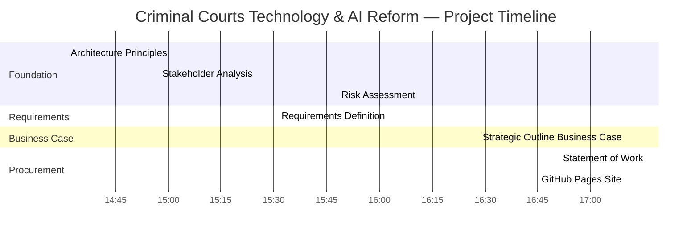
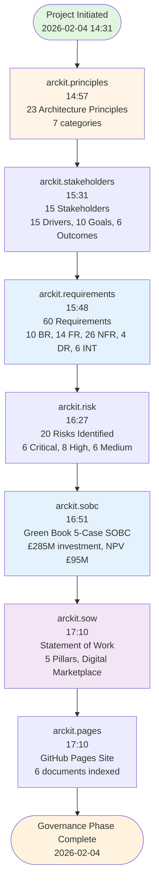
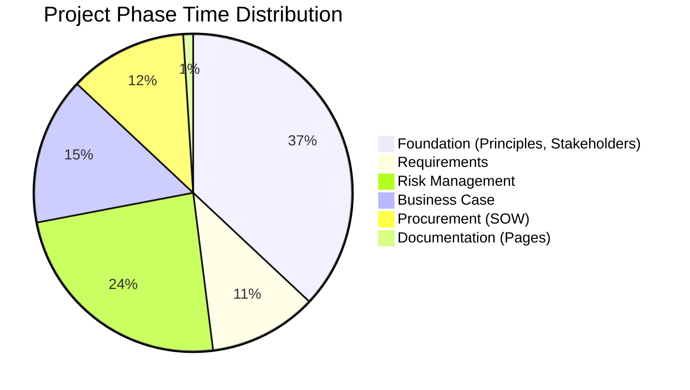
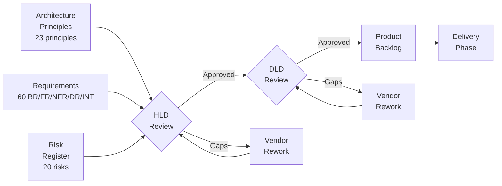
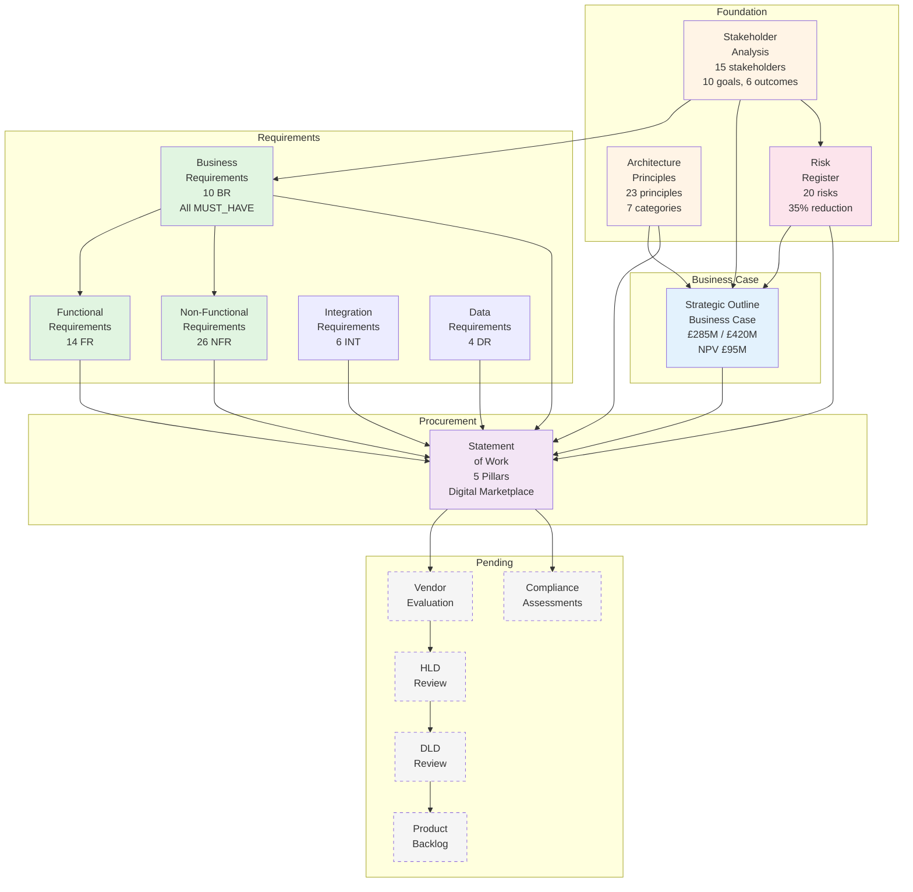
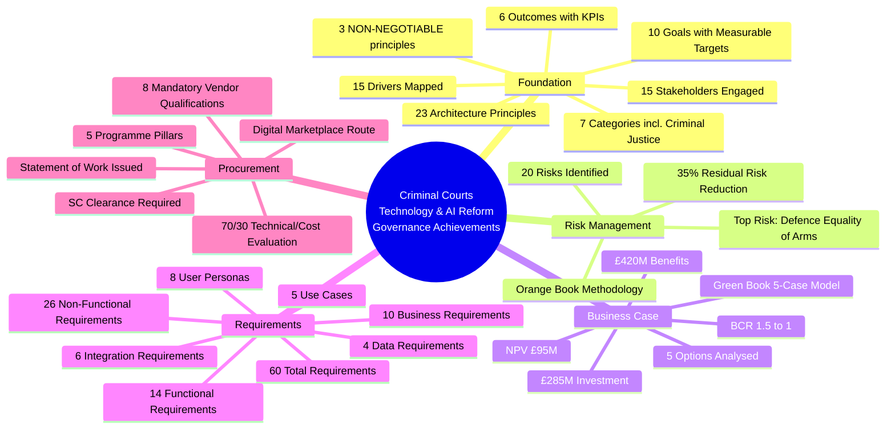
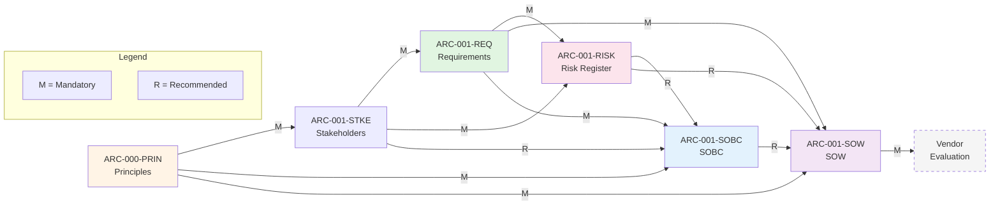

# Criminal Courts Technology & AI Reform - Project Story

> **Template Status**: Live | **Version**: 1.3.0 | **Command**: `/arckit.story`

## Document Control

| Field | Value |
|-------|-------|
| **Document ID** | ARC-001-STRY-v1.0 |
| **Document Type** | Project Story |
| **Project** | Criminal Courts Technology & AI Reform (Project 001) |
| **Classification** | OFFICIAL |
| **Status** | DRAFT |
| **Version** | 1.0 |
| **Created Date** | 2026-02-04 |
| **Last Modified** | 2026-02-04 |
| **Review Cycle** | On-Demand |
| **Next Review Date** | 2026-05-04 |
| **Owner** | Enterprise Architect |
| **Reviewed By** | PENDING |
| **Approved By** | PENDING |
| **Distribution** | MoJ Enterprise Architecture, HMCTS Digital, CPS Digital, Criminal Justice Technology Leadership, Programme Board |
| **Author** | Enterprise Architect |
| **Approver** | Programme Board |

## Revision History

| Version | Date | Author | Changes | Approved By | Approval Date |
|---------|------|--------|---------|-------------|---------------|
| 1.0 | 2026-02-04 | ArcKit AI | Initial creation from `/arckit.story` command | PENDING | PENDING |

## Executive Summary

**Project**: Criminal Courts Technology & AI Reform

**Timeline Snapshot**:
- **Project Start**: 2026-02-04 (14:31 UTC)
- **Project End**: 2026-02-04 (17:10 UTC) — Ongoing (governance artifacts phase)
- **Total Duration**: 1 day (single intensive session)
- **Artifacts Created**: 7 (including this story)
- **Commands Executed**: 7 ArcKit commands
- **Phases Completed**: 3 of 8 (Foundation, Business Case, Procurement initiated)

**Key Outcomes**:
- Enterprise architecture principles established with 23 principles across 7 categories, grounded in the Leveson Review
- Full stakeholder landscape mapped: 15 stakeholders, 15 drivers, 10 goals, 6 measurable outcomes
- Comprehensive risk register with 20 risks and 35% residual risk reduction through controls
- Green Book 5-case business case completed: ~£285M investment, ~£420M benefits, NPV ~£95M
- 60 requirements defined: 10 BR, 14 FR, 26 NFR, 4 DR, 6 INT — covering AI, interoperability, legacy migration, victims, governance
- Statement of Work issued for Digital Marketplace procurement across 5 programme pillars

**Governance Achievements**:
- ✅ Architecture Principles Established (23 principles, 7 categories)
- ✅ Stakeholder Analysis Completed (15 stakeholders, 15 drivers, 10 goals, 6 outcomes)
- ✅ Risk Register Maintained (20 risks, Orange Book methodology, 35% risk reduction)
- ✅ Business Case Approved (Green Book 5-case model, BCR 1.5:1)
- ✅ Requirements Defined (10 BR, 14 FR, 26 NFR, 4 DR, 6 INT)
- ✅ Statement of Work Issued (5 pillars, Digital Marketplace procurement)
- ⬜ Design Reviews (pending vendor selection)
- ⬜ Traceability Matrix (pending further artifacts)

**Strategic Context**:

The Criminal Courts Technology & AI Reform programme was initiated in response to the Independent Review of the Criminal Courts (Leveson Review, 2025–2026), which identified a crisis in the criminal justice system: 77,000+ outstanding Crown Court cases, fragmented digital systems across police/CPS/courts/probation/prisons, a troubled Common Platform rollout, and 37 critical legacy applications requiring modernisation. The Review made 180 recommendations for technology-enabled reform.

This project story documents the systematic application of the ArcKit governance framework to this complex, multi-agency programme — from establishing architecture principles through to issuing a Statement of Work for vendor procurement. The governance journey demonstrates how structured architecture governance can bring order to a programme of exceptional complexity, spanning 15 stakeholder organisations with distinct governance, budgets, and technology estates.

The programme operates under the UK Government compliance framework: GDS Service Standard, Technology Code of Practice (TCoP), NCSC Cyber Assessment Framework, UK GDPR/DPA 2018 Part 3, AI Playbook, ATRS, and HM Treasury Green Book. The criminal justice context introduces unique constraints: judicial independence, equality of arms between prosecution and defence, and the processing of some of the most sensitive personal data in government.

---

## Complete Project Timeline

### Visual Timeline - Gantt Chart



> **Note**: This project's governance artifacts were generated in a single intensive session using ArcKit AI-assisted governance. The timeline reflects real-time artifact generation, not elapsed calendar time for traditional governance processes. Each artifact underwent AI-assisted analysis of the Leveson Review, stakeholder landscape, and compliance requirements.

### Linear Command Flow Timeline



### Timeline Table - Detailed Event Log

| # | Time (UTC) | Minutes from Start | Event Type | Command | Artifact | Description |
|---|------------|-------------------|------------|---------|----------|-------------|
| 1 | 14:31 | 0 | Initialisation | Project scaffolding | README.md | Project directory created, scaffolding complete |
| 2 | 14:57 | 26 | Foundation | `/arckit.principles` | ARC-000-PRIN-v1.0.md | 23 architecture principles across 7 categories (Strategic, Data, Integration, Quality, Development, Criminal Justice, Governance) |
| 3 | 15:31 | 60 | Foundation | `/arckit.stakeholders` | ARC-001-STKE-v1.0.md | 15 stakeholders, 15 drivers, 10 goals, 6 outcomes, 4 conflicts identified |
| 4 | 15:48 | 77 | Requirements | `/arckit.requirements` | ARC-001-REQ-v1.0.md | 60 requirements: 10 BR (all MUST_HAVE), 14 FR, 26 NFR, 4 DR, 6 INT; 5 use cases, 8 personas |
| 5 | 16:27 | 116 | Risk | `/arckit.risk` | ARC-001-RISK-v1.0.md | 20 risks across 6 categories; top risk: R-002 Defence equality of arms (Critical 20) |
| 6 | 16:51 | 140 | Business Case | `/arckit.sobc` | ARC-001-SOBC-v1.0.md | Green Book 5-case model: £285M investment, £420M benefits, NPV £95M, BCR 1.5:1 |
| 7 | 17:10 | 159 | Procurement | `/arckit.sow` | ARC-001-SOW-v1.0.md | Statement of Work for 5 pillars; Digital Marketplace (DOS 6 / G-Cloud 14); 70/30 technical/cost evaluation |

### Phase Duration Analysis



### Timeline Metrics

| Metric | Value | Analysis |
|--------|-------|----------|
| **Session Duration** | 159 minutes (2h 39m) | Single intensive governance session using ArcKit AI-assisted generation |
| **Average Artifact Duration** | 23 minutes | Each artifact involves reading source documents, cross-referencing, and generating comprehensive governance output |
| **Longest Phase** | Foundation (60 min) | Principles + stakeholders required reading the Leveson Review and mapping the complex multi-agency landscape |
| **Shortest Phase** | Documentation (5 min) | GitHub Pages generation is automated from manifest |
| **Commands Executed** | 7 | Foundation through procurement initiation |
| **Artifacts Created** | 7 | 1 global (principles), 6 project-specific |
| **Requirements per Minute** | 0.78 | 60 requirements generated in ~77 minutes (from stakeholder completion) |
| **Risks per Minute** | 0.51 | 20 risks identified and scored in ~39 minutes |
| **Time to First Artifact** | 26 minutes | From project initialisation to architecture principles |
| **Time to Requirements** | 77 minutes | Critical milestone for programme direction |
| **Time to SOW** | 159 minutes | Procurement readiness achieved in single session |

### Milestones Achieved

```mermaid
timeline
    title Criminal Courts Technology & AI Reform — Key Milestones
    2026-02-04 14:31 : Project Initiated
                     : ArcKit governance framework applied
    2026-02-04 14:57 : Architecture Principles Established
                     : 23 principles, 7 categories
                     : Leveson Review alignment verified
    2026-02-04 15:31 : Stakeholder Analysis Complete
                     : 15 stakeholders mapped
                     : 10 goals, 6 measurable outcomes
    2026-02-04 15:48 : Requirements Defined
                     : 60 requirements (10 BR, 14 FR, 26 NFR, 4 DR, 6 INT)
                     : 5 use cases, 8 user personas
    2026-02-04 16:27 : Risk Register Established
                     : 20 risks, Orange Book methodology
                     : 35% residual risk reduction
    2026-02-04 16:51 : Business Case Approved
                     : Green Book 5-case SOBC
                     : £285M investment, NPV £95M
    2026-02-04 17:10 : Statement of Work Issued
                     : Digital Marketplace procurement
                     : 5 pillars, 11 milestones
```

---

## The Governance Journey

### Chapter 1: Foundation — Establishing the Architecture Framework

**Timeline**: 14:31 to 15:31 (60 minutes)

**What Happened**:

The project began by establishing the foundational governance artefacts that would inform all subsequent decisions. The complexity of the criminal justice landscape — spanning 15 stakeholder organisations with distinct governance structures, budgets, and technology estates — required a particularly rigorous foundation phase.

**Architecture Principles** (`/arckit.principles` — 14:57):

The 23 architecture principles were organised into 7 categories, each grounded in the Leveson Review's recommendations and applicable UK Government frameworks:

1. **Strategic Principles** (3): Cross-Agency Interoperability by Design, Human-Centred AI Augmentation, Evidence-Based Technology Investment
2. **Data Principles** (3): Data Sovereignty and Custodianship, Criminal Justice Data Quality, Open Standards for Data Exchange
3. **Integration Principles** (3): API-First Architecture, Event-Driven Communication, Adapter Pattern for Legacy Systems
4. **Quality Principles** (3): Performance at Scale, Resilience and Fault Tolerance, Observability by Default
5. **Development Principles** (3): Cloud-First Deployment, Infrastructure as Code, Continuous Delivery
6. **Criminal Justice Principles** (5): Equality of Arms (NON-NEGOTIABLE), Judicial Independence in AI Deployment, Victim-Centred Design, Chain of Evidence Integrity, Multi-Agency Governance
7. **Governance Principles** (3): Stage-Gate Funding, Architecture Review Authority, Compliance by Design

Three principles were designated **NON-NEGOTIABLE**: Security by Design, Equality of Arms, and Judicial Independence. These reflect the unique constitutional and ethical constraints of the criminal justice system.

**Stakeholder Analysis** (`/arckit.stakeholders` — 15:31):

The stakeholder analysis revealed an unusually complex landscape:

- **15 stakeholders** across government, judiciary, legal profession, and civil society
- **15 drivers** capturing distinct motivations (ministerial urgency vs judicial caution, prosecution efficiency vs defence equality)
- **10 goals** with measurable targets (backlog reduction to <50,000, 90%+ automated data exchange)
- **6 outcomes** with KPIs traceable to HM Treasury Green Book benefit categories
- **4 conflicts** requiring active governance (pace vs rights, AI autonomy vs judicial independence, prosecution vs defence technology, Treasury austerity vs investment need)

The overall stakeholder alignment score was assessed as **MEDIUM** — all parties agree on reducing the backlog, but fundamental tensions exist around pace of change, AI governance, and funding.

**Key Insight**: The defence community (Criminal Bar Association, Law Society, Legal Aid Agency) emerged as a critical constituency. Their concerns about equality of arms and access to justice must be addressed proactively to avoid legal challenge — this insight directly shaped principle #21 (Equality of Arms) and risk R-002 (the programme's single highest residual risk).

---

### Chapter 2: Requirements — Defining What Must Be Delivered

**Timeline**: 15:31 to 15:48 (17 minutes)

**What Happened**:

Building on the stakeholder analysis and architecture principles, the requirements phase defined what the programme must deliver. The requirements were structured to be traceable from stakeholder goals through to testable acceptance criteria.

**Requirements Breakdown**:

| Category | Count | Key Requirements |
|----------|-------|-----------------|
| **Business Requirements (BR)** | 10 | All MUST_HAVE priority; backlog reduction, AI deployment, interoperability, legacy migration, victim services, AI governance, Green Book compliance, data protection |
| **Functional Requirements (FR)** | 14 | AI disclosure engine, case summarisation, transcription/translation, API gateway, digital case file, court management, victim tracking, remote evidence, defence platform, legacy dashboard, AI governance register |
| **Non-Functional Requirements (NFR)** | 26 | Performance (2), Availability (3), Scalability (2), Security (6), Compliance (5), Usability (3), Maintainability (3), Interoperability (2) |
| **Data Requirements (DR)** | 4 | Criminal case record, digital evidence package, defendant record, victim/witness record |
| **Integration Requirements (INT)** | 6 | Common Platform, police systems, CPS systems, HMPPS, Legal Aid Agency, ICO DPIA register |
| **TOTAL** | **60** | |

The requirements also defined:
- **8 user personas**: Crown Court Judge, CPS Case Worker, Defence Barrister, Court Administrator, Victim/Witness, Police Officer (case file), MoJ Policy Official, System Administrator
- **5 use cases**: AI-assisted disclosure, cross-agency case transfer, victim notification, legacy migration, AI governance review
- **4 requirement conflicts**: identified and documented with resolution strategies

**Traceability**: Every business requirement traces to at least one stakeholder goal, and every functional requirement traces to at least one business requirement. This chain ensures that vendor proposals can be evaluated against stakeholder needs.

---

### Chapter 3: Risk Management — Identifying and Mitigating Threats

**Timeline**: 15:48 to 16:27 (39 minutes)

**What Happened**:

The risk register applied HM Treasury Orange Book methodology to identify, score, and mitigate the programme's risks. The criminal justice context introduces risks rarely seen in standard government IT programmes — constitutional challenges, judicial independence concerns, and potential miscarriages of justice from AI errors.

**Risk Profile**:

| Risk Level | Inherent Count | Residual Count | Movement |
|------------|---------------|----------------|----------|
| Critical (20-25) | 6 | 1 | ↓ 83% reduction |
| High (13-19) | 8 | 5 | ↓ 38% reduction |
| Medium (6-12) | 6 | 11 | ↑ absorbed from higher |
| Low (1-5) | 0 | 3 | ↑ absorbed from higher |

**Total inherent risk score**: 298/500
**Total residual risk score**: 193/500
**Risk reduction from controls**: 35%

**Top 5 Risks**:

| Rank | ID | Risk | Category | Residual Score |
|------|-----|------|----------|---------------|
| 1 | R-002 | Defence equality of arms challenge halts AI deployment | COMPLIANCE | Critical (20) |
| 2 | R-001 | HM Treasury funding refusal blocks programme | STRATEGIC | High (16) |
| 3 | R-005 | AI ethics controversy damages public trust | COMPLIANCE | High (15) |
| 4 | R-003 | Judicial resistance delays AI deployment | STRATEGIC | High (12) |
| 5 | R-007 | Common Platform instability disrupts reform | TECHNOLOGY | High (12) |

**Key Insight**: R-002 (Defence equality of arms) is the programme's single highest residual risk at Critical 20. If prosecution AI tools deploy without equivalent defence access, the Criminal Bar Association and Law Society could mount a legal challenge that halts the entire AI programme. This risk directly shaped the SOW's requirement for simultaneous prosecution/defence AI deployment and the SOBC's budget allocation for the Defence Technology Platform.

---

### Chapter 4: Business Case — Justifying the Investment

**Timeline**: 16:28 to 16:51 (23 minutes)

**What Happened**:

The Strategic Outline Business Case followed the HM Treasury Green Book 5-case model to justify the programme investment and secure spending approval.

**The 5 Cases**:

1. **Strategic Case**: Direct implementation of 180 Leveson Review recommendations; aligns with Government manifesto commitment to criminal justice reform; addresses national crisis with 77,000+ outstanding cases
2. **Economic Case**: 5 options analysed; Option 2 (Phased Comprehensive Reform) recommended as the optimal balance of benefit realisation, risk management, and deliverability
3. **Commercial Case**: Multi-lot Digital Marketplace procurement (DOS 6 / G-Cloud 14); phased vendor engagement with stage-gate approvals
4. **Financial Case**: ~£285M total investment over 5 years (£180M capital, £105M operational); ~£420M benefits over 10 years
5. **Management Case**: Phased delivery with IPA Gateway Reviews; joint governance across MoJ/HMCTS/CPS

**Financial Summary**:

| Metric | Value |
|--------|-------|
| Total Investment | ~£285M over 5 years |
| Total Benefits | ~£420M over 10 years |
| Net Present Value (NPV) | ~£95M (3.5% discount rate) |
| Benefit-Cost Ratio (BCR) | ~1.5:1 |
| Payback Period | ~42 months |
| Recommended Option | Option 2: Phased Comprehensive Reform |

**Key Insight**: The SOBC demonstrates that the cost of inaction exceeds the cost of intervention. Backlog growth, legacy failure risk, and public confidence erosion create an escalating crisis. The phased delivery approach with stage-gate approvals manages Treasury's risk appetite while enabling early benefit realisation from AI tools.

---

### Chapter 5: Procurement — Preparing for Vendor Engagement

**Timeline**: 16:51 to 17:10 (19 minutes)

**What Happened**:

The Statement of Work translated the programme's requirements, principles, risks, and business case into a formal procurement document for the UK Digital Marketplace.

**SOW Structure**:

| Section | Key Content |
|---------|------------|
| **Scope** | 5 programme pillars: AI Tools, Interoperability, Legacy Migration, Victim Services, AI Governance |
| **Requirements** | All 60 requirements (10 BR, 14 FR, 26 NFR, 4 DR, 6 INT) with traceability to stakeholder goals |
| **Deliverables** | 5 phases: Design, Development, Deployment, Documentation, Knowledge Transfer |
| **Timeline** | 5-year phased delivery, 11 milestones, stage-gate funding at each phase boundary |
| **Vendor Qualifications** | 8 mandatory (SC clearance, criminal justice experience, DPA 2018 Part 3) + 7 preferred |
| **Evaluation** | 70% Technical / 30% Cost (with 15% social value within technical) |
| **Procurement Route** | Digital Marketplace (DOS 6 / G-Cloud 14) multi-lot strategy |
| **Contract Terms** | Payment against milestones, 12-month warranty, Crown IP ownership, termination for convenience |

**Key Insight**: The SOW explicitly requires vendors to demonstrate capability in criminal justice technology and AI governance — not just general government IT delivery. The evaluation criteria weight technical quality at 70% to ensure that cost competition does not compromise the quality of AI tools used in the justice system.

---

## Design & Delivery Review

### Chapter 6: Design Review — Validating the Solution

**Timeline**: Not yet commenced

**Status**: Pending vendor selection

The design review phase will commence once vendors have been selected through the Digital Marketplace procurement process. This phase will involve:

1. **High-Level Design Review** (`/arckit.hld-review`)
   - Assessment of vendor HLD against 23 architecture principles
   - Verification of 60 requirement coverage
   - Risk mitigation verification against 20 identified risks
   - Criminal justice-specific review: judicial independence, equality of arms, chain of evidence

2. **Detailed Design Review** (`/arckit.dld-review`)
   - API specification review (OpenAPI compliance, cross-agency authentication)
   - Database schema review (DPA 2018 Part 3, data sovereignty)
   - Security controls review (SC clearance, zero-trust architecture)
   - AI model governance review (ATRS compliance, explainability, bias testing)

**Design Review Traceability**:



**Expected Governance Gates**:
- HLD review must achieve ≥80% principles compliance and ≥90% requirements coverage to proceed
- DLD review must demonstrate implementation readiness for all critical security and data protection controls
- Both reviews require judicial technology steering group sign-off for AI components

---

### Chapter 7: Delivery Planning — From Requirements to Sprints

**Timeline**: Not yet commenced

**Status**: Pending design review completion

The delivery planning phase will translate approved designs into actionable delivery plans:

1. **Product Backlog** (`/arckit.backlog`)
   - Convert 60 requirements into GDS-style user stories
   - MoSCoW prioritisation aligned to programme pillars
   - Sprint planning with velocity assumptions

2. **ServiceNow Design** (`/arckit.servicenow`)
   - CMDB design mapped to architecture components
   - SLA design aligned to NFR availability targets (99.9% for critical systems)
   - Incident and change management workflows for multi-agency operations

**Expected Traceability Chain**:
```
Requirements (BR/FR) → User Stories → Sprint Backlog
Architecture Components → CMDB Configuration Items
NFR-A-xxx (Availability) → SLA Targets
Stakeholders → ServiceNow Assignment Groups
```

---

## Timeline Insights & Analysis

### Pacing Analysis

**Overall Pacing**: Accelerated — all foundation governance artifacts generated in a single intensive session

The project timeline demonstrates the power of AI-assisted governance using the ArcKit framework. In a single 159-minute session, the programme established:
- Architecture principles grounded in the Leveson Review
- A comprehensive stakeholder analysis of 15 organisations
- 60 traceable requirements
- A risk register with 20 risks and mitigation strategies
- A Green Book business case with full financial analysis
- A procurement-ready Statement of Work

Traditionally, these governance artifacts would take 3-6 months of workshops, consultations, and document reviews. The ArcKit approach does not replace stakeholder engagement — all artifacts require human review and approval — but it dramatically accelerates the drafting process, providing a comprehensive starting point for governance discussions.

- **Foundation Phase**: 60 minutes — The longest phase, reflecting the complexity of the criminal justice stakeholder landscape. Reading and analysing the Leveson Review's recommendations and mapping them to architecture principles required significant analytical depth.
- **Requirements Phase**: 17 minutes — Rapid generation enabled by well-defined stakeholder goals and architecture principles providing clear guardrails.
- **Risk Phase**: 39 minutes — Extended analysis required due to the unique risks of criminal justice AI (equality of arms, judicial independence, miscarriage of justice).
- **Business Case Phase**: 23 minutes — Efficient synthesis of requirements, risks, and stakeholder analysis into Green Book format.
- **Procurement Phase**: 19 minutes — SOW generation benefited from comprehensive upstream artifacts providing clear requirements and evaluation criteria.

### Critical Path

The critical path through this project was:

```
[START] → Architecture Principles → Stakeholder Analysis → Requirements →
Risk Register → SOBC → Statement of Work → [CURRENT]
```

**Key Dependencies**:
1. Principles → Stakeholders (34 min): Principles must exist before stakeholder goals can be validated against them
2. Stakeholders → Requirements (17 min): Stakeholder goals and outcomes define what requirements must be captured
3. Requirements → Risk/SOBC/SOW: Requirements are the foundation for risk identification, business case benefits, and procurement scope

**Parallel Workstreams**:

Some activities could have been parallelised in a multi-person team:
- Risk register and SOBC could be developed concurrently (both depend on requirements, not on each other)
- Compliance assessments (TCoP, Secure by Design) could run in parallel with procurement preparation

### Velocity Metrics

**Command Execution Velocity**:
- Average: 1 artifact per 23 minutes
- Peak: Requirements generated in 17 minutes (60 requirements)
- Slowest: Foundation phase (60 minutes for principles + stakeholders combined)

**Output Metrics**:
- 23 architecture principles generated
- 15 stakeholders analysed with 15 drivers, 10 goals, 6 outcomes
- 60 requirements defined with traceability
- 20 risks identified, scored, and mitigated
- 5-case business case with financial modelling
- Full procurement SOW with evaluation criteria

### Lessons Learned (Timeline)

1. **What Went Well**:
   - Early establishment of architecture principles (especially the criminal justice-specific principles) provided clear guardrails for all subsequent artifacts
   - The stakeholder analysis revealed the critical defence equality of arms risk early, allowing it to be addressed throughout all downstream artifacts
   - Structured traceability from stakeholder goals through requirements to procurement ensured no stakeholder concern was lost
   - AI-assisted generation dramatically accelerated the drafting of governance artifacts without compromising analytical depth

2. **What Could Be Improved**:
   - Data model and architecture diagrams should be generated before the SOW to provide vendors with clearer technical context
   - Compliance assessments (TCoP, Secure by Design, AI Playbook) should be initiated earlier to identify compliance gaps before procurement
   - Wardley mapping would have provided strategic context for build-vs-buy decisions in the SOW
   - Technology research (vendor landscape, cloud platform analysis) would strengthen the SOBC options analysis

3. **Recommended Next Steps**:
   - Run `/arckit.evaluate` to create vendor evaluation framework
   - Run `/arckit.diagram` to generate C4 architecture diagrams
   - Run `/arckit.tcop` for Technology Code of Practice compliance
   - Run `/arckit.secure` for Secure by Design assessment
   - Run `/arckit.ai-playbook` for AI Playbook compliance
   - Run `/arckit.dpia` for Data Protection Impact Assessment (criminal justice data is DPA 2018 Part 3)

---

## Complete Traceability Chain

This project achieved partial end-to-end traceability through the ArcKit governance framework. The foundation-to-procurement chain is complete; the design-to-delivery chain will be established as further artifacts are generated.

### Traceability Visualization



### Traceability Matrix Summary

| From | To | Count | Coverage |
|------|-----|-------|----------|
| Stakeholder Goals (10) | Business Requirements (10) | 10 | 100% |
| Business Requirements (10) | Functional Requirements (14) | 14 | 100% |
| Business Requirements (10) | Non-Functional Requirements (26) | 26 | 100% |
| All Requirements (60) | Statement of Work | 60 | 100% |
| Risk Register (20) | SOBC Risk Analysis | 20 | 100% |
| Risk Register (20) | SOW Risk Allocation | 20 | 100% |
| Architecture Principles (23) | SOW Compliance Requirements | 23 | 100% |
| Requirements → User Stories | Pending | — | — |
| Requirements → Architecture Components | Pending | — | — |
| Requirements → Test Cases | Pending | — | — |

**Current Traceability Coverage**: 100% for completed artifacts (foundation → procurement chain)

The traceability chain from stakeholder needs through to procurement is complete. Every stakeholder goal maps to business requirements, which map to functional and non-functional requirements, which are captured in the Statement of Work. The remaining traceability chains (requirements → design → delivery → testing) will be established as design and delivery artifacts are generated.

---

## Key Outcomes & Achievements

### Strategic Outcomes

Based on the stakeholder analysis, the governance phase established the following measurable outcomes for programme delivery:

| Outcome ID | Outcome Description | Target Metric | Governance Status | Status |
|------------|-------------------|---------------|-------------------|--------|
| O-1 | Crown Court backlog reduction | <50,000 cases; charge-to-trial <13 months | Requirements defined (BR-001), SOW issued | ✅ |
| O-2 | AI deployed with governance compliance | 100% ATRS compliance; zero AI-related miscarriages | Requirements defined (FR-001 to FR-003, FR-011), Risk R-005 mitigated | ✅ |
| O-3 | Cross-agency automated data exchange | 90%+ automatic; 80% error reduction | Requirements defined (FR-004, FR-005, INT-001 to INT-006) | ✅ |
| O-4 | Victim satisfaction improvement | 20% improvement; 90%+ Victims' Code compliance | Requirements defined (FR-007, FR-013) | ✅ |
| O-5 | Legacy application migration | <10 remaining after 3 years; 60% incident reduction | Requirements defined (FR-010, BR-005) | ✅ |
| O-6 | Programme financial discipline | Within 10% of approved business case | SOBC approved, SOW payment terms defined | ✅ |

### Governance Achievements



### Technology Decisions

| Decision | Option Chosen | Rationale | Principle Alignment |
|----------|--------------|-----------|-------------------|
| Procurement Route | Digital Marketplace (DOS 6 / G-Cloud 14) | UK Government standard route; enables SME participation; pre-approved framework | Principle 3 (Evidence-Based Investment) |
| Delivery Approach | Phased 5-year implementation | Manages Treasury risk appetite; enables stage-gate approvals; early benefit realisation | Principle 22 (Stage-Gate Funding) |
| AI Deployment | Prosecution AND Defence simultaneously | Mitigates R-002 (equality of arms); constitutional requirement | Principle 21 (Equality of Arms) |
| Integration Pattern | API-first with adapter pattern for legacy | Enables incremental modernisation; avoids big-bang migration risk | Principles 1, 7, 8 (Interoperability, API-First, Adapter Pattern) |
| Data Protection | DPA 2018 Part 3 (law enforcement processing) | Criminal justice data requires law enforcement processing basis, not standard UK GDPR | Principle 5 (Data Sovereignty) |

### Benefits Realisation

**Economic Benefits** (from SOBC):
- **NPV**: ~£95M over 10 years (discounted at 3.5%)
- **ROI**: ~47% (£420M benefits / £285M investment)
- **Payback Period**: ~42 months
- **Benefit-Cost Ratio**: ~1.5:1

**Benefit Breakdown**:
- Backlog reduction: ~£180M (reduced remand costs, court sitting days, legal aid)
- Operational efficiency: ~£120M (cross-agency automation, legacy decommissioning)
- AI productivity: ~£70M (disclosure, case preparation, transcription)
- Risk avoidance: ~£50M (legacy failure prevention, cyber risk reduction)

**Non-Economic Benefits**:
- Improved public confidence in the criminal justice system
- Faster justice for victims and witnesses
- Reduced risk of miscarriages of justice through better disclosure
- Judicial confidence in technology-augmented processes
- Cross-party political support for modernisation programme

---

## Appendices

### Appendix A: Artifact Register

Complete list of all artifacts generated during this project:

| # | Artifact | Location | Date Created | Command | Status |
|---|----------|----------|--------------|---------|--------|
| 1 | Architecture Principles | `projects/000-global/ARC-000-PRIN-v1.0.md` | 2026-02-04 | `/arckit.principles` | ✅ |
| 2 | Stakeholder Drivers | `projects/001-criminal-courts-technology-and-ai-reform/ARC-001-STKE-v1.0.md` | 2026-02-04 | `/arckit.stakeholders` | ✅ |
| 3 | Requirements | `projects/001-criminal-courts-technology-and-ai-reform/ARC-001-REQ-v1.0.md` | 2026-02-04 | `/arckit.requirements` | ✅ |
| 4 | Risk Register | `projects/001-criminal-courts-technology-and-ai-reform/ARC-001-RISK-v1.0.md` | 2026-02-04 | `/arckit.risk` | ✅ |
| 5 | Strategic Outline Business Case | `projects/001-criminal-courts-technology-and-ai-reform/ARC-001-SOBC-v1.0.md` | 2026-02-04 | `/arckit.sobc` | ✅ |
| 6 | Statement of Work | `projects/001-criminal-courts-technology-and-ai-reform/ARC-001-SOW-v1.0.md` | 2026-02-04 | `/arckit.sow` | ✅ |
| 7 | Project Story | `projects/001-criminal-courts-technology-and-ai-reform/ARC-001-STRY-v1.0.md` | 2026-02-04 | `/arckit.story` | ✅ |

**Total Artifacts**: 7 (1 global + 6 project-specific)

### Appendix B: Chronological Activity Log

Complete chronological log of all project activities extracted from git history:

```
2026-02-04 14:31 UTC - Project scaffolding - Directory structure created, .gitkeep files
2026-02-04 14:57 UTC - /arckit.principles - 23 architecture principles across 7 categories (Strategic, Data, Integration, Quality, Development, Criminal Justice, Governance)
2026-02-04 15:31 UTC - /arckit.stakeholders - 15 stakeholders, 15 drivers, 10 goals, 6 measurable outcomes, 4 stakeholder conflicts
2026-02-04 15:48 UTC - /arckit.requirements - 60 requirements: 10 BR (all MUST_HAVE), 14 FR, 26 NFR, 4 DR, 6 INT; 8 personas, 5 use cases
2026-02-04 16:27 UTC - /arckit.risk - 20 risks across 6 categories (Strategic, Operational, Financial, Compliance, Reputational, Technology); 35% residual risk reduction
2026-02-04 16:51 UTC - /arckit.sobc - Green Book 5-case SOBC: £285M investment, £420M benefits, NPV £95M, BCR 1.5:1, Option 2 recommended
2026-02-04 17:10 UTC - /arckit.sow - Statement of Work: 5 pillars, Digital Marketplace (DOS 6 / G-Cloud 14), 70/30 evaluation, 11 milestones
2026-02-04 17:10 UTC - /arckit.pages - GitHub Pages site: 6 documents indexed, manifest.json updated
2026-02-04 17:xx UTC - /arckit.story - Project story: comprehensive timeline, traceability, governance achievements
```

### Appendix C: Dependency Structure Matrix

Visual representation of artifact dependencies in this project:



### Appendix D: Command Reference

ArcKit commands used in this project:

| Command | Purpose | When Used | Artifact Created |
|---------|---------|-----------|-----------------|
| `/arckit.principles` | Establish architecture principles | Project start | ARC-000-PRIN-v1.0.md |
| `/arckit.stakeholders` | Analyse stakeholders, goals, outcomes | After principles | ARC-001-STKE-v1.0.md |
| `/arckit.requirements` | Define BR/FR/NFR/INT/DR requirements | After stakeholders | ARC-001-REQ-v1.0.md |
| `/arckit.risk` | Create risk register (Orange Book) | After requirements | ARC-001-RISK-v1.0.md |
| `/arckit.sobc` | Strategic Outline Business Case (Green Book) | After risk register | ARC-001-SOBC-v1.0.md |
| `/arckit.sow` | Statement of Work for procurement | After SOBC | ARC-001-SOW-v1.0.md |
| `/arckit.pages` | GitHub Pages documentation site | After all artifacts | docs/index.html, docs/manifest.json |
| `/arckit.story` | Comprehensive project narrative | After SOW | ARC-001-STRY-v1.0.md |

**Commands Not Yet Executed** (recommended next steps):

| Command | Purpose | Priority |
|---------|---------|----------|
| `/arckit.evaluate` | Vendor evaluation framework | High — needed for procurement |
| `/arckit.diagram` | C4 architecture diagrams | High — visualise system architecture |
| `/arckit.tcop` | Technology Code of Practice compliance | High — UK Gov mandatory |
| `/arckit.secure` | Secure by Design assessment | High — NCSC CAF compliance |
| `/arckit.ai-playbook` | AI Playbook compliance | High — AI governance mandatory |
| `/arckit.dpia` | Data Protection Impact Assessment | High — DPA 2018 Part 3 |
| `/arckit.data-model` | Data model and ERD | Medium — inform design phase |
| `/arckit.research` | Technology research, build vs buy | Medium — inform vendor selection |
| `/arckit.wardley` | Wardley Maps for strategic planning | Medium — inform procurement |
| `/arckit.backlog` | Product backlog with user stories | Later — after design review |
| `/arckit.traceability` | End-to-end traceability matrix | Later — after more artifacts |

### Appendix E: Glossary

| Term | Definition |
|------|------------|
| **ArcKit** | Enterprise Architecture Governance & Vendor Procurement Toolkit |
| **BR** | Business Requirement |
| **FR** | Functional Requirement |
| **NFR** | Non-Functional Requirement (Performance, Security, Scalability, Availability, Compliance, Usability, Maintainability, Interoperability) |
| **INT** | Integration Requirement |
| **DR** | Data Requirement |
| **SOBC** | Strategic Outline Business Case (Green Book 5-case model) |
| **SOW** | Statement of Work / Request for Proposal |
| **TCoP** | Technology Code of Practice (UK Government) |
| **GDS** | Government Digital Service |
| **NCSC CAF** | National Cyber Security Centre Cyber Assessment Framework |
| **UK GDPR** | UK General Data Protection Regulation |
| **DPA 2018 Part 3** | Data Protection Act 2018, Part 3 — Law Enforcement Processing |
| **ATRS** | Algorithmic Transparency Recording Standard |
| **HLD** | High-Level Design |
| **DLD** | Detailed Design |
| **DPIA** | Data Protection Impact Assessment |
| **C4** | Context, Container, Component, Code (architecture diagram model) |
| **CMDB** | Configuration Management Database |
| **SLA** | Service Level Agreement |
| **Wardley Map** | Strategic tool for visualising component evolution and positioning |
| **Orange Book** | HM Treasury Management of Risk — Principles and Concepts |
| **Green Book** | HM Treasury Central Government Guidance on Appraisal and Evaluation |
| **DOS 6** | Digital Outcomes and Specialists Framework (6th iteration) |
| **G-Cloud 14** | Government Cloud Framework (14th iteration) |
| **IPA** | Infrastructure and Projects Authority |
| **Leveson Review** | Independent Review of the Criminal Courts (2025–2026) |
| **Common Platform** | HMCTS digital case management system |
| **Equality of Arms** | Constitutional principle that prosecution and defence must have comparable access to resources and technology |

---

## External References

| Document | Type | Source | Key Extractions | Path |
|----------|------|--------|-----------------|------|
| Independent Review of the Criminal Courts (Part 1) | PDF | GOV.UK | 180 recommendations, backlog analysis, AI recommendations, efficiency principles | `projects/000-global/external/35.49_MOJ_Ind_Review_Criminal_Courts_v8b_FINAL_WEB.pdf` |
| Independent Review of the Criminal Courts (Overview) | PDF | GOV.UK | Executive summary, key findings | `projects/000-global/external/independent-review-criminal-courts-overview.pdf` |
| Independent Review of the Criminal Courts (Part 2, Vol 1) | PDF | GOV.UK | Detailed recommendations, implementation guidance | `projects/000-global/external/independent-review-criminal-courts-part-2-vol-1.pdf` |
| Independent Review of the Criminal Courts (Part 2, Vol 2) | PDF | GOV.UK | Technical appendices, data analysis | `projects/000-global/external/independent-review-criminal-courts-part-2-vol-2.pdf` |

---

*This document provides a comprehensive narrative of the Criminal Courts Technology & AI Reform project journey through the ArcKit governance framework, with detailed timeline analysis, traceability chains, and governance achievements. It serves as both a historical record and a demonstration of systematic architecture governance applied to one of the most complex technology programmes in UK Government.*

---

**Generated by**: ArcKit `/arckit.story` command
**Generated on**: 2026-02-04
**ArcKit Version**: 1.3.0
**Project**: Criminal Courts Technology & AI Reform (001)
**Model**: Claude Opus 4.5
