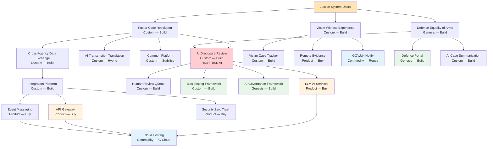

# Wardley Map: Criminal Courts Technology & AI Reform — Current State & Procurement Strategy

> **Template Origin**: Official | **ArcKit Version**: 1.5.0 | **Command**: `/arckit.wardley`

## Document Control

| Field | Value |
|-------|-------|
| **Document ID** | ARC-001-WARD-001-v1.0 |
| **Document Type** | Wardley Map |
| **Project** | Criminal Courts Technology & AI Reform (Project 001) |
| **Classification** | OFFICIAL |
| **Status** | DRAFT |
| **Version** | 1.0 |
| **Created Date** | 2026-03-16 |
| **Last Modified** | 2026-03-16 |
| **Review Cycle** | Quarterly |
| **Next Review Date** | 2026-04-15 |
| **Owner** | MoJ Chief Digital and Information Officer |
| **Reviewed By** | PENDING |
| **Approved By** | PENDING |
| **Distribution** | MoJ Enterprise Architecture, HMCTS Digital, CPS Digital, HMPPS Digital, Programme Board |

## Revision History

| Version | Date | Author | Changes | Approved By | Approval Date |
|---------|------|--------|---------|-------------|---------------|
| 1.0 | 2026-03-16 | ArcKit AI | Initial creation from `/arckit:wardley` command | PENDING | PENDING |

---

## Map Visualization

**View this map**: Paste the map code below into [https://create.wardleymaps.ai](https://create.wardleymaps.ai)

```wardley
title Criminal Courts Technology & AI Reform — Current State & Procurement Strategy

anchor Justice System Users [0.97, 0.63]
annotation 1 [0.62, 0.18] HIGH-RISK AI — Human oversight mandatory
annotation 2 [0.30, 0.88] Commodity — use GOV.UK services and cloud utility
annotation 3 [0.78, 0.32] Criminal justice AI — build custom, strategic differentiator
note G-Cloud for commodity/product; DOS Outcomes for custom/genesis [0.12, 0.15]

component Justice System Users [0.97, 0.63]
component Faster Case Resolution [0.94, 0.28]
component Victim Witness Experience [0.91, 0.30]
component Defence Equality of Arms [0.88, 0.18]

component AI Disclosure Review [0.82, 0.25]
component AI Transcription Translation [0.79, 0.35]
component AI Case Summarisation [0.76, 0.30]
component Victim Case Tracker [0.73, 0.32]
component Cross-Agency Data Exchange [0.70, 0.28]

component Common Platform [0.68, 0.42]
component Defence Practitioner Portal [0.66, 0.22]
component AI Governance Framework [0.64, 0.20]
component Remote Evidence Facilities [0.62, 0.55]

component Cross-Agency Integration Platform [0.58, 0.35]
component Human Review Queue [0.56, 0.38]
component Bias Testing Framework [0.54, 0.25]
component Legacy Migration Service [0.52, 0.30]
component Criminal Justice Data Standards [0.50, 0.28]

component Event-Driven Messaging [0.45, 0.62]
component API Gateway [0.43, 0.65]
component LLM AI Services [0.40, 0.68]
component Identity Access Management [0.38, 0.72]
component GOV.UK Design System [0.36, 0.78]
component GOV.UK Notify [0.34, 0.92]

component Container Orchestration [0.28, 0.82]
component Managed Databases [0.25, 0.90]
component Monitoring Observability [0.22, 0.80]
component Security Zero Trust [0.20, 0.70]
component Cloud Hosting [0.15, 0.95]

Justice System Users -> Faster Case Resolution
Justice System Users -> Victim Witness Experience
Justice System Users -> Defence Equality of Arms

Faster Case Resolution -> AI Disclosure Review
Faster Case Resolution -> AI Transcription Translation
Faster Case Resolution -> Common Platform
Faster Case Resolution -> Cross-Agency Data Exchange

Victim Witness Experience -> Victim Case Tracker
Victim Witness Experience -> Remote Evidence Facilities
Victim Witness Experience -> GOV.UK Notify

Defence Equality of Arms -> AI Disclosure Review
Defence Equality of Arms -> Defence Practitioner Portal
Defence Equality of Arms -> AI Case Summarisation

AI Disclosure Review -> LLM AI Services
AI Disclosure Review -> Human Review Queue
AI Disclosure Review -> Bias Testing Framework
AI Disclosure Review -> AI Governance Framework

AI Transcription Translation -> LLM AI Services
AI Transcription Translation -> Human Review Queue

AI Case Summarisation -> LLM AI Services
AI Case Summarisation -> Human Review Queue

Victim Case Tracker -> GOV.UK Notify
Victim Case Tracker -> GOV.UK Design System
Victim Case Tracker -> Cross-Agency Integration Platform

Cross-Agency Data Exchange -> Cross-Agency Integration Platform
Cross-Agency Data Exchange -> Criminal Justice Data Standards
Cross-Agency Data Exchange -> Event-Driven Messaging

Common Platform -> Managed Databases
Common Platform -> Identity Access Management
Common Platform -> API Gateway

Defence Practitioner Portal -> GOV.UK Design System
Defence Practitioner Portal -> Identity Access Management
Defence Practitioner Portal -> LLM AI Services

AI Governance Framework -> Bias Testing Framework
AI Governance Framework -> Monitoring Observability

Cross-Agency Integration Platform -> API Gateway
Cross-Agency Integration Platform -> Event-Driven Messaging
Cross-Agency Integration Platform -> Security Zero Trust
Cross-Agency Integration Platform -> Criminal Justice Data Standards

Human Review Queue -> Identity Access Management
Human Review Queue -> GOV.UK Notify

Legacy Migration Service -> Container Orchestration
Legacy Migration Service -> Managed Databases
Legacy Migration Service -> Cloud Hosting

LLM AI Services -> Cloud Hosting
LLM AI Services -> Security Zero Trust

API Gateway -> Cloud Hosting
API Gateway -> Security Zero Trust

Event-Driven Messaging -> Cloud Hosting
Container Orchestration -> Cloud Hosting
Managed Databases -> Cloud Hosting
Monitoring Observability -> Cloud Hosting

evolve LLM AI Services 0.82 label Commoditising rapidly
evolve AI Disclosure Review 0.45 label Move to product in 24m
evolve Common Platform 0.55 label Stabilise to product
evolve Cross-Agency Integration Platform 0.55 label Mature to product

pipeline AI Disclosure Review [0.82, 0.20, 0.50]

style wardley
```

---

## Evolution Stages Reference

| Stage | Maturity | Characteristics | Strategic Actions |
|-------|----------|-----------------|-------------------|
| **Genesis** (0.00 - 0.25) | Novel, uncertain, rapidly changing | Unique and rare; poorly understood; rapid change; high uncertainty; future value uncertain | R&D focus; accept failure; explore and experiment; build in-house if strategic |
| **Custom** (0.25 - 0.50) | Emerging, growing understanding | Bespoke solutions; artisanal development; competitive advantage; requires significant skill; still evolving rapidly | Invest in differentiation; build custom if competitive advantage; hire specialists |
| **Product** (0.50 - 0.75) | Maturing, good/rental services | Products with feature differentiation; rental models; slower evolution; defined practices; training available | Buy products; compare features; use market leaders; standardize where possible |
| **Commodity** (0.75 - 1.00) | Industrialized, utility | Standardized; volume operations; cost of deviation high; utility services; highly evolved | Use commodity/utility; cloud services; outsource/procure; focus on cost efficiency |

---

## Component Inventory

### User Needs (Top of Map — High Visibility)

| Component | Visibility | Evolution | Stage | Description | Strategic Notes |
|-----------|-----------|-----------|-------|-------------|-----------------|
| Justice System Users | 0.97 | 0.63 | Product | All system users: judges, prosecutors, defence, victims, witnesses, court staff | Anchor — all value chains flow from this |
| Faster Case Resolution | 0.94 | 0.28 | Custom | Reduce 77,000+ Crown Court backlog to < 50,000 in 3 years | Core user need; Genesis/Custom — novel combination of AI + process reform |
| Victim Witness Experience | 0.91 | 0.30 | Custom | Real-time case tracking, Victims' Code compliance, remote evidence | Custom — no existing product meets CJS-specific needs |
| Defence Equality of Arms | 0.88 | 0.18 | Genesis | Defence access to AI tools equivalent to prosecution | Genesis — no precedent globally; constitutionally critical (Article 6 ECHR) |

### Capabilities (Mid-Upper Visibility)

| Component | Visibility | Evolution | Stage | Description | Strategic Notes |
|-----------|-----------|-----------|-------|-------------|-----------------|
| AI Disclosure Review | 0.82 | 0.25 | Custom | AI-assisted evidence disclosure review for prosecution and defence | HIGH-RISK AI; build custom with judicial oversight; ATRS mandatory |
| AI Transcription Translation | 0.79 | 0.35 | Custom | AI transcription of hearings, translation for multilingual proceedings | Custom — CJS-specific terminology; human review mandatory |
| AI Case Summarisation | 0.76 | 0.30 | Custom | AI-generated case summaries for preparation and scheduling | Custom — requires deep CJS domain knowledge |
| Victim Case Tracker | 0.73 | 0.32 | Custom | Real-time case progress notifications for victims and witnesses | Custom — CJS-specific; integrates across agencies |
| Cross-Agency Data Exchange | 0.70 | 0.28 | Custom | Automated data flow between police, CPS, HMCTS, HMPPS, LAA | Custom — no COTS product serves 5+ CJS agencies |
| Common Platform | 0.68 | 0.42 | Custom | HMCTS/CPS court case management system (existing, stabilising) | Custom moving to Product; stabilise before extending |
| Defence Practitioner Portal | 0.66 | 0.22 | Genesis/Custom | Portal for defence solicitors/barristers to access AI tools and case materials | Genesis — no equivalent exists in any jurisdiction |
| AI Governance Framework | 0.64 | 0.20 | Genesis | ATRS registration, DPIA, judicial approval gates, ethics board | Genesis — first criminal justice AI governance framework globally |
| Remote Evidence Facilities | 0.62 | 0.55 | Product | Video link and remote testimony infrastructure in courts | Product — commercial solutions exist; configure for CJS |

### Supporting Components (Mid Visibility)

| Component | Visibility | Evolution | Stage | Description | Strategic Notes |
|-----------|-----------|-----------|-------|-------------|-----------------|
| Cross-Agency Integration Platform | 0.58 | 0.35 | Custom | API-first integration layer connecting 5+ justice agencies | Custom — unique multi-agency topology; evolving toward product |
| Human Review Queue | 0.56 | 0.38 | Custom | Mandatory human-in-the-loop workflow for all AI outputs | Custom — criminal justice-specific review workflow |
| Bias Testing Framework | 0.54 | 0.25 | Custom | Fairness testing across protected characteristics for CJS AI | Custom — domain-specific bias detection for criminal justice |
| Legacy Migration Service | 0.52 | 0.30 | Custom | Tooling and processes for migrating 37 legacy applications | Custom — bespoke per-application; phased approach |
| Criminal Justice Data Standards | 0.50 | 0.28 | Custom | Cross-agency data schema, API specifications, evidence formats | Custom — CJS-specific standards being created |

### Platform Services (Lower-Mid Visibility)

| Component | Visibility | Evolution | Stage | Description | Strategic Notes |
|-----------|-----------|-----------|-------|-------------|-----------------|
| Event-Driven Messaging | 0.45 | 0.62 | Product | Pub/sub messaging for case progression events | Product — AWS SNS/SQS, Azure Service Bus |
| API Gateway | 0.43 | 0.65 | Product | API management, rate limiting, authentication | Product — Kong, AWS API Gateway, Azure APIM |
| LLM AI Services | 0.40 | 0.68 | Product | Large Language Model services for NLP tasks | Product rapidly commoditising — Azure OpenAI, AWS Bedrock |
| Identity Access Management | 0.38 | 0.72 | Product | Authentication, SSO, role-based access control | Product — Auth0, Azure AD, AWS IAM |
| GOV.UK Design System | 0.36 | 0.78 | Commodity | Frontend component library, accessibility patterns | Commodity — mandatory reuse for UK Government |
| GOV.UK Notify | 0.34 | 0.92 | Commodity | Government notification service (SMS, email, letters) | Commodity — mandatory reuse; never build custom |

### Infrastructure (Low Visibility)

| Component | Visibility | Evolution | Stage | Description | Strategic Notes |
|-----------|-----------|-----------|-------|-------------|-----------------|
| Container Orchestration | 0.28 | 0.82 | Commodity | Kubernetes/ECS for microservice deployment | Commodity — managed cloud services |
| Managed Databases | 0.25 | 0.90 | Commodity | PostgreSQL RDS, DynamoDB, Cosmos DB | Commodity — cloud-managed, pay-as-you-go |
| Monitoring Observability | 0.22 | 0.80 | Commodity | Logging, metrics, tracing, alerting | Commodity — CloudWatch, Datadog, Grafana |
| Security Zero Trust | 0.20 | 0.70 | Product | Zero-trust network, encryption, WAF, SIEM | Product — maturing but requires CJS-specific config |
| Cloud Hosting | 0.15 | 0.95 | Commodity | AWS/Azure UK regions, compute, storage, networking | Commodity — utility; G-Cloud procurement |

---

## Evolution Analysis

### Components in Genesis (0.00 - 0.25)

**Novel, unproven, high uncertainty**

| Component | Current Position | Risk | Opportunity | Action |
|-----------|------------------|------|-------------|--------|
| Defence Equality of Arms | 0.18 | No global precedent; constitutional challenge if unmet | First-in-world defence AI parity — sets global standard | Build custom; invest in R&D; simultaneous prosecution-defence deployment |
| AI Governance Framework | 0.20 | No established CJS AI governance model; risk of regulatory gaps | Sets UK criminal justice AI standard; exportable model | Build custom; engage judiciary and ICO from inception |
| Defence Practitioner Portal | 0.22 | User adoption risk from fragmented defence profession (sole practitioners) | Enables constitutional equality of arms | Build custom; extensive user research with defence practitioners |
| Bias Testing Framework | 0.25 | Limited criminal justice-specific fairness testing tools | Builds trust in AI; prevents discriminatory outcomes | Build custom; academic partnerships for CJS fairness metrics |

**Strategic Recommendations**:

- [x] Accept high failure rate for genesis components — iterate rapidly
- [x] Invest in R&D and experimentation (AI governance sandbox)
- [x] Build in-house — these are strategic differentiators with no market alternatives
- [x] Avoid outsourcing core innovation — retain IP and expertise
- [x] Plan for rapid change and iteration — agile delivery

### Components in Custom (0.25 - 0.50)

**Emerging practices, competitive advantage**

| Component | Current Position | Competitive Advantage? | Action |
|-----------|------------------|------------------------|--------|
| AI Disclosure Review | 0.25 | Yes — core programme differentiator; HIGH-RISK AI | Build custom with judicial oversight; DPIA mandatory |
| Faster Case Resolution | 0.28 | Yes — unique combination of AI + process reform | Build custom workflows; no COTS equivalent |
| Cross-Agency Data Exchange | 0.28 | Yes — unique 5-agency topology; no COTS product | Build custom integration; publish open standards |
| Criminal Justice Data Standards | 0.28 | Yes — creates reusable CJS interoperability standard | Build and publish as open standards (TCoP Point 3) |
| Victim Witness Experience | 0.30 | Yes — CJS-specific user needs | Build custom; GOV.UK Notify/Design System for commodity layers |
| AI Case Summarisation | 0.30 | Partial — LLM providers moving toward CJS-capable models | Build custom prompts/fine-tuning on commodity LLM services |
| Legacy Migration Service | 0.30 | No — migration tooling is generic | Build custom migration plans per application; buy tooling |
| Victim Case Tracker | 0.32 | Partial — CJS-specific but notification is commodity | Build custom CJS logic; reuse GOV.UK Notify for delivery |
| AI Transcription Translation | 0.35 | Partial — CJS terminology needs custom models | Hybrid — buy base service, build custom CJS vocabulary |
| Cross-Agency Integration Platform | 0.35 | Yes — unique multi-agency integration | Build custom on product-stage components (API Gateway, messaging) |
| Human Review Queue | 0.38 | Yes — mandatory for criminal justice AI | Build custom — non-negotiable for AI governance compliance |
| Common Platform | 0.42 | Partial — existing system requiring stabilisation | Stabilise existing; evolve toward product maturity |

**Strategic Recommendations**:

- [x] Build custom for strategic differentiators (AI disclosure, cross-agency integration)
- [x] Invest in specialist skills (CJS AI, multi-agency integration)
- [x] Publish Criminal Justice Data Standards as open standards
- [x] Monitor evolution velocity — LLM AI Services moving fast toward commodity
- [x] Build vs Buy decision critical for AI Transcription (hybrid approach recommended)

### Components in Product (0.50 - 0.75)

**Maturing market, feature differentiation**

| Component | Current Position | Market Options | Action |
|-----------|------------------|----------------|--------|
| Remote Evidence Facilities | 0.55 | Pexip, Zoom (Gov), Cloud Video Platform | Buy — mature video conferencing market; configure for courts |
| Event-Driven Messaging | 0.62 | AWS SNS/SQS, Azure Service Bus, RabbitMQ | Buy — commodity pricing; select cloud-native option |
| API Gateway | 0.65 | Kong, AWS API Gateway, Azure APIM, Apigee | Buy — select based on multi-cloud strategy |
| LLM AI Services | 0.68 | Azure OpenAI, AWS Bedrock, Google Vertex AI | Buy — rapidly commoditising; avoid single-vendor lock-in |
| Security Zero Trust | 0.70 | Zscaler, Cloudflare Zero Trust, Azure AD Conditional Access | Buy — configure for CJS sensitivity levels |
| Identity Access Management | 0.72 | Azure AD, Auth0, AWS IAM, Okta | Buy — integrate with existing MoJ identity services |

**Strategic Recommendations**:

- [x] Procure from market leaders via G-Cloud Digital Marketplace
- [x] Compare feature sets and pricing — multi-vendor where possible
- [x] Standardise on common platforms across agencies
- [x] Avoid custom development — no competitive advantage in product-stage components
- [x] RFP process for Remote Evidence Facilities and Security Zero Trust

### Components in Commodity (0.75 - 1.00)

**Industrialized, utility services**

| Component | Current Position | Commodity Provider | Action |
|-----------|------------------|-------------------|--------|
| GOV.UK Design System | 0.78 | GOV.UK (mandatory) | Reuse — never build custom frontend framework |
| Monitoring Observability | 0.80 | AWS CloudWatch, Datadog, Grafana Cloud | Buy via G-Cloud — optimise for cost |
| Container Orchestration | 0.82 | AWS EKS, Azure AKS, GKE | Buy via G-Cloud — managed Kubernetes |
| Managed Databases | 0.90 | AWS RDS, Azure SQL, CosmosDB | Buy via G-Cloud — managed database services |
| GOV.UK Notify | 0.92 | GOV.UK Notify (free government service) | Reuse — mandatory; never build custom notifications |
| Cloud Hosting | 0.95 | AWS (UK regions), Azure (UK regions) | Buy via G-Cloud — utility cloud services |

**Strategic Recommendations**:

- [x] Use commodity/utility services exclusively — never build custom
- [x] Focus on cost efficiency and operational automation
- [x] Use Digital Marketplace (G-Cloud) for all procurement
- [x] GOV.UK Notify and Design System are mandatory reuse — no alternatives
- [x] Automate infrastructure provisioning via Infrastructure as Code (Principle P-17)

---

## Build vs Buy Analysis

### Build (In-House Development)

**Candidates for Building**:

| Component | Evolution Stage | Rationale | Risk | Procurement |
|-----------|----------------|-----------|------|-------------|
| AI Disclosure Review | Custom (0.25) | Core programme differentiator; HIGH-RISK AI requiring CJS-specific controls | High — novel AI in criminal justice context | DOS Outcomes (discovery + build) |
| AI Governance Framework | Genesis (0.20) | No global precedent; requires judicial and ICO co-design | High — regulatory uncertainty | In-house with specialist contractors |
| Defence Practitioner Portal | Genesis (0.22) | No equivalent exists; constitutional equality requirement | High — fragmented user base; adoption risk | DOS Outcomes (user research + build) |
| Human Review Queue | Custom (0.38) | Mandatory for criminal justice AI; no COTS meets requirements | Medium — workflow design complexity | In-house build |
| Bias Testing Framework | Custom (0.25) | CJS-specific fairness metrics; domain expertise required | Medium — academic partnership needed | In-house with university partnerships |
| Cross-Agency Integration Platform | Custom (0.35) | Unique 5-agency topology; no COTS serves CJS | Medium — multi-stakeholder governance complexity | DOS Outcomes (architecture + build) |
| Criminal Justice Data Standards | Custom (0.28) | Establishes reusable CJS interoperability standards | Low — standards creation is well-understood | In-house with cross-agency working group |
| Victim Case Tracker | Custom (0.32) | CJS-specific notification and tracking requirements | Medium — cross-agency data dependency | In-house build on GOV.UK services |
| Legacy Migration Service | Custom (0.30) | Bespoke per-application migration for 37 systems | High — complexity and duration risk | DOS Specialists (migration expertise) |

**Build Criteria Met**:

- Genesis/Custom stage ( < 0.50 evolution)
- Provides competitive advantage or meets constitutional requirements
- Core to programme differentiation
- No suitable market alternatives for criminal justice context
- Strategic IP ownership important (AI governance, data standards)

### Buy (Procurement)

**Candidates for Buying**:

| Component | Evolution Stage | Market Options | Rationale | Procurement Route |
|-----------|----------------|----------------|-----------|-------------------|
| Remote Evidence Facilities | Product (0.55) | Pexip, Zoom Gov, Cloud Video Platform | Mature market; configure for courts | G-Cloud |
| Event-Driven Messaging | Product (0.62) | AWS SNS/SQS, Azure Service Bus | Standard messaging; no CJS differentiation | G-Cloud |
| API Gateway | Product (0.65) | Kong, AWS API Gateway, Azure APIM | Standard API management; cloud-native | G-Cloud |
| LLM AI Services | Product (0.68) | Azure OpenAI, AWS Bedrock, Anthropic | Rapidly commoditising; avoid lock-in to single model | G-Cloud (multi-vendor) |
| Security Zero Trust | Product (0.70) | Zscaler, Cloudflare, Azure AD | Mature zero-trust products; CJS config required | G-Cloud |
| Identity Access Management | Product (0.72) | Azure AD, Okta, Auth0 | Standard IAM; integrate with MoJ existing | G-Cloud |

**Buy Criteria Met**:

- Product/Commodity stage ( > 0.50 evolution)
- Mature market with multiple vendors
- Not a competitive differentiator
- Cost of building > cost of buying
- Time to market critical

### Rent/SaaS (Utility Services)

**Candidates for SaaS/Cloud**:

| Component | Evolution Stage | Provider | Rationale | Procurement Route |
|-----------|----------------|----------|-----------|-------------------|
| Cloud Hosting | Commodity (0.95) | AWS UK / Azure UK | Utility; G-Cloud procurement | G-Cloud |
| Managed Databases | Commodity (0.90) | AWS RDS / Azure SQL | Managed service; no operational burden | G-Cloud |
| GOV.UK Notify | Commodity (0.92) | GOV.UK (free) | Mandatory government service | Direct (free) |
| GOV.UK Design System | Commodity (0.78) | GOV.UK (free) | Mandatory government UI framework | Direct (free) |
| Container Orchestration | Commodity (0.82) | AWS EKS / Azure AKS | Managed Kubernetes; utility pricing | G-Cloud |
| Monitoring Observability | Commodity (0.80) | Datadog / Grafana Cloud | SaaS monitoring; pay-per-use | G-Cloud |

**Rent Criteria Met**:

- Commodity stage ( > 0.75 evolution)
- Utility services available via G-Cloud
- Pay-as-you-go model preferred
- Low switching costs (open standards)
- Standardised functionality sufficient

---

## Inertia and Barriers to Change

**Inertia** = resistance to evolution due to existing practices, skills, or investments

| Component | Current Evolution | Desired Evolution | Inertia Factor | Barrier Description | Mitigation Strategy |
|-----------|-------------------|-------------------|----------------|---------------------|---------------------|
| Common Platform | 0.42 (Custom) | 0.55 (Product) | High | £250M+ sunk investment; organisational reputation tied to success; CPS/HMCTS staff trained on current workflows | Stabilise-then-extend strategy; protect investment while enabling API-first integration |
| Legacy Applications (37) | 0.15 (Genesis/obsolete) | 0.80+ (Commodity) | Critical | Decades of accumulated knowledge; skills concentrated in COBOL/legacy tech; political inertia from prior failed migrations | Phased strangler-fig pattern; dual-running periods; upskilling programme |
| Cross-Agency Data Exchange | 0.28 (Custom) | 0.55 (Product) | High | 5 agencies with separate governance, budgets, and data models; political inertia from agency independence | MoJ as convening authority; shared data standards working group; legislation if necessary |
| AI Disclosure Review | 0.25 (Custom) | 0.45 (Custom/Product) | Medium | Judicial caution regarding AI in criminal proceedings; CBA resistance on fairness grounds | Judicial steering group co-design; sandbox pilots; simultaneous prosecution-defence deployment |
| Defence Practitioner Portal | 0.22 (Genesis) | 0.40 (Custom) | High | Fragmented defence profession (thousands of sole practitioners); limited IT infrastructure; LAA funding constraints | Extensive user research; mobile-first design; LAA-funded access; CBA/Law Society engagement |
| Security Zero Trust | 0.70 (Product) | 0.80 (Commodity) | Medium | Multiple agencies with different security postures; cross-domain trust boundaries complex | NCSC-approved patterns; phased zero-trust rollout; cross-agency security working group |

**Common Inertia Sources Identified**:

- **Capital inertia**: £250M+ Common Platform investment; legacy infrastructure depreciation schedules
- **Skills inertia**: COBOL/mainframe expertise for legacy systems; limited AI/ML skills in CJS
- **Political inertia**: Agency independence (5 separate organisations); judiciary's constitutional independence
- **Supplier inertia**: Existing vendor contracts (Common Platform); vendor lock-in risk
- **Consumer inertia**: Defence practitioners' limited technology adoption; court staff trained on legacy workflows
- **Regulatory inertia**: DPA 2018 Part 3 compliance complexity; ICO consultation timelines

**De-risking Strategies**:

- [x] Upskilling programmes for cloud-native and AI/ML skills across agencies
- [x] Sandbox pilots for AI tools before full deployment (3 Crown Court sites first)
- [x] Phased strangler-fig migration for legacy systems (no big-bang)
- [x] Multi-vendor procurement to reduce supplier lock-in
- [x] Change management programme with dedicated CJS change champions per agency

---

## Movement and Evolution Predictions

**Evolution Velocity** = how fast components are expected to move along evolution axis

### Next 12 Months

| Component | Current | Predicted (12m) | Velocity | Impact | Action Required |
|-----------|---------|----------------|----------|--------|-----------------|
| LLM AI Services | 0.68 | 0.80 | Fast | LLMs becoming commodity; cost drops; multi-model strategies viable | Monitor market; avoid single-vendor lock-in; plan for model switching |
| AI Disclosure Review | 0.25 | 0.32 | Medium | First pilot deployments at 3 Crown Court sites | Build MVP; pilot with CPS and defence practitioners; gather evidence |
| Common Platform | 0.42 | 0.48 | Medium | Stabilisation programme delivers core API layer | Focus on API-first interfaces; third-party integration readiness |
| AI Governance Framework | 0.20 | 0.28 | Medium | Framework published; ATRS registrations begin | Engage judiciary and ICO; publish governance standards |
| Cross-Agency Integration Platform | 0.35 | 0.42 | Medium | First 2-3 agency integrations operational (police-CPS, CPS-HMCTS) | Deliver priority integrations; publish API catalogue |
| Security Zero Trust | 0.70 | 0.75 | Medium | Maturing toward commodity as cloud-native ZT improves | Adopt cloud-provider zero trust; reduce custom configuration |
| Defence Practitioner Portal | 0.22 | 0.26 | Slow | Discovery and alpha phases; user research underway | Extensive user research with defence practitioners; prototype testing |

### Next 24 Months

| Component | Current | Predicted (24m) | Velocity | Impact | Action Required |
|-----------|---------|----------------|----------|--------|-----------------|
| LLM AI Services | 0.68 | 0.88 | Fast | LLMs fully commodity; CJS-specific fine-tuning becomes standard offering | Renegotiate contracts; leverage competition; switch models as needed |
| AI Disclosure Review | 0.25 | 0.42 | Medium | Deployed across 50%+ Crown Court cases; evidence of efficacy | Scale deployment; begin product patterns (configurable rules, templates) |
| Common Platform | 0.42 | 0.55 | Medium | API-first platform operational; third-party integration active | Transition from stabilisation to extension; ecosystem growth |
| Cross-Agency Integration Platform | 0.35 | 0.52 | Medium | All 5 agencies integrated; data standards published | Standardise; consider open-sourcing integration patterns |
| Defence Practitioner Portal | 0.22 | 0.35 | Medium | Beta live; initial adoption by larger firms and chambers | Scale access via LAA; mobile app for sole practitioners |
| Bias Testing Framework | 0.25 | 0.38 | Medium | CJS-specific fairness metrics established; published for reuse | Academic peer review; consider open-source publication |
| Legacy Migration Service | 0.30 | 0.45 | Medium | 15-20 of 37 applications migrated or decommissioned | Accelerate based on learned patterns; cloud-native re-platforming |

**Strategic Implications**:

- [x] LLM AI Services moving Genesis → Commodity fast: plan multi-model strategy now; avoid single-vendor AI dependency
- [x] AI Disclosure Review moving Custom → Product: prepare for configurable, reusable disclosure tools
- [x] Common Platform stabilisation enables ecosystem: API-first approach unlocks third-party integration
- [x] Cross-agency integration approaching product maturity: opportunity to publish open standards for CJS interoperability
- [x] Legacy migration creates capacity: as systems migrate, redirect freed resources to innovation

---

## UK Government Context

### GOV.UK Services and Platforms

**Mapped GOV.UK Components**:

| GOV.UK Service | Evolution Stage | Current Usage | Rationale for Evolution Position |
|----------------|----------------|---------------|----------------------------------|
| GOV.UK Notify | Commodity (0.92) | Planned — victim notifications, case updates | Mature utility; 7+ years in production; 3B+ notifications sent |
| GOV.UK Design System | Commodity (0.78) | Planned — all user-facing services | Mandatory for GDS service assessment; accessibility compliance built-in |
| GOV.UK PaaS | Deprecated | Not used — sunset 2024 | Replaced by cloud-native hosting on AWS/Azure |
| GOV.UK Pay | Commodity (0.90) | Not applicable | No payment processing in criminal courts programme |
| GOV.UK Verify / One Login | Product (0.55) | Under evaluation | Government identity service; may apply for defence practitioner authentication |

**Reuse Opportunities**:

- [x] GOV.UK Notify for all victim/witness notifications (never build custom notification)
- [x] GOV.UK Design System for all frontend interfaces (mandatory accessibility compliance)
- [x] Cross-government shared components for Identity (GOV.UK One Login evaluation)
- [x] HMCTS existing digital court booking for remote evidence scheduling
- [x] CPS Case Management API (existing) for prosecution data integration

### Digital Marketplace Procurement Strategy

**Components to Procure via Digital Marketplace**:

| Component | Evolution Stage | Framework | Lot | Estimated Annual Value | Rationale |
|-----------|----------------|-----------|-----|------------------------|-----------|
| Cloud Hosting (AWS/Azure) | Commodity (0.95) | G-Cloud | Cloud hosting | £8-12M | Utility compute; UK regions required |
| LLM AI Services | Product (0.68) | G-Cloud | Cloud software | £3-5M | Multi-model strategy; Azure OpenAI + AWS Bedrock |
| Managed Databases | Commodity (0.90) | G-Cloud | Cloud hosting | £2-3M | Cloud-managed PostgreSQL, document stores |
| Container Orchestration | Commodity (0.82) | G-Cloud | Cloud hosting | £1-2M | Managed Kubernetes (EKS/AKS) |
| Monitoring Observability | Commodity (0.80) | G-Cloud | Cloud software | £0.5-1M | Datadog or Grafana Cloud |
| Security Zero Trust | Product (0.70) | G-Cloud | Cloud software | £1-2M | Zscaler or equivalent |
| Remote Evidence Facilities | Product (0.55) | G-Cloud | Cloud software | £1-2M | Video conferencing for courts |
| Identity Access Management | Product (0.72) | G-Cloud | Cloud software | £0.5-1M | Azure AD or Okta |
| AI Disclosure Build | Custom (0.25) | DOS | Outcomes | £5-10M | Discovery + alpha + beta for AI tools |
| Integration Platform Build | Custom (0.35) | DOS | Outcomes | £3-5M | Cross-agency API platform development |
| Defence Portal Build | Genesis (0.22) | DOS | Outcomes | £2-4M | User research + build for defence practitioners |
| Legacy Migration Specialists | Custom (0.30) | DOS | Specialists | £3-5M | COBOL, mainframe, and cloud migration expertise |

**Procurement Recommendations**:

- **Genesis/Custom** ( < 0.50): DOS Outcomes for discovery + build; DOS Specialists for niche expertise
- **Product** (0.50-0.75): G-Cloud for commercial off-the-shelf products
- **Commodity** ( > 0.75): G-Cloud for cloud services (AWS, Azure)
- **SME Participation**: Target 33%+ SME contract value per programme commitment

### Technology Code of Practice Mapping

| TCoP Point | Related Components | Compliance Status | Gap Analysis |
|------------|-------------------|-------------------|--------------|
| 1. User Needs | Defence Practitioner Portal, Victim Case Tracker, Common Platform | Partially Compliant | User research planned but not yet conducted for all services; defence practitioner research critical |
| 2. Accessibility | GOV.UK Design System, Defence Practitioner Portal, Victim Case Tracker | Planned | WCAG 2.2 AA mandatory; GOV.UK Design System ensures baseline; assistive technology testing needed |
| 3. Open Source | Criminal Justice Data Standards, Cross-Agency Integration Platform | Planned | Publish CJS data standards as open standards; open-source integration patterns where possible |
| 4. Open Standards | Criminal Justice Data Standards, API Gateway, Event-Driven Messaging | Planned | Use open API standards (OpenAPI 3.1); open data formats (JSON-LD); open messaging protocols |
| 5. Cloud First | Cloud Hosting, Managed Databases, Container Orchestration | Compliant | Full cloud-native architecture on AWS/Azure UK regions |
| 6. Security | Security Zero Trust, Identity Access Management | Planned | NCSC CAF assessment required; zero-trust architecture designed |
| 8. Share/Reuse | GOV.UK Notify, GOV.UK Design System, Cross-government components | Planned | Mandatory reuse of GOV.UK services; share CJS standards for other departments |
| 11. Purchasing | All procured components | Planned | G-Cloud for commodity/product; DOS for custom/genesis; SME participation targets |

### AI Playbook Mapping

| AI Principle | Related Components | Compliance Status | Gap Analysis |
|--------------|-------------------|-------------------|--------------|
| Human Oversight | Human Review Queue, AI Governance Framework | Planned | Human-in-the-loop mandatory for all case-affecting AI; judicial approval gates |
| Fairness & Bias Mitigation | Bias Testing Framework, AI Disclosure Review | Planned | CJS-specific fairness metrics under development; protected characteristics testing |
| Transparency & Explainability | AI Governance Framework, ATRS Registration | Planned | ATRS publication mandatory; explainability requirements for disclosure AI |
| Data Quality & Governance | Criminal Justice Data Standards, Cross-Agency Data Exchange | Planned | Data quality framework part of CJS data standards; lineage tracking required |
| Proportionality & Necessity | AI Governance Framework | Planned | AI categorisation taxonomy (productivity/insight/accessibility/predictive) defines proportionality |
| Accountability | AI Governance Framework, Human Review Queue | Planned | Named accountable officers per AI deployment; judicial steering group oversight |

**HIGH-RISK AI Components**:

- [x] Human Review Queue mapped (Custom, 0.38 evolution) — mandatory human-in-the-loop for all disclosure AI
- [x] Bias Testing Framework mapped (Custom, 0.25 evolution) — fairness testing for protected characteristics
- [x] DPIA completed (ARC-001-DPIA-v1.0) — HIGH impact assessment; ICO consultation required
- [x] ATRS publication requirement noted — mandatory before live phase for all AI tools
- [x] AI Governance Framework (Genesis, 0.20) — judicial approval gates for case-affecting AI

---

## Dependencies and Value Chain

**Component Dependencies**:



**Critical Path Analysis**:

1. **Primary Critical Path**: Justice System Users → Faster Case Resolution → AI Disclosure Review → LLM AI Services → Cloud Hosting
   - Risk: AI Disclosure Review is genesis/custom with HIGH-RISK AI requirements; LLM dependency on rapidly evolving market
   - Mitigation: Multi-model LLM strategy; phased pilot deployment

2. **Constitutional Critical Path**: Defence Equality of Arms → Defence Practitioner Portal + AI Disclosure Review
   - Risk: Genesis-stage component (Defence Portal) with critical constitutional requirement; delayed defence access = legal challenge
   - Mitigation: Simultaneous prosecution-defence deployment; dedicated defence user research stream

3. **Integration Critical Path**: Cross-Agency Data Exchange → Cross-Agency Integration Platform → API Gateway + Event Messaging
   - Risk: Multi-agency governance complexity; 5 organisations with different timescales and priorities
   - Mitigation: MoJ as convening authority; shared data standards working group; phased integration (police-CPS first)

4. **Legacy Critical Path**: Legacy Migration Service → Managed Databases + Container Orchestration + Cloud Hosting
   - Risk: 37 applications with varying complexity; mainframe/COBOL skills scarcity
   - Mitigation: Strangler-fig pattern; DOS Specialists for legacy expertise; phased priority-based migration

---

## Strategic Gameplay

### Doctrine Assessment Summary

Applying Wardley Doctrine assessment to the Criminal Justice System technology landscape:

| Phase | Category | Score (1-5) | Evidence |
|-------|----------|-------------|----------|
| **I: Stop Self-Harm** | Common Language | 2 | Fragmented terminology across 5 agencies; no shared glossary; "case" means different things to police, CPS, and courts |
| | Know Your Users | 3 | Leveson Review provides user evidence; but deep user research with defence practitioners and victims not yet conducted |
| | Focus on User Needs | 2 | Common Platform built from organisational needs, not user needs; troubled rollout demonstrates this gap |
| | Remove Bias & Duplication | 2 | Significant duplication across agencies (e.g., case data re-entered 5+ times); bias in AI untested |
| | Use Appropriate Methods | 2 | Waterfall procurement history; agile adoption nascent in HMCTS |
| **II: Context Aware** | Manage Inertia | 2 | Legacy systems recognised as problem but migration repeatedly deferred; Common Platform sunk cost bias |
| | Bias Towards Open | 3 | TCoP mandates open standards; but inter-agency data sharing remains culturally resistant |
| | Be Pragmatic | 3 | Hybrid build/buy strategy demonstrates pragmatism |
| | Use Standards | 2 | No cross-agency CJS data standard exists yet; agency-specific standards persist |
| **III: Better for Less** | Do Better with Less | 1 | Criminal justice system chronically underfunded; efficiency gains not systematically pursued |
| **IV: Continuously Evolving** | Listen to Ecosystem | 2 | Leveson Review is a rare external listening event; no systematic ecosystem monitoring |

**Overall Doctrine Maturity**: Phase I/II transition (2.2/5.0 average). The CJS is in early Phase I — significant self-harm through duplication, lack of common language, and failure to know users. The programme must prioritise Phase I doctrine (common language, user needs, appropriate methods) before attempting Phase III/IV maturity.

**Critical Doctrine Gaps**:
1. **Common Language** (Score: 2): Must establish cross-agency CJS terminology before integration can succeed
2. **Remove Bias & Duplication** (Score: 2): Data re-entry 5+ times across agencies is systematic self-harm
3. **Manage Inertia** (Score: 2): Common Platform sunk cost and legacy migration deferrals show unaddressed inertia
4. **Use Standards** (Score: 2): Criminal Justice Data Standards (component at 0.28) must be prioritised

### Applicable Gameplay Patterns

**Offensive Plays**:

| Play | Alignment | Application | Components Affected |
|------|-----------|-------------|---------------------|
| **Open Approaches** (LG) | Lawful Good | Publish Criminal Justice Data Standards as open standards to accelerate cross-agency adoption and enable ecosystem growth | Criminal Justice Data Standards, Cross-Agency Integration Platform |
| **Education** (LG) | Lawful Good | Educate judiciary and defence practitioners about AI capabilities and governance safeguards to accelerate adoption | AI Governance Framework, Defence Practitioner Portal |
| **Market Enablement** (LG) | Lawful Good | Create shared integration infrastructure that lowers barriers for all CJS agencies | Cross-Agency Integration Platform, API Gateway |
| **Co-creation** (LG) | Lawful Good | Co-create AI governance framework with judiciary, ICO, and academic partners | AI Governance Framework, Bias Testing Framework |
| **Industrial Policy** (N) | Neutral | Leverage Leveson Review mandate and ministerial support to accelerate adoption across reluctant agencies | All components — mandate compliance through governance |
| **Directed Investment** (LG) | Lawful Good | Concentrate investment on AI Disclosure Review and Defence Portal as core differentiators | AI Disclosure Review, Defence Practitioner Portal |

**Defensive Plays**:

| Play | Alignment | Application | Components Affected |
|------|-----------|-------------|---------------------|
| **Managing Inertia** (N) | Neutral | Actively address Common Platform sunk cost bias and legacy migration resistance | Common Platform, Legacy Applications |
| **Refactoring** (LG) | Lawful Good | Stabilise Common Platform through API-first refactoring rather than replacement | Common Platform |
| **Disposal of Liability** (N) | Neutral | Responsibly decommission legacy applications with proper migration paths | Legacy Applications (37) |

**Anti-Patterns to Avoid**:

| Anti-Pattern | Risk | Mitigation |
|-------------|------|------------|
| **Legacy Trap** | Continuing to invest in 37 legacy applications rather than migrating | Strict sunset timeline; no new features on legacy systems |
| **Premature Innovation** | Deploying AI disclosure tools before governance framework is ready | Governance framework must precede AI deployment; judicial approval gates |
| **Single-play Dependence** | Relying solely on AI to reduce backlog without process reform | Layer technology with process redesign, judicial reform, and workforce changes |
| **Open Washing** | Claiming open standards while maintaining agency-specific data silos | Genuine cross-agency data standard governance; ICO oversight |

### Climatic Pattern Analysis

| Pattern | Impact on Programme | Components Most Affected | Strategic Response |
|---------|--------------------|--------------------------|--------------------|
| **Everything Evolves** | LLM AI Services moving rapidly from Product to Commodity; disclosure tools will evolve | LLM AI Services, AI Disclosure Review | Multi-model strategy; avoid single-vendor AI lock-in; plan for model switching |
| **Efficiency Enables Innovation** | Commodity cloud enables rapid CJS-specific innovation above it | Cloud Hosting → AI Services → Disclosure AI | Fully leverage commodity cloud to free resources for CJS-specific innovation |
| **Higher Order Systems Create Value** | Commodity LLMs + CJS data standards → higher-order AI disclosure and governance tools | AI Disclosure Review, AI Governance Framework | Build CJS-specific value on top of commoditising AI infrastructure |
| **Co-evolution** | AI governance practices co-evolving with AI capability; CJS data standards co-evolving with integration platform | AI Governance Framework + AI Disclosure Review; CJS Data Standards + Integration Platform | Invest in both pairs simultaneously; do not sequence governance after capability |
| **Inertia Can Kill** | Common Platform sunk cost bias; legacy system inertia; agency independence | Common Platform, Legacy Applications, Cross-Agency Data Exchange | Active inertia management programme; ministerial authority to break deadlocks |
| **Success Breeds Inertia** | Common Platform's partial success makes it harder to acknowledge remaining problems | Common Platform | Honest assessment; stabilise-then-extend strategy; do not treat sunk cost as justification |
| **Punctuated Equilibrium** | LLM market may shift suddenly from product to utility pricing | LLM AI Services | Maintain flexibility; short-term contracts; cloud-provider AI services |
| **P[what] vs P[when]** | Direction clear (AI will transform CJS) but timing uncertain (judicial adoption speed, defence profession readiness) | All AI components; Defence Practitioner Portal | Invest in direction; maintain flexibility on timing; phased rollout |
| **Peace/War/Wonder Cycle** | CJS technology is entering a "War" phase as AI industrialises legal tech | All components | Transform rapidly; leverage commodity AI; build CJS-specific differentiators |

**Current Phase Assessment**: The criminal justice technology landscape is entering the **War** phase, triggered by the industrialisation of LLM AI services and the Leveson Review mandate. Legacy systems and fragmented agencies represent critical inertia that must be overcome. The "Wonder" phase (new CJS-native digital services built on commodity AI + cloud) is visible on the 24-month horizon.

---

## Risk Analysis

### High-Risk Areas

| Risk | Component(s) Affected | Likelihood | Impact | Mitigation |
|------|----------------------|------------|--------|------------|
| **AI miscarriage of justice** | AI Disclosure Review, LLM AI Services | M | Critical | Human-in-the-loop mandatory; judicial approval gates; bias testing; DPIA; ATRS |
| **Defence inequality challenge** | Defence Practitioner Portal, AI Disclosure Review | H | Critical | Simultaneous prosecution-defence deployment; LAA funding; constitutional safeguard |
| **Common Platform sunk cost trap** | Common Platform | H | H | Stabilise-then-extend; API-first refactoring; honest assessment of limitations |
| **Cross-agency governance deadlock** | Cross-Agency Integration Platform, CJS Data Standards | H | H | MoJ convening authority; escalation to ministers; legislative backing if needed |
| **Legacy migration failure** | Legacy Migration Service, 37 legacy applications | M | H | Phased strangler-fig; prioritise by risk; DOS Specialists for expertise |
| **LLM vendor lock-in** | LLM AI Services | M | M | Multi-model strategy; abstraction layer; short-term contracts; switch capability |
| **Skills gap** | AI Disclosure Review, Integration Platform, Legacy Migration | H | M | Upskilling programme; DOS Specialists; university partnerships; apprenticeships |
| **Judicial adoption resistance** | AI Governance Framework, AI Disclosure Review | M | H | Co-design with judiciary; education programme; sandbox pilots; respect independence |

### Opportunities

| Opportunity | Component(s) | Potential Value | Investment Required | Action Plan |
|-------------|--------------|-----------------|---------------------|-------------|
| **Global CJS AI governance standard** | AI Governance Framework | High — UK sets global standard for criminal justice AI; exportable framework | £2-3M | Engage international partners; publish framework openly; present at UNODC |
| **Open CJS data standards** | Criminal Justice Data Standards | High — reusable across UK government and international justice systems | £1-2M | Publish as open standards; engage devolved administrations; share with Five Eyes |
| **LLM commoditisation cost savings** | LLM AI Services | Medium — 30-50% cost reduction as LLMs commoditise over 24 months | Minimal — renegotiate contracts | Multi-model strategy; benchmark costs quarterly; leverage competition |
| **Defence tech market creation** | Defence Practitioner Portal | Medium — creates new market for legal tech serving defence profession | £3-5M | Open API for third-party legal tech; LAA funding for access; CBA partnership |
| **Cross-government CJS integration reuse** | Cross-Agency Integration Platform | High — patterns reusable for other multi-agency government programmes | £1-2M | Document patterns; publish integration playbook; engage GDS |

---

## Traceability

### Requirements Mapping

| Requirement ID | Related Components | Evolution Stage | Build/Buy Decision |
|----------------|-------------------|-----------------|-------------------|
| BR-001 (Reduce backlog) | Faster Case Resolution, AI Disclosure Review, Common Platform, Cross-Agency Data Exchange | Custom (0.25-0.42) | Build |
| BR-002 (AI disclosure) | AI Disclosure Review, LLM AI Services, Human Review Queue, Bias Testing Framework | Custom/Product (0.25-0.68) | Build AI logic; Buy LLM services |
| BR-003 (Defence equality) | Defence Equality of Arms, Defence Practitioner Portal, AI Disclosure Review | Genesis/Custom (0.18-0.25) | Build |
| BR-004 (Cross-agency interop) | Cross-Agency Data Exchange, Cross-Agency Integration Platform, CJS Data Standards, API Gateway | Custom/Product (0.28-0.65) | Build integration; Buy API Gateway |
| BR-005 (Legacy migration) | Legacy Migration Service, Cloud Hosting, Managed Databases, Container Orchestration | Custom/Commodity (0.30-0.95) | Build migration service; Buy cloud |
| BR-006 (AI governance) | AI Governance Framework, Bias Testing Framework, Human Review Queue | Genesis/Custom (0.20-0.38) | Build |
| BR-007 (Victim/witness) | Victim Witness Experience, Victim Case Tracker, GOV.UK Notify, Remote Evidence Facilities | Custom/Commodity (0.30-0.92) | Build tracker; Buy/Reuse GOV.UK Notify |
| BR-009 (GDS/TCoP) | GOV.UK Design System, GOV.UK Notify, Cloud Hosting | Commodity (0.78-0.95) | Reuse |
| BR-010 (Data protection) | AI Governance Framework, Bias Testing Framework, Identity Access Management | Genesis/Product (0.20-0.72) | Build governance; Buy IAM |

### Architecture Principles Alignment

| Principle | Related Components | Compliance | Gap Analysis |
|-----------|-------------------|------------|--------------|
| P-01: Cross-Agency Interoperability | Cross-Agency Integration Platform, CJS Data Standards, API Gateway | Planned | Standards and platform in design; not yet operational |
| P-02: Human-Centred AI Augmentation | Human Review Queue, AI Governance Framework, Bias Testing Framework | Planned | Human-in-the-loop designed; not yet deployed |
| P-03: Security by Design (NON-NEGOTIABLE) | Security Zero Trust, Identity Access Management | Planned | Zero-trust architecture designed; implementation pending |
| P-04: Legacy Modernisation | Legacy Migration Service, Cloud Hosting | Planned | Assessment of 37 applications underway; migration not started |
| P-05: Scalability and Elasticity | Cloud Hosting, Container Orchestration, Managed Databases | Compliant | Cloud-native architecture inherently scalable |
| P-08: Data as Shared Strategic Asset | Criminal Justice Data Standards, Cross-Agency Data Exchange | Planned | Data standards being created; cross-agency sharing not yet operational |
| P-17: Infrastructure as Code | Cloud Hosting, Container Orchestration | Planned | IaC approach mandated in architecture; tooling selection pending |
| P-20: Open Standards | Criminal Justice Data Standards, API Gateway, GOV.UK Design System | Planned | Open API standards selected; CJS data standard in development |
| P-21: Equality of Arms | Defence Practitioner Portal, AI Disclosure Review | Critical Gap | Defence portal in genesis stage; prosecution tools ahead — simultaneous deployment essential |
| P-22: Judicial Independence | AI Governance Framework | Planned | Judicial steering group designed; judicial veto on case-affecting AI |
| P-23: Victim/Witness Protection | Victim Case Tracker, GOV.UK Notify | Planned | Privacy-by-design in tracker; special access controls designed |

---

## Recommendations

### Immediate Actions (0-3 months)

1. **Establish Criminal Justice Data Standards Working Group**
   - **Component**: Criminal Justice Data Standards (0.28)
   - **Rationale**: Common language is the highest-priority doctrine gap (Score: 2/5); cross-agency integration cannot proceed without shared data models
   - **Investment**: £200K (cross-agency secondments)
   - **Owner**: MoJ CDIO
   - **Success Criteria**: Cross-agency working group operational; first draft data dictionary published

2. **Procure Cloud Hosting via G-Cloud**
   - **Component**: Cloud Hosting (0.95)
   - **Rationale**: Commodity service; foundation for all other components; no competitive advantage in delay
   - **Investment**: £2M (initial cloud commitment)
   - **Owner**: HMCTS CTO
   - **Success Criteria**: G-Cloud framework agreement signed; UK-region environments provisioned

3. **Begin AI Governance Framework Design**
   - **Component**: AI Governance Framework (0.20)
   - **Rationale**: Governance must precede AI deployment; judicial engagement needed early; addresses R-002 (Critical risk)
   - **Investment**: £500K (specialist governance consultants + judicial engagement)
   - **Owner**: MoJ Chief AI Officer
   - **Success Criteria**: Draft governance framework; judicial steering group inaugural meeting

4. **Commission Defence Practitioner User Research**
   - **Component**: Defence Practitioner Portal (0.22)
   - **Rationale**: Genesis component with critical constitutional requirement; user research must start immediately to inform design
   - **Investment**: £300K (user research specialists via DOS)
   - **Owner**: LAA Chief Executive
   - **Success Criteria**: 50+ defence practitioner interviews completed; persona map published; technology needs assessment

### Short-Term Actions (3-12 months)

1. **Build AI Disclosure Review MVP and Pilot**
   - **Component**: AI Disclosure Review (0.25)
   - **Rationale**: Core programme differentiator; HIGH-RISK AI requires careful phased approach; 3 Crown Court site pilots
   - **Investment**: £5M (DOS Outcomes — discovery + alpha + beta)
   - **Owner**: CPS Chief Digital Officer + MoJ Chief AI Officer
   - **Success Criteria**: MVP deployed at 3 pilot sites; judicial approval obtained; ATRS registered; DPIA approved; prosecution AND defence access simultaneously

2. **Deliver Cross-Agency Integration Platform v1**
   - **Component**: Cross-Agency Integration Platform (0.35)
   - **Rationale**: Enables data exchange; priority integrations: police-CPS evidence sharing, CPS-HMCTS case data
   - **Investment**: £3M (DOS Outcomes — architecture + build)
   - **Owner**: MoJ CDIO
   - **Success Criteria**: Police-CPS and CPS-HMCTS integrations operational; API catalogue published; 50%+ reduction in manual data transfer for pilot sites

3. **Procure Multi-Model LLM AI Services**
   - **Component**: LLM AI Services (0.68)
   - **Rationale**: Rapidly commoditising; multi-vendor strategy avoids lock-in; supports AI disclosure, transcription, and summarisation
   - **Investment**: £3M (G-Cloud — Azure OpenAI + AWS Bedrock)
   - **Owner**: HMCTS CTO
   - **Success Criteria**: Two or more LLM providers under contract; abstraction layer operational; model switching capability demonstrated

4. **Begin Legacy Application Assessment and Phase 1 Migration**
   - **Component**: Legacy Migration Service (0.30)
   - **Rationale**: 37 critical legacy applications; assessment must complete in 6 months; first 5-8 applications migrated by month 12
   - **Investment**: £4M (DOS Specialists — migration expertise)
   - **Owner**: HMCTS CTO
   - **Success Criteria**: All 37 applications assessed and prioritised; 5-8 highest-risk applications migrated or decommissioned

### Long-Term Strategic Actions (12-24 months)

1. **Scale AI Disclosure to National Deployment**
   - **Component**: AI Disclosure Review (target: 0.42)
   - **Rationale**: Following successful pilots, scale to 50%+ of Crown Court cases; evolve from custom toward product patterns
   - **Investment**: £8M (scaling + continuous improvement)
   - **Owner**: CPS Chief Digital Officer
   - **Success Criteria**: 50%+ Crown Court cases using AI-assisted disclosure; disclosure-related case collapses reduced by 40%

2. **Launch Defence Practitioner Portal Beta**
   - **Component**: Defence Practitioner Portal (target: 0.35)
   - **Rationale**: Constitutional equality of arms; must not fall behind prosecution AI deployment timeline
   - **Investment**: £4M (build + LAA-funded access programme)
   - **Owner**: LAA Chief Executive + CBA/Law Society
   - **Success Criteria**: Beta live; 30%+ defence practitioner adoption; mobile app available; satisfaction score ≥ 7/10

3. **Complete Cross-Agency Integration (All 5 Agencies)**
   - **Component**: Cross-Agency Integration Platform (target: 0.52)
   - **Rationale**: Full 5-agency integration delivers 90%+ automated data exchange; approaching product maturity
   - **Investment**: £5M (extension + operational support)
   - **Owner**: MoJ CDIO
   - **Success Criteria**: All 5 agencies integrated; 90%+ case data exchanged automatically; data errors reduced by 80%

4. **Publish Open Criminal Justice Data Standards**
   - **Component**: Criminal Justice Data Standards (target: 0.45)
   - **Rationale**: Open standards accelerate ecosystem growth; reusable across UK government; TCoP Point 3/4 compliance
   - **Investment**: £500K (standardisation and publication)
   - **Owner**: MoJ CDIO + GDS/CDDO
   - **Success Criteria**: Standards published on data.gov.uk; adopted by all 5 agencies; used as reference by devolved administrations

---

## Map Versioning

**Version History**:

| Version | Date | Author | Changes | Rationale |
|---------|------|--------|---------|-----------|
| v1.0 | 2026-03-16 | ArcKit AI | Initial current state map with procurement strategy | Baseline strategic situational awareness for programme board |

**Next Review Date**: 2026-06-16

**Review Frequency**: Quarterly (aligned with programme board cadence)

**Planned Future Maps**:

| Map | Purpose | Trigger |
|-----|---------|---------|
| WARD-002: Future State (24-month) | Target architecture positions after first wave of delivery | After AI Disclosure Review pilot results (Month 9-12) |
| WARD-003: Gap Analysis | Current vs future state comparison for investment prioritisation | After WARD-002 creation |
| WARD-004: Vendor Comparison | Compare vendor proposals for AI and integration lots | After DOS Outcomes responses received |

---

## Appendix: Wardley Mapping Primer

### What is a Wardley Map?

A Wardley Map is a visual representation of:

1. **Value Chain** (Visibility axis, top to bottom): User needs → capabilities → components
2. **Evolution** (Evolution axis, left to right): Genesis → Custom → Product → Commodity
3. **Movement**: How components evolve over time
4. **Dependencies**: What depends on what

### How to Read This Map

- **Y-axis (Visibility)**: How visible the component is to the user
  - Top (0.95-1.0): Direct user needs
  - Middle (0.4-0.7): Supporting capabilities
  - Bottom (0.0-0.3): Infrastructure components

- **X-axis (Evolution)**: How industrialized/commoditized the component is
  - Left (0.0-0.25): Genesis - novel, unproven, uncertain
  - Custom (0.25-0.50): Bespoke, emerging practices
  - Product (0.50-0.75): Products with feature differentiation
  - Right (0.75-1.0): Commodity - utility, standardized

### Strategic Decision Rules

1. **Genesis** (0.0-0.25): Build only if strategic differentiator
2. **Custom** (0.25-0.50): Build vs Buy decision critical — evaluate competitive advantage
3. **Product** (0.50-0.75): Buy from market unless very specific needs
4. **Commodity** (0.75-1.0): Always use commodity/utility — never build

### Common Mistakes to Avoid

- Building custom solutions for commodity components (high cost, low value)
- Buying products for Genesis stage needs (no market solutions exist yet)
- Ignoring inertia (people, process, technology resistance to change)
- Not mapping dependencies (missing critical path risks)
- Static maps (not updating as components evolve)

---

## Additional Resources

- **Wardley Mapping**: https://learnwardleymapping.com/
- **Create Maps**: https://create.wardleymaps.ai
- **UK Government Digital Marketplace**: https://www.digitalmarketplace.service.gov.uk/
- **Technology Code of Practice**: https://www.gov.uk/guidance/the-technology-code-of-practice

## External References

| Document | Type | Source | Key Extractions | Path |
|----------|------|--------|-----------------|------|
| ARC-000-PRIN-v1.0 | Architecture Principles | Global | 23 principles including CJS-specific (P-21 Equality of Arms, P-22 Judicial Independence, P-23 Victim Protection) | projects/000-global/ |
| ARC-001-REQ-v1.0 | Requirements | Project 001 | 10 business requirements (BR-001 to BR-010); functional and non-functional requirements | projects/001-criminal-courts-technology-and-ai-reform/ |
| ARC-001-STKE-v1.0 | Stakeholder Analysis | Project 001 | 15 stakeholders; power/interest grid; RACI matrix | projects/001-criminal-courts-technology-and-ai-reform/ |
| ARC-001-STRAT-v1.0 | Architecture Strategy | Project 001 | Strategic vision; build/buy decisions; 5-year horizon; £281M investment | projects/001-criminal-courts-technology-and-ai-reform/ |
| ARC-001-RISK-v1.0 | Risk Register | Project 001 | 20 risks; 6 critical inherent; R-002 (equality of arms) is programme gate | projects/001-criminal-courts-technology-and-ai-reform/ |
| ARC-001-TCOP-v1.1 | TCoP Assessment | Project 001 | 6/13 TCoP points compliant; gaps in user research, open source, security | projects/001-criminal-courts-technology-and-ai-reform/ |
| ARC-001-DPIA-v1.0 | DPIA | Project 001 | HIGH impact assessment; criminal justice data; ICO consultation required | projects/001-criminal-courts-technology-and-ai-reform/ |
| Independent Review of the Criminal Courts | Government Report | GOV.UK | 180 recommendations; 77,000+ backlog; 37 legacy applications; AI for disclosure | projects/000-global/external/ |

---

**Generated by**: ArcKit `/arckit:wardley` command
**Generated on**: 2026-03-16 14:30 GMT
**ArcKit Version**: 1.5.0
**Project**: Criminal Courts Technology & AI Reform (Project 001)
**AI Model**: claude-opus-4-6
**Generation Context**: Synthesised from ARC-000-PRIN-v1.0, ARC-001-REQ-v1.0, ARC-001-STKE-v1.0, ARC-001-STRAT-v1.0, ARC-001-RISK-v1.0, ARC-001-TCOP-v1.1, ARC-001-DPIA-v1.0, and Wardley Mapping strategic reference materials (doctrine, gameplay, climatic patterns, mapping examples)
