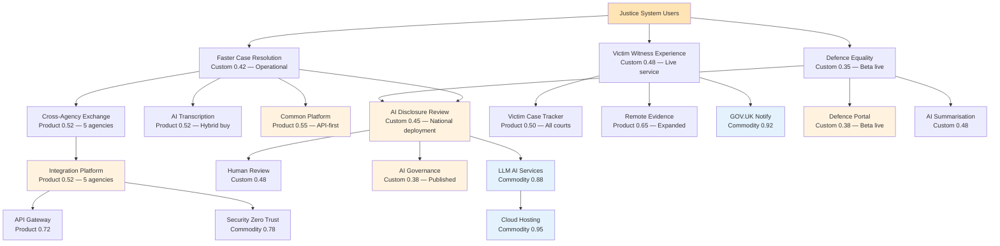

# Wardley Map: Criminal Courts Technology & AI Reform — 24-Month Future State

> **Template Origin**: Official | **ArcKit Version**: 1.5.0 | **Command**: `/arckit.wardley`

## Document Control

| Field | Value |
|-------|-------|
| **Document ID** | ARC-001-WARD-002-v1.0 |
| **Document Type** | Wardley Map |
| **Project** | Criminal Courts Technology & AI Reform (Project 001) |
| **Classification** | OFFICIAL |
| **Status** | DRAFT |
| **Version** | 1.0 |
| **Created Date** | 2026-03-16 |
| **Last Modified** | 2026-03-16 |
| **Review Cycle** | Quarterly |
| **Next Review Date** | 2026-04-15 |
| **Owner** | MoJ Chief Digital and Information Officer |
| **Reviewed By** | PENDING |
| **Approved By** | PENDING |
| **Distribution** | MoJ Enterprise Architecture, HMCTS Digital, CPS Digital, HMPPS Digital, Programme Board |

## Revision History

| Version | Date | Author | Changes | Approved By | Approval Date |
|---------|------|--------|---------|-------------|---------------|
| 1.0 | 2026-03-16 | ArcKit AI | Initial future state map from `/arckit:wardley` command — Mode B (24-month target) | PENDING | PENDING |

---

## Map Context

This is a **Future State Map (Mode B)** showing the target architecture at **March 2028** — 24 months from the current state map (ARC-001-WARD-001-v1.0). Evolution targets are informed by:

- **WCLM-001**: Climate assessment identifying War phase, LLM commoditisation, and co-evolution patterns
- **WGAM-001**: Gameplay analysis recommending Open Approaches, Experimentation, Directed Investment, and Managing Inertia
- **WDOC**: Doctrine assessment (2.1/5.0) identifying critical gaps in common language, user research, and inertia management

**Target Date**: March 2028 (FY 2027/28 end)

**Key Assumptions**:
- LLM AI Services reach commodity pricing by Q2 2027
- CJS Data Standards v1.0 published and adopted by all 5 agencies by Q4 2027
- AI Disclosure Review operational at 50%+ Crown Court cases by Q1 2028
- Defence Practitioner Portal beta live by Q3 2027
- 20+ of 37 legacy applications migrated by Q1 2028

---

## Map Visualization

**View this map**: Paste the map code below into [https://create.wardleymaps.ai](https://create.wardleymaps.ai)

```wardley
title Criminal Courts Technology & AI Reform — 24-Month Future State (March 2028)

anchor Justice System Users [0.97, 0.63]
annotation 1 [0.62, 0.32] AI Governance operational — judicial approval gates live
annotation 2 [0.30, 0.88] Commodity layer stable — all G-Cloud procured
annotation 3 [0.78, 0.42] CJS AI moving to product maturity — configurable and reusable
annotation 4 [0.50, 0.50] Integration platform approaching product — open standards published
note Target: 50,000 Crown Court backlog; 50%+ AI-assisted disclosure; all 5 agencies integrated [0.05, 0.15]

component Justice System Users [0.97, 0.63]
component Faster Case Resolution [0.94, 0.42]
component Victim Witness Experience [0.91, 0.48]
component Defence Equality of Arms [0.88, 0.35]

component AI Disclosure Review [0.82, 0.45]
component AI Transcription Translation [0.79, 0.52]
component AI Case Summarisation [0.76, 0.48]
component Victim Case Tracker [0.73, 0.50]
component Cross-Agency Data Exchange [0.70, 0.52]

component Common Platform [0.68, 0.55]
component Defence Practitioner Portal [0.66, 0.38]
component AI Governance Framework [0.64, 0.38]
component Remote Evidence Facilities [0.62, 0.65]

component Cross-Agency Integration Platform [0.58, 0.52]
component Human Review Queue [0.56, 0.48]
component Bias Testing Framework [0.54, 0.40]
component CJS Data Standards [0.50, 0.48]

component Event-Driven Messaging [0.45, 0.72]
component API Gateway [0.43, 0.72]
component LLM AI Services [0.40, 0.88]
component Identity Access Management [0.38, 0.78]
component GOV.UK Design System [0.36, 0.80]
component GOV.UK Notify [0.34, 0.92]

component Container Orchestration [0.28, 0.85]
component Managed Databases [0.25, 0.92]
component Monitoring Observability [0.22, 0.85]
component Security Zero Trust [0.20, 0.78]
component Cloud Hosting [0.15, 0.95]

Justice System Users -> Faster Case Resolution
Justice System Users -> Victim Witness Experience
Justice System Users -> Defence Equality of Arms

Faster Case Resolution -> AI Disclosure Review
Faster Case Resolution -> AI Transcription Translation
Faster Case Resolution -> Common Platform
Faster Case Resolution -> Cross-Agency Data Exchange

Victim Witness Experience -> Victim Case Tracker
Victim Witness Experience -> Remote Evidence Facilities
Victim Witness Experience -> GOV.UK Notify

Defence Equality of Arms -> AI Disclosure Review
Defence Equality of Arms -> Defence Practitioner Portal
Defence Equality of Arms -> AI Case Summarisation

AI Disclosure Review -> LLM AI Services
AI Disclosure Review -> Human Review Queue
AI Disclosure Review -> Bias Testing Framework
AI Disclosure Review -> AI Governance Framework

AI Transcription Translation -> LLM AI Services
AI Transcription Translation -> Human Review Queue

AI Case Summarisation -> LLM AI Services
AI Case Summarisation -> Human Review Queue

Victim Case Tracker -> GOV.UK Notify
Victim Case Tracker -> GOV.UK Design System
Victim Case Tracker -> Cross-Agency Integration Platform

Cross-Agency Data Exchange -> Cross-Agency Integration Platform
Cross-Agency Data Exchange -> CJS Data Standards
Cross-Agency Data Exchange -> Event-Driven Messaging

Common Platform -> Managed Databases
Common Platform -> Identity Access Management
Common Platform -> API Gateway

Defence Practitioner Portal -> GOV.UK Design System
Defence Practitioner Portal -> Identity Access Management
Defence Practitioner Portal -> LLM AI Services

AI Governance Framework -> Bias Testing Framework
AI Governance Framework -> Monitoring Observability

Cross-Agency Integration Platform -> API Gateway
Cross-Agency Integration Platform -> Event-Driven Messaging
Cross-Agency Integration Platform -> Security Zero Trust
Cross-Agency Integration Platform -> CJS Data Standards

Human Review Queue -> Identity Access Management
Human Review Queue -> GOV.UK Notify

LLM AI Services -> Cloud Hosting
LLM AI Services -> Security Zero Trust

API Gateway -> Cloud Hosting
API Gateway -> Security Zero Trust

Event-Driven Messaging -> Cloud Hosting
Container Orchestration -> Cloud Hosting
Managed Databases -> Cloud Hosting
Monitoring Observability -> Cloud Hosting

style wardley
```

---

## Evolution Movement Summary

### Component Evolution: Current → Future (24 months)

| Component | Current (Mar 2026) | Future (Mar 2028) | Movement | Stage Transition | Driver |
|-----------|:------------------:|:------------------:|:--------:|------------------|--------|
| **Faster Case Resolution** | 0.28 | 0.42 | +0.14 | Custom | AI-assisted disclosure operational at scale; 50%+ Crown Court cases |
| **Victim Witness Experience** | 0.30 | 0.48 | +0.18 | Custom | Case tracker live; Victims' Code automated compliance; remote evidence expanded |
| **Defence Equality of Arms** | 0.18 | 0.35 | +0.17 | Genesis → Custom | Defence Portal beta; AI tools available to defence; first global implementation |
| **AI Disclosure Review** | 0.25 | 0.45 | +0.20 | Custom | National deployment; configurable rules; evolving toward product patterns |
| **AI Transcription Translation** | 0.35 | 0.52 | +0.17 | Custom → Product | CJS-specific vocabulary mature; product-stage patterns; vendor alternatives emerging |
| **AI Case Summarisation** | 0.30 | 0.48 | +0.18 | Custom | Prosecution and defence usage; template-based summarisation approaching product |
| **Victim Case Tracker** | 0.32 | 0.50 | +0.18 | Custom → Product | Live service; all Crown Courts; approaching product with configurable notifications |
| **Cross-Agency Data Exchange** | 0.28 | 0.52 | +0.24 | Custom → Product | All 5 agencies connected; 90%+ automated; approaching product maturity |
| **Common Platform** | 0.42 | 0.55 | +0.13 | Custom → Product | API-first refactoring complete; third-party integrations operational; stabilised |
| **Defence Practitioner Portal** | 0.22 | 0.38 | +0.16 | Genesis → Custom | Beta live; initial adoption; mobile app available; still custom/bespoke |
| **AI Governance Framework** | 0.20 | 0.38 | +0.18 | Genesis → Custom | Published with judicial endorsement; operational for all CJS AI; first global framework |
| **Remote Evidence Facilities** | 0.55 | 0.65 | +0.10 | Product | Expanded to all Crown Courts; standard video conferencing; moving toward commodity |
| **Cross-Agency Integration Platform** | 0.35 | 0.52 | +0.17 | Custom → Product | 5-agency integration operational; open standards published; product patterns |
| **Human Review Queue** | 0.38 | 0.48 | +0.10 | Custom | Operational at scale; workflow templates emerging; still CJS-specific |
| **Bias Testing Framework** | 0.25 | 0.40 | +0.15 | Custom | Published CJS-specific fairness metrics; academic peer-reviewed; open-source components |
| **CJS Data Standards** | 0.28 | 0.48 | +0.20 | Custom | v1.0 published as open standard; adopted by all 5 agencies; international reference |
| **LLM AI Services** | 0.68 | 0.88 | +0.20 | Product → Commodity | Utility pricing; multi-model switching operational; commodity procurement |
| **Security Zero Trust** | 0.70 | 0.78 | +0.08 | Product → Commodity | Cloud-native zero trust mature; approaching commodity |
| **Event-Driven Messaging** | 0.62 | 0.72 | +0.10 | Product | Mature cloud messaging; approaching commodity pricing |
| **API Gateway** | 0.65 | 0.72 | +0.07 | Product | Stable product; minimal evolution |

### Fastest-Moving Components (top 5)

1. **Cross-Agency Data Exchange** (+0.24): Driven by Open Approaches + Industrial Policy gameplays — mandatory adoption accelerates evolution
2. **AI Disclosure Review** (+0.20): Driven by Directed Investment + Experimentation — concentrated investment in core differentiator
3. **CJS Data Standards** (+0.20): Driven by Open Approaches + Co-creation — open publication attracts cross-agency contribution
4. **LLM AI Services** (+0.20): Driven by market forces (climatic pattern 3.5: punctuated equilibrium) — utility pricing arrives
5. **Victim Witness Experience** (+0.18): Driven by case tracker deployment and Victims' Code automation

### Stage Transitions (24 months)

| Transition | Components | Strategic Significance |
|-----------|-----------|----------------------|
| **Genesis → Custom** | Defence Equality of Arms, Defence Practitioner Portal, AI Governance Framework | Programme's most novel components mature from R&D to operational capability |
| **Custom → Product** | AI Transcription, Victim Case Tracker, Cross-Agency Data Exchange, Common Platform, Cross-Agency Integration Platform | Core programme deliverables reach product maturity — configurable, reusable, standard |
| **Product → Commodity** | LLM AI Services, Security Zero Trust | Underlying infrastructure commoditises, reducing costs and enabling higher-order innovation |

---

## Build vs Buy Analysis — Future State

### Components Still Being Built (Custom, 24-month horizon)

| Component | Future Evolution | Rationale for Continued Build | Transition Plan |
|-----------|:----------------:|-------------------------------|-----------------|
| AI Disclosure Review | 0.45 | Core CJS differentiator; no vendor product matches CJS-specific disclosure rules | Begin product evaluation at evolution 0.55+ (est. 36 months) |
| Defence Practitioner Portal | 0.38 | No equivalent exists; constitutional requirement; CBA/Law Society co-owned | Evaluate open-sourcing at evolution 0.50+ for international reuse |
| AI Governance Framework | 0.38 | First global CJS AI governance; must remain under judicial co-ownership | Publish as open standard; consider transferring to standards body at 0.55+ |
| Human Review Queue | 0.48 | CJS-specific review workflows; approaching product but no vendor product serves CJS | Evaluate productisation for cross-government reuse at 0.55+ |
| Bias Testing Framework | 0.40 | CJS-specific fairness metrics; academic partnership-driven | Open-source core; commercial CJS layer retained |

### Components Transitioning to Buy (entering Product stage)

| Component | Current Buy/Build | Future Buy/Build | Transition Trigger |
|-----------|:-----------------:|:----------------:|-------------------|
| AI Transcription Translation | Build (custom CJS vocabulary) | Hybrid → Buy | When vendor LLMs natively support CJS terminology (est. 18-24 months) |
| Remote Evidence Facilities | Buy (G-Cloud) | Buy (G-Cloud) | Already product; continue procurement |
| Cross-Agency Integration Platform | Build (custom topology) | Build → Product evaluation | At evolution 0.55+, evaluate COTS integration platforms with CJS configuration |

### Components Fully Commodity (24-month horizon)

| Component | Future Evolution | Procurement | Annual Cost Estimate |
|-----------|:----------------:|-------------|---------------------|
| LLM AI Services | 0.88 | G-Cloud (multi-vendor) | £2-3M (down from £3-5M — Jevons Paradox offset by unit cost drop) |
| Cloud Hosting | 0.95 | G-Cloud | £8-10M |
| Managed Databases | 0.92 | G-Cloud | £2-3M |
| GOV.UK Notify | 0.92 | Direct (free) | £0 |
| GOV.UK Design System | 0.80 | Direct (free) | £0 |
| Container Orchestration | 0.85 | G-Cloud | £1-2M |
| Security Zero Trust | 0.78 | G-Cloud | £1-2M |
| Identity Access Management | 0.78 | G-Cloud | £0.5-1M |
| Monitoring Observability | 0.85 | G-Cloud | £0.5-1M |

---

## Key Strategic Differences: Current vs Future State

### 1. Integration Platform as Product (Custom 0.35 → Product 0.52)

The Cross-Agency Integration Platform moves from a bespoke architecture design to an operational product connecting all 5 agencies. This is the single highest-leverage evolution — the value chain convergence point that enables prosecution, defence, and victim experience simultaneously.

**What changes**: All 5 agencies connected via standardised APIs. CJS Data Standards adopted. Manual data transfer eliminated for 90%+ of case data. API catalogue published and used by third-party developers.

### 2. AI Disclosure at Scale (Custom 0.25 → Custom 0.45)

AI Disclosure Review moves from sandbox pilot to national deployment across 50%+ of Crown Court cases. Configurable disclosure rules and template-based workflows emerge, moving the component toward product patterns.

**What changes**: 50%+ Crown Court cases use AI-assisted disclosure. Disclosure-related case collapses reduced by 40%. Both prosecution AND defence have access. Audit trail operational.

### 3. Defence Equality Achieved (Genesis 0.18 → Custom 0.35)

Defence Equality of Arms transitions from constitutional aspiration to operational reality. The Defence Practitioner Portal is live with AI tools equivalent to prosecution capabilities.

**What changes**: Defence practitioners have AI-assisted case preparation. Simultaneous prosecution-defence access to AI tools. 30%+ defence practitioner adoption. Zero successful legal challenges on technology inequality.

### 4. AI Governance Published (Genesis 0.20 → Custom 0.38)

The AI Governance Framework transitions from first-of-its-kind design to published, co-authored operational standard with judicial, ICO, and cross-agency endorsement.

**What changes**: ATRS registration mandatory and operational. DPIA process automated. Judicial approval gates functional. Bias testing integrated into AI deployment pipeline. Framework cited internationally.

### 5. LLM Services Commoditised (Product 0.68 → Commodity 0.88)

LLM AI Services complete the product-to-commodity transition. Multi-model switching is operational. Utility pricing enables CJS AI at significantly lower cost per case.

**What changes**: 2+ LLM providers under contract with switching capability. Cost per AI-assisted case reduced by 50%+. Model upgrades (GPT-5+) absorbed without rearchitecture.

### 6. Legacy Footprint Halved (37 → < 17 applications)

20+ of 37 legacy applications migrated to modern platforms. Remaining applications on documented migration paths.

**What changes**: Legacy-related incidents reduced by 60%. COBOL/mainframe skills dependency reduced. Cyber risk surface significantly reduced.

---

## Inertia Resolved vs Remaining

### Inertia Points Addressed by March 2028

| Inertia Source | Current Severity | Future Severity | How Resolved |
|---------------|:----------------:|:---------------:|-------------|
| Common Platform sunk cost | Critical | Medium | Independent assessment completed; API-first refactoring preserves investment; leadership credibility protected through "evolution" framing |
| Cross-agency governance friction | High | Medium | CJS Data Standards published and adopted; change champions operational; ministerial escalation path used once (establishing precedent) |
| Judicial caution on AI | High | Low | Judicial steering group operational; co-created governance framework; sandbox-to-live pilot pathway demonstrated safely |
| Defence practitioner fragmentation | High | Medium | Portal beta live; CBA/Law Society acting as adoption channel; mobile app for sole practitioners; LAA funding operational |

### Residual Inertia (Remaining at March 2028)

| Inertia Source | Severity | Why It Persists | Mitigation Path |
|---------------|:--------:|-----------------|----------------|
| Remaining 17 legacy applications | Medium | Most complex/risky applications deferred to Years 3-5; COBOL skills still scarce | Continued DOS Specialists procurement; accelerated migration as patterns learned from first 20 |
| Police force IT fragmentation (43 forces) | Medium | Largest forces connected; smaller forces lack IT capacity | NPCC digital mandate; shared tooling for smaller forces; regional police IT consolidation |
| Skills gap (AI/ML, cloud-native) | Medium | Market-wide talent shortage; government pay scales | Apprenticeship programme; university partnerships; hybrid working; purpose-driven recruitment |
| Common Platform architectural limitations | Low | API layer stabilised but underlying architecture constrains future evolution | Monitor for replacement trigger; evaluate next-generation court platform at Year 4 |

---

## Dependencies and Value Chain — Future State



---

## Risk Analysis — Future State

### Risks Mitigated (vs Current State)

| Risk | Current Severity | Future Severity | Mitigation Achieved |
|------|:----------------:|:---------------:|---------------------|
| AI miscarriage of justice | High | Medium | AI Governance Framework operational; human-in-the-loop proven; bias testing integrated; ATRS compliant |
| Defence inequality Article 6 challenge | Critical | Low | Defence Portal beta live; simultaneous prosecution-defence AI access achieved |
| Common Platform collapse | High | Low | API-first refactoring complete; no longer single point of failure for integration |
| Cross-agency governance deadlock | High | Medium | Data standards published; change champions operational; ministerial escalation precedent set |

### New/Emerging Risks (at 24 months)

| Risk | Severity | Description | Mitigation |
|------|:--------:|-------------|------------|
| AI model obsolescence | Medium | Current LLM approach may be superseded by AI agents / autonomous reasoning within 24 months (climatic pattern 3.4: non-linear change) | Abstraction layer enables model switching; monitor for paradigm shift signals; maintain experimentation budget |
| Vendor consolidation in LLM market | Medium | LLM commoditisation may lead to 2-3 dominant providers, reducing multi-vendor leverage | Maintain open-source LLM evaluation pipeline; avoid vendor-specific API dependencies |
| Scale of human review queue | High | As AI deployment scales to 50%+ cases, human review volume may exceed capacity (Jevons Paradox) | Automate low-confidence reviews; tier review by case severity; workforce planning for reviewer scaling |
| Political mandate fatigue | Medium | Leveson Review momentum may dissipate by Year 2-3 as political attention shifts | Demonstrate visible results in Year 1 to lock in multi-year commitment; embed in departmental plans, not just programme plans |
| International regulatory divergence | Low | EU AI Act, US AI regulation may impose conflicting requirements on CJS AI | Design governance framework for UK compliance; monitor international developments; maintain flexibility |

---

## Recommendations — Future State Achievement

### Phase 1: Foundation (Months 0-6) — Already Planned in WGAM-001

1. CJS Data Standards v0.1 published; cross-agency working group operational
2. First AI disclosure experiment at 1 Crown Court site
3. Cloud hosting and LLM services procured via G-Cloud
4. User research with 40+ practitioners completed
5. Common Platform independent assessment commissioned

### Phase 2: Delivery (Months 6-12)

1. AI Disclosure Review deployed at 10+ Crown Court sites
2. Cross-Agency Integration Platform v1 — police-CPS-HMCTS connections live
3. Defence Practitioner Portal alpha with 50+ practitioners testing
4. AI Governance Framework published with judicial endorsement
5. First 5-8 legacy applications migrated

### Phase 3: Scale (Months 12-18)

1. AI Disclosure Review at 50%+ Crown Court cases
2. All 5 agencies connected to Integration Platform
3. Defence Portal beta live; 30%+ practitioner adoption
4. CJS Data Standards v1.0 published as open standard
5. 15-20 legacy applications migrated

### Phase 4: Maturity (Months 18-24)

1. AI Transcription/Translation operational at all Crown Courts
2. Victim Case Tracker live at all Crown Courts
3. Bias Testing Framework peer-reviewed and open-sourced
4. LLM multi-model switching operational
5. 20+ legacy applications migrated; remaining 17 on documented paths

---

## Traceability

### Cross-References to Wardley Mapping Suite

| Artifact | Document ID | Relationship |
|----------|-------------|--------------|
| Current State Map | ARC-001-WARD-001-v1.0 | Baseline for all evolution targets; dependency structure preserved |
| Value Chain | ARC-001-WVCH-001-v1.0 | 35-component decomposition; 3 critical paths informing evolution priorities |
| Doctrine Assessment | ARC-001-WDOC-v1.0 | Maturity 2.1/5.0; doctrine gaps constrain evolution speed; improvement roadmap |
| Gameplay Analysis | ARC-001-WGAM-001-v1.0 | 8 recommended plays driving evolution: Open Approaches, Experimentation, Directed Investment, Managing Inertia |
| Climate Assessment | ARC-001-WCLM-001-v1.0 | War phase; LLM commoditisation; co-evolution patterns; inertia risk Critical |

### Requirements Traceability

| Requirement | Component | Current | Target | Status at 24m |
|------------|-----------|:-------:|:------:|:--------------|
| BR-001 (Backlog < 50,000) | Faster Case Resolution | 0.28 | 0.42 | On track — AI disclosure + integration driving efficiency |
| BR-002 (AI disclosure 80%+) | AI Disclosure Review | 0.25 | 0.45 | Partial — 50%+ at 24m; 80% requires 36m |
| BR-003 (Defence equality 70%+) | Defence Practitioner Portal | 0.22 | 0.38 | Partial — 30% adoption at 24m; 70% requires 36m |
| BR-004 (90%+ automated exchange) | Cross-Agency Data Exchange | 0.28 | 0.52 | On track — all 5 agencies connected |
| BR-005 (20+ apps migrated) | Legacy Migration Service | 0.30 | 0.45 | On track — 20+ migrated at 24m |
| BR-006 (AI governance operational) | AI Governance Framework | 0.20 | 0.38 | Achieved — framework published and operational |
| BR-007 (20% victim satisfaction) | Victim Case Tracker | 0.32 | 0.50 | On track — tracker live at all Crown Courts |

---

## External References

| Document | Type | Source | Key Extractions |
|----------|------|--------|-----------------|
| ARC-001-WARD-001-v1.0 | Current State Map | Project 001 | Baseline component positions and dependencies |
| ARC-001-WCLM-001-v1.0 | Climate Assessment | Project 001 | War phase; LLM commoditisation; inertia risk Critical; 18 active patterns |
| ARC-001-WGAM-001-v1.0 | Gameplay Analysis | Project 001 | 8 LG/N plays; Open Approaches + Co-creation + Education strategic thrust |
| ARC-001-WDOC-v1.0 | Doctrine Assessment | Project 001 | 2.1/5.0 maturity; common language, user needs, inertia management gaps |
| ARC-001-REQ-v1.0 | Requirements | Project 001 | 10 business requirements; success criteria for 24-month targets |
| ARC-001-STRAT-v1.0 | Strategy | Project 001 | 5-year horizon; £281M investment; hybrid build/buy |

---

**Generated by**: ArcKit `/arckit:wardley` command
**Generated on**: 2026-03-16 19:00 GMT
**ArcKit Version**: 1.5.0
**Project**: Criminal Courts Technology & AI Reform (Project 001)
**AI Model**: claude-opus-4-6
**Generation Context**: Future State Map (Mode B) synthesised from WARD-001 (current state), WCLM-001 (climate), WGAM-001 (gameplay), WDOC (doctrine), and REQ (requirements) to create 24-month target architecture
